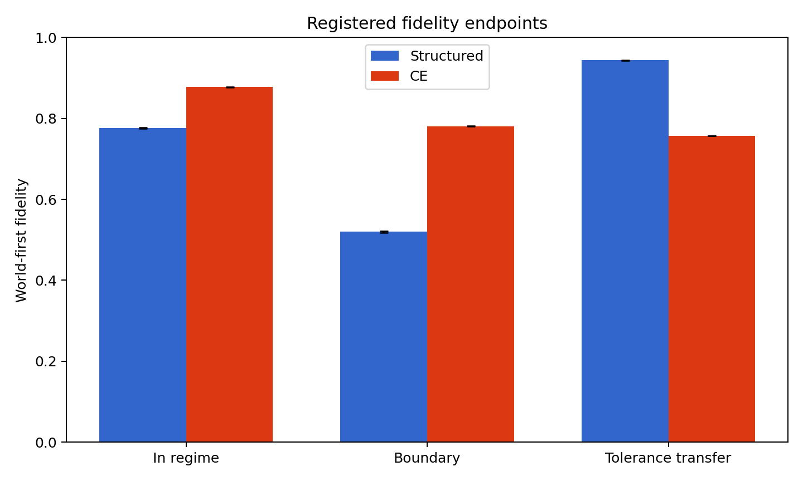
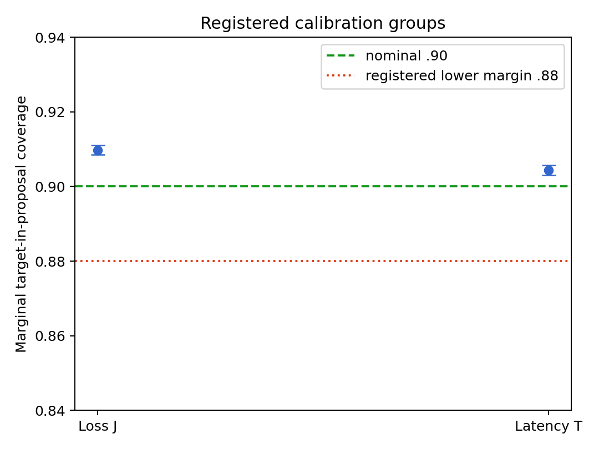
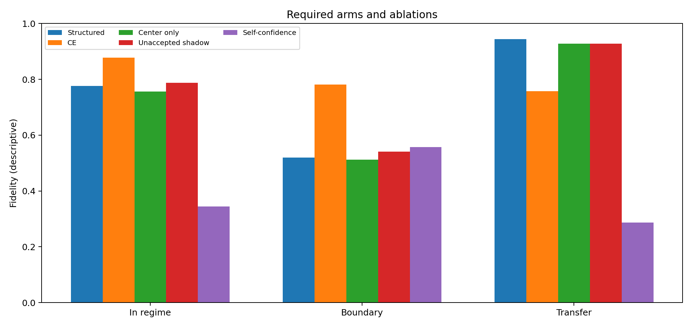

# Task 21: frozen experiment results

Date: 2026-07-16  
Scientific protocol: `value-logic-experiment-v1.0.0`  
Execution amendment: `value-logic-implementation-v1.1.0`  
Status: completed once; project-level adjudication completed at Checkpoint C1

> **Checkpoint C1 adjudication (2026-07-18):** Aggregate `F35` remains `I1`,
> mixed with decisive opposing effects. Its registered transfer component is
> `F35a/S1`; boundary superiority and in-regime noninferiority are
> `F35b/F35c/X1` at their registered margins. `F36/S1` remains marginal
> target-in-proposal coverage only. The scorer receives the declared tolerance
> and is re-evaluated per query, so the transfer result is no-retraining
> generalization by a statistic-output interface, not literal reuse of one
> invariant prediction region. Conservative dead-band geometry is a plausible
> explanation, not a causally identified decomposition. See
> [`C1_empirical_adjudication.md`](../notes/checkpoints/C1_empirical_adjudication.md).

## 1. Result in ordinary language

The experiment did **not** establish one generally preferable neural encoding of the value logic.

The structured network, which predicts a center and uncertainty radius before an exact decoder assigns `Refuted`, `Open`, or `Supported`, generalized exceptionally well to changed-tolerance queries without retraining. It was much worse than a direct three-class cross-entropy network on ordinary in-regime cases and on the preregistered boundary panel. This is a stable trade-off across all eight fit seeds, not an average hiding opposite seed-level results.

The held-out residual-expansion procedure did pass its narrower calibration claim: its proposed intervals contained the target at the registered marginal rate in both statistic groups. That result concerns target-in-proposal coverage only. It does not certify a whole profile, a selected route, a deployed system, or the truth of a model.

Accordingly, the immediate machine-readable disposition is:

- `F35`: **mixed or inconclusive**. The broad practical preference for structured statistic/envelope learning is not established.
- `F36`: **supported in its exact registered marginal scope**.

These labels report the frozen numerical rules. Checkpoint C1 remains responsible for the careful claim-ledger and paper-level interpretation.

## 2. Minimum confirmatory core

The independent inferential unit is one of 5,000 final world roots. For each world, the eight fixed paired fit seeds are averaged before the world bootstrap. Confidence intervals use 10,000 paired world-bootstrap samples. The two `F35` superiority endpoints and the two `F36` coverage groups use their preregistered Holm families.

| endpoint | structured | direct `K_3` CE | paired difference | 95% paired bootstrap interval | registered result |
|---|---:|---:|---:|---:|---|
| tolerance transfer | 0.9436 | 0.7570 | +0.1866 | [0.1860, 0.1873] | passes 0.05 superiority margin |
| boundary panel | 0.5196 | 0.7808 | -0.2612 | [-0.2636, -0.2587] | fails 0.05 superiority margin |
| ordinary in-regime guard | 0.7764 | 0.8773 | -0.1009 | [-0.1022, -0.0997] | fails -0.02 noninferiority margin |

`F35` required both superiority endpoints and the noninferiority guard to pass. Only transfer passed. The registered reverse-falsification condition also does not pass, because the large positive transfer result rules out a simple conclusion that direct classification dominates everywhere. The correct result is therefore mixed/inconclusive, not supported and not falsified under the preregistered decision rule.

The transfer result uses the 16 monotonicity-compatible cells frozen in Task 20. No eight impossible Cartesian cells were invented after the result was seen. The boundary result uses the exact frozen four-query panel.

### Absolute marginal calibration

| statistic group | observed coverage | 95% bootstrap interval | Holm one-sided lower bound | registered lower margin | result |
|---|---:|---:|---:|---:|---|
| loss `J` | 0.9098 | [0.9085, 0.9111] | 0.9085 | 0.88 | passes |
| latency `T` | 0.9044 | [0.9031, 0.9058] | 0.9033 | 0.88 | passes |

Both groups pass `F36`. The estimand is marginal target-in-proposal coverage under the exact exchangeable generator and disjoint split protocol. It is not conditional coverage, finite-evidence usability in a different population, profile coverage, route coverage, or a system guarantee. In this run all calibration expansions were finite and the binding rejection and infinite-proposal rates were zero, but those are descriptive facts rather than extensions of the registered theorem or claim.

## 3. What explains the mixed result?

The unweighted trace companions reveal a clear behavior: the structured arm learned to be extremely conservative.

| probe behavior | structured | direct CE |
|---|---:|---:|
| accuracy when the reference state is `Open`, group `J` | 0.9910 | 0.8120 |
| accuracy when the reference state is `Supported`, group `J` | 0.5253 | 0.9343 |
| accuracy when the reference state is `Refuted`, group `J` | 0.6849 | 0.9482 |
| false support rate | 0.0087 | 0.0988 |
| false refutation rate | 0.0146 | 0.1624 |
| missed support rate | 0.4611 | 0.0640 |
| missed refutation rate | 0.3248 | 0.0627 |

The `T` state-specific pattern is similar. The structured arm almost never makes the wrong positive assertion, but often withholds a correct assertion. Its downstream fallback mass is 0.9962, versus 0.9139 for direct CE. This explains why it can preserve a numerical region and answer changed thresholds very well while performing poorly on the frozen current-threshold boundary and in-regime classifications.

This is a useful design discovery. The structured representation really does retain reusable threshold information, as Proposition 2 predicted it could, but the selected loss/calibration path does not by itself produce a generally better operational classifier. Future writing must distinguish the **information advantage** from the **decision-performance trade-off**.

The direction of every primary difference is unchanged across all eight seeds:

- transfer differences range from +0.0969 to +0.2468;
- boundary differences range from -0.3046 to -0.2349; and
- in-regime differences range from -0.1413 to -0.0647.

Descriptive two-way world-and-seed bootstrap intervals are respectively `[0.1513, 0.2212]`, `[-0.2789, -0.2456]`, and `[-0.1177, -0.0833]`. These are robustness summaries, not substitutes for the preregistered world-first inference.

## 4. Required ablations and negative results

The table below is descriptive; the core multiplicity rule applies only to the registered endpoints above.

| arm or ablation | in regime | boundary | transfer |
|---|---:|---:|---:|
| accepted structured region | 0.7764 | 0.5196 | 0.9436 |
| direct cross-entropy | 0.8773 | 0.7808 | 0.7570 |
| center only | 0.7564 | 0.5116 | 0.9277 |
| unaccepted-radius shadow | 0.7869 | 0.5405 | 0.9278 |
| invalid learned self-confidence | 0.3444 | 0.5570 | 0.2874 |

The accepted calibrated region improves transfer over center-only and the unaccepted shadow, but it does not repair the current-threshold boundary deficit. Treating learned self-confidence as if it were an externally accepted certificate fails badly, especially on transfer. The unaccepted production path is deliberately withholding rather than authorizing.

The direct CE arm's unweighted probability diagnostics are Brier 0.1829, ten-bin ECE 0.0935, and NLL 0.3194. These describe its class probabilities; they are not region coverage and cannot establish certificate validity.

## 5. Routing, certificates, and system evidence

Inactive selection was exactly zero for both learned arms over all 40,000 world/seed evaluations. This verifies the fixed masking invariant in the observed run; it does not show that the learned arm selected useful plans often. Indeed, the structured arm's fallback rate was nearly one.

The succession fixture and `F18` system/certificate checks remain deterministic integration witnesses. They verify such properties as proof erasure, grounded ranks, rejection of an invalid local certificate, cycle rejection, and audit/confirmation lineage separation. They are not a powered empirical system comparison. Hard MoE was prospectively omitted and receives no empirical disposition.

No result here establishes semantic alignment, mechanistic interpretability, scientific realism, ReLU optimality, or a general architecture theorem. Functional fidelity, proposal coverage, exact certificate checking, routing safety, and system adequacy remain different claims.

## 6. Execution record and deviations

The scientific protocol, worlds, sample counts, endpoints, margins, model families, losses, calibrators, fit seeds, and multiplicity rules were unchanged. Task 20R changed only the execution path after the original object-heavy runner proved unreliable.

The successful v1.1 stages were separately checkpointed and hash-verified:

| stage | compact artifact | SHA-256 | approximate runtime |
|---|---|---|---:|
| select | `selection_checkpoint_v1_1.json` | `84e7456a41d4bb19db943c47a6cc567f1a865fdfd6ea4693f88b5c5ceacac2b0` | 675 s on successful invocation |
| eight paired fits | `fit_checkpoint_v1_1.json` | `1298e87f9346da493a35a1f41cdcc0e25b229ae160c4854321f36635c96df759` | 401 s |
| calibration | `calibration_checkpoint_v1_1.json` | `48663fa80a7fbec5d6c16c3a0febfdeaaa50fbe159ce3e0cbb0bc2185d48abac` | 13 s |
| final confirmation | local `raw_results_v1_1.json` | `b7decc0ad233c0cbb5e70882001c914989026921357cd043b7e9a15bed4068fe` | 125 s |
| analysis | `analysis_v1_1.json` | `dbb1768625a268bdfefa72f85fbb1b076130fede8f07746d3f31c3f8df791728` | 19 s |

The selected common budget was 20,000 parameters. The structured arm used learning rate `.001`; direct CE used `.003`; both selected zero weight decay. The fit archive contains 16 distinct verified model hashes for eight paired seeds. Final confirmation wrote 50 sealed 100-world blocks and 400 verified trace shards.

The complete raw JSON is about 60 MB, while the model archive, progress blocks, and trace shards are larger reproducible run products. They remain local and Git-ignored; the compact checkpoints, analysis, figures, hashes, and this record are committed.

Every deviation or reporting limit is retained in the machine-readable analysis:

1. **21-D1 — versioned execution amendment.** The v1 object-heavy path failed before a readable result; v1.1 used equivalent arrays, batching, checkpointing, and the differentially tested C++ decoder. No scientific estimand changed.
2. **21-D2 — unread selection retry.** A first v1.1 selection invocation stopped after about nine seconds with the transient message `Plan object is not callable`, before a checkpoint or final payload existed. Unchanged frozen source completed on the diagnostic retry. No result-based choice occurred.
3. **21-D3 — secondary reporting gap.** Compact traces did not retain target/design weights, polarity, evidence-mode, or diagnostic labels, and cannot reconstruct selected/deployed task loss or misroute severity. These quantities are unreported rather than post hoc reconstructed.
4. **21-D4 — bootstrap generator clarification.** The protocol fixed the seed and replicate count but not the pseudorandom algorithm. Analysis records NumPy `default_rng`/PCG64 and the pinned NumPy version.
5. **21-D5 — post-final analysis failures.** Two attempts to regenerate custom final-world metadata encountered the same transient CPython object-state failure family before writing an analysis. Raw results and traces were unchanged. The completed analysis safely uses sealed target-weighted metric rows and only fixed-layout unweighted trace companions; it never regenerates final worlds.

The unavailable registered secondaries are target-weighted trace false-support/refutation and class-miss rates; atom fidelity by polarity, evidence mode, and exact diagnostic; selected and deployed task loss; and misroute severity. Their absence cannot rescue or overturn the minimum core. Any repair belongs to a separately versioned future study, not a rerun selected after seeing these outcomes.

## 7. Project impact carried into Checkpoint C1

The result weakens one proposed neural implementation default, not the value logic itself. The architecture-neutral finite-stage license semantics, exact `WF + K_3` decoder, typed certificate boundary, representation theorems, and the motivation for task/domain-relative warrant do not depend on `F35`.

What must change is the empirical narrative. The paper cannot say that center–radius learning is generally the natural or superior neural fit. It can say that the representation preserves information needed for changed tolerances and that the frozen implementation demonstrates a striking transfer/conservatism trade-off. Checkpoint C1 should decide whether to present that trade-off as a central limitation, refine the status of `F35`, and narrow every downstream comparative claim before Tasks 22–25.

The compact numerical source is [`analysis_v1_1.json`](analysis_v1_1.json). The analysis implementation is [`analyze_results.py`](analyze_results.py). Neither file authorizes another final-confirmation run.
