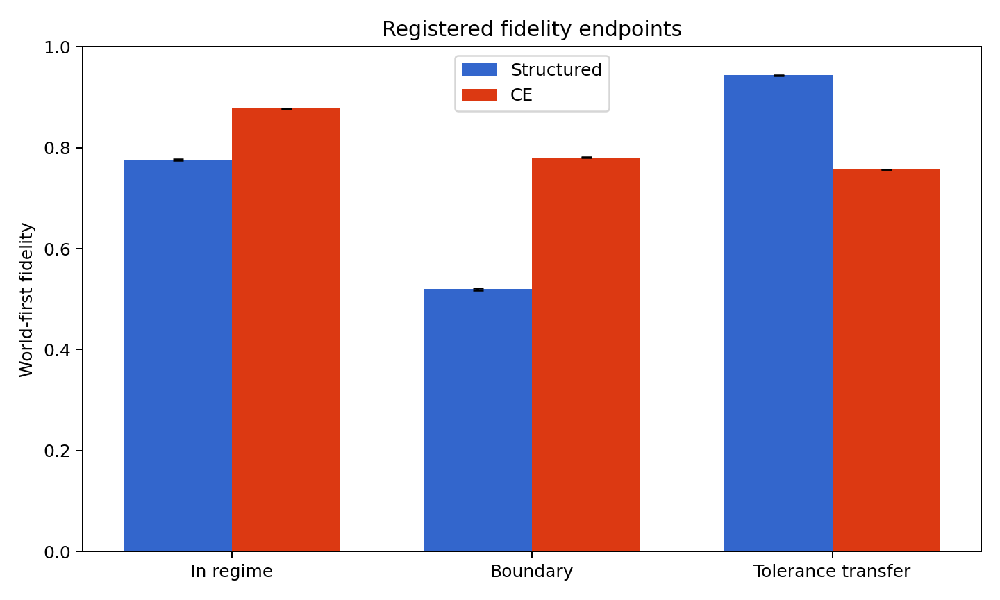
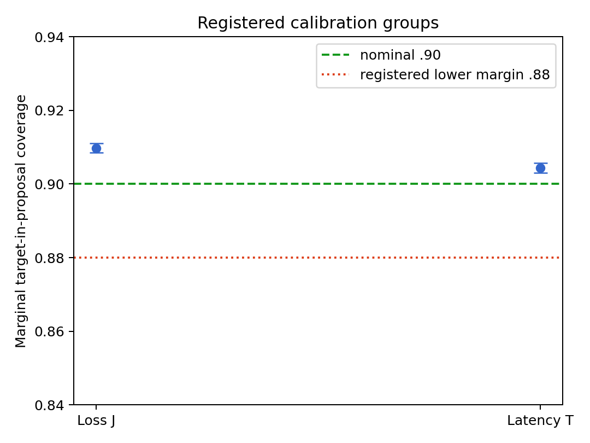

# Value Logic: Scoped Reliance on Fallible Models Under Open-Ended Succession

Tristan Miano

## Abstract

Newton's laws are considered superseded—“falsified” by modern physics in an
unrestricted sense—yet remain taught and used. Their continued use exhibits
pragmatic value: on a restricted domain, a fallible model may provide adequate
predictions at lower computational or operational cost than invoking a
successor. We expect present physics, including the Standard Model, to be
superseded in turn, without knowing whether the chain ends. We formalize such
value as a finite-stage, evidence-relative license indexed by domain, task
loss, fallback, tolerance, profile, and provenance. An architecture-neutral
factorization lets learned modules propose reusable statistics while exact
checks preserve states and fallback; finite ReLU networks supply one reference
realization. In a frozen synthetic experiment, tolerance transfer and marginal
proposal coverage were supported, registered boundary superiority and
in-regime noninferiority were refuted at their margins, and usable coverage was
poor. Formal claims remain neutral about final truth, architectural
optimality, and true-utility recovery.

## 1. Introduction: Reliance Before Finality

What does it mean for a model to be superseded? Newton's laws are a familiar
case. Modern physics supersedes—and, under an unrestricted reading,
“falsifies”—them. Yet college students still learn those laws, and Newtonian
models remain useful in engineering and other applications. We also expect the
Standard Model and other current fundamental frameworks to be superseded in
turn. On the motivating philosophical reading, this means that we regard even
our best present models as “false” when they are read as unrestricted final
descriptions: we expect future theories to expose limits that we do not yet
know. We do not know when this will happen, or even whether the chain of
supersession ends.

The physical evidence is narrower than that philosophical expectation. The
nonrelativistic, low-velocity approximation recovers familiar Newtonian
momentum and force laws ([The Feynman Lectures on
Physics](https://www.feynmanlectures.caltech.edu/TIPS_02.html)), while CERN
describes the Standard Model as extensively tested but incomplete, including
because it omits gravity ([CERN, “The Standard
Model”](https://home.cern/science/physics/standard-model/)). This supports
restricted retention and present incompleteness; it does not prove that every
current theory must have a successor.

Continued Newtonian use links that fallibilist motivation to value. A more
general or accurate successor may require different measurements, calculation,
expertise, or cost, while an older model already meets a restricted tolerance
and is easier to inspect or deploy. **Pragmatic value** here is task-relative:
how well reliance serves a stated purpose under a named loss, domain, and cost,
compared with a successor, fallback, or available plan. This does not define
truth by utility. Because such value can survive an unrestricted truth claim,
supersession leads naturally to licensed use.

This expectation motivates the paper; it is not a premise proved below. The
practical problem arises before any final verdict: a successor can restrict an
older model's dependable range while a bounded agent must still decide what to
use now. The motivating question is:

> Can a bounded agent represent present permission to rely on a fallible model,
> preserve the reasons and limits of that permission, and revise it as evidence
> and alternatives change?

Our answer is a finite-stage, profile-indexed license. It records whether an
evaluated use plan may presently be relied upon for a specified domain and
purpose, under named evidence, constraints, tolerance, fallback, comparison
set, and provenance. This is an operational judgment. The project remains
neutral about whether a current theory is finally true, and a license does not
turn task loss into a degree of metaphysical falsity. Truth, empirical
adequacy, usability, current selection, and archival retention remain distinct
questions.

The compressed notation $\Pi(M,D,\epsilon)$ is a useful way to expose the
design problem, but only $M$ and $D$ follow directly from local retention under
succession. A model may work on one domain and fail the demands of another.
The symbol $\epsilon$ acquires meaning only after a task loss, a domain-level
risk aggregation, and a reliance rule have been declared. It may come from an
external safety or precision requirement. It may instead be induced by the
agent's fallback: if the outside option has loss $J(B,D)$ and switching must
improve on it by $\Delta$, then the contextual ceiling is
$\epsilon_B(D)=J(B,D)-\Delta$. Beating that ceiling and satisfying an absolute
adequacy constraint are separate requirements; a poor fallback can be easy to
beat while the candidate remains unsuitable for use.

The “model” being assessed may be an equation, fitted predictor, or finite
plan composing models, translations, estimators, and a router. Its internal
structure remains visible for error and provenance, while the complete plan
can be assessed as one candidate. Payload, quantitative grade, and evidence
remain separate, as do the task loss, an estimator of that loss, and the
optimizer's training objective.

The paper makes four formal contributions:

1. **A finite-stage profile calculus.** A compact request separates the use
   plan, reliance context, epistemic state, and finite requirement profile.
   Well-formedness is checked before meaningful requirements receive supported,
   open, or refuted states. Their required meet yields Granted, Withheld, or
   Refused. We prove profile-refinement soundness and relative completeness on
   a finite independently realizable fragment within a fixed instantiation
   fiber.
2. **Constructive stability under open succession.** Continuation semantics
   distinguishes a present grant, eventual stabilization, permanent stability,
   scheme-relative certification, library completeness, and optional finality.
   Checked frozen dependencies and margin-separated sequential evidence give
   positive stability conditions. Finite non-domination remains relative to
   the searched library, so a later admissible candidate can change comparative
   status.
3. **Typed locality for revision.** Finite read footprints for the actual atom
   evaluators determine complete diagnostics, including negative collection
   reads. Disjoint writes preserve those diagnostics, and the canonical
   event-to-key-to-slot graph is change-complete under its stated realizability
   condition.
4. **An architecture-neutral representation with a ReLU reference.** The
   interface separates learned numerical proposals from exact evidence,
   well-formedness, decoding, masks, and fallback. We prove conservative
   recovery away from explicit error bands and give exact finite ReLU
   realizations for suitable finite continuous piecewise-linear statistics.
   Boundary collisions, scale, hard seams, and expandable libraries delimit
   the result.

ReLU compatibility was engineered at this typed boundary, delimited
mathematically, and tested in one frozen synthetic implementation. That test
gave an asymmetric result. Without retraining, the structured statistic arm
generalized strongly to changed tolerances (macro accuracy $.9436$ versus
$.7570$; paired difference $+.1866$, 95% interval $[.1860,.1873]$). Its
registered boundary-superiority proposition was refuted at its $+.05$ margin
(difference $-.2612$), and its in-regime-noninferiority proposition was refuted
at its $-.02$ margin (difference $-.1009$). The reverse comparisons were not
preregistered confirmatory claims. Marginal
target-in-proposal coverage was supported for the two registered groups
($.9098$ and $.9044$), while support/refutation miss rates were $.4611/.3248$
and target-weighted fallback mass was $.9962$. Thus:

> **Retaining a reusable numerical statistic helped when the decision threshold
> changed. But wrapping that statistic in a conservative uncertainty-and-decoding
> pipeline often turned informative predictions into abstentions.
> Representational information, calibrated caution, and operational usefulness
> are separate achievements.**

Conservative dead-band geometry is consistent with these observations. The
experiment did not identify how much of the effect came from the objective,
fit, calibration, interval construction, decoder, or their interaction. It
also was not an architecture comparison. ReLU is one analytically explicit
reference witness; the architecture-neutral interface admits other
realizations that preserve the same typed obligations.

For the optional black-box-policy motivation, a value-like,
environment-relative surrogate may provide a high-level semantic view. Finite
encoder-image existence and conditional behavioral reconstruction make a
bounded bridge; they do not address whether true utility exists or is
recovered. Section 8 separates representation, return semantics, practical
reconstruction, mechanism, and human interpretation.

Section 2 carries one succession decision through the paper. Sections 3–6
develop the calculus, revision results, composition rules, and representation;
Section 7 tests one implementation. Sections 8–11 give the optional
policy/value bridge, neighboring work, limitations, and conclusion.

## 2. One Succession Decision

### 2.1 From local usefulness to a reliance threshold

Let $M$ be a candidate use plan and $D$ the cases on which reliance is being
considered. A local loss $\ell_L(M,z)$ measures mismatch under a declared task
criterion $L$. A domain functional $\rho_D$ then gives

$$
R_{D,L}(M)=\rho_D\!\left(z\mapsto\ell_L(M,z)\right).
$$

Depending on the request, $\rho_D$ might be an expectation, a worst-case
operator, a tail functional, or an empirical estimate with its own uncertainty.
Only after these choices does the shorthand

$$
\Pi(M,D,\epsilon) \quad\text{suggest}\quad R_{D,L}(M)\leq\epsilon
$$

have an operational reading. The notation suppresses $L$, the aggregation,
the evidence supporting the bound, and the conditions under which the result
authorizes action. We therefore use it only as motivational compression; the
formal calculus will elaborate it into a complete request.

There are two common origins for $\epsilon$. An external rule may supply a
maximum acceptable error, failure probability, latency, or cost. A fallback
may instead supply a comparative origin. Let $J$ combine the task loss and
declared use costs, let $B$ be what the agent will do if no candidate is
selected, and let $\Delta\geq0$ be the improvement needed to justify switching.
Then

$$
s_B(M,D)=J(B,D)-J(M,D)-\Delta,
\qquad
\epsilon_B(D)=J(B,D)-\Delta.
$$

The candidate improves on the fallback when $s_B(M,D)\geq0$, equivalently
$J(M,D)\leq\epsilon_B(D)$. This comparison coexists with externally imposed
requirements. It does not certify the fallback as safe, and abstention inherits
the fallback's actual consequences.

### 2.2 A finite, synthetic succession

Consider four public names: an older local plan $M_{old}$, a broader successor
$M_{succ}$, a specialist $M_{new}$ that becomes available later, and fallback
$B$. The example is Newtonian-like only in its pattern of restricted retention.
Its numbers are synthetic and make no empirical claim about any physical
theory.

Take smaller-is-better task loss $J$. Since $J(B)=.35$ and switching must gain
$\Delta=.05$, the fallback-derived ceiling is

$$
\epsilon_B=.35-.05=.30.
$$

The request separately requires absolute adequacy $J(e)\leq.20$ and latency
$T(e)\leq50\text{ ms}$. At the initial stage, on an overlap,

$$
\begin{array}{c|cc}
&U_J&U_T\\ \hline
M_{old}&[.14,.18]&[43,47]\\
M_{succ}&[.11,.16]&[45,49]
\end{array}
$$

Both plans satisfy the displayed requirements and can be Granted. Simultaneous
licensing permits both uses; a router may still select one according to a
declared policy. On another region neither plan is licensed, so the explicit
fallback runs. A request in the wrong units is Undefined. A well-formed request
whose latency record is missing is Withheld.

At the next stage, the older loss certificate expires. Its relevant requirement
becomes open, and reliance is Withheld because the warrant has lapsed. Later,
accepted evidence $U_J(M_{old})=[.23,.25]$ supports the contrary side of the
$.20$ boundary, so that request is Refused. Lapse and rebuttal are different
revision paths.

Now tighten absolute adequacy from $.20$ to $.16$ while retaining the original
intervals. The older interval straddles the new boundary and remains open. The
successor is supported at inclusive equality. This reassessment requires no
learner retraining: the interval was reusable, and a changed decision followed
from a changed standard. At a later stage, $M_{new}$ fills the earlier gap.
Checked paired-difference certificates make it strictly better in loss and
latency than the displayed candidates on one exact finite overlap. It can
therefore become preferred there. The other models remain in the library and
may retain licenses on other scopes.

This example motivates the profile-indexed judgment selected for the paper.
The choice is an explicit interface design, rather than terminology forced by
the opening question. A profile says which adequacy, fallback, constraint,
trace, and finite-comparison requirements are mandatory and which are reported.
This lets current permission, comparative status, actual selection, and archive
retention change independently. It also keeps finite comparison honest: the
specialist dominates the exact evaluated set on the certified overlap; the
claim does not range over unexamined future candidates.

### 2.3 Granularity, recursion, and the representation question

For this request, each $M$ denotes an evaluated use plan. A plan can contain a
finite acyclic composition of predictors, converters, loss estimators, and
routers. Internally, each component keeps its identity and scope so that error
and provenance can be propagated. Externally, the complete plan can be assessed
as one candidate when the composition constructs a valid root grade and
certificate. This relative granularity blocks two shortcuts. Grants for
components do not automatically certify their composite, and a learned model
of the task loss is not the task criterion itself. Higher-order evaluation is
available through another typed request when its evidence graph is finite and
grounded.

The same distinctions create the neural representation problem. The scientific
object above is an overlapping licensed cover: several plans may be usable on
one case, there may be gaps, and selection occurs after licensing. A finite
ReLU network has its own activation complex, the polyhedral partition induced
by activation patterns. A router has a selection partition as well. These are
three mathematical objects, and no one-to-one correspondence among them is
assumed.

The hybrid interface gives learned modules a narrower job: propose named
statistics such as interval endpoints, risks, and margins. Exact external
machinery retains evidence identity, well-formedness, inclusive boundary rules,
profile aggregation, active masks, and fallback. For an accepted loss interval
$[l,u]$ at threshold $\epsilon$, the signed support margin is
$m_{support}=\epsilon-u$. Positive $\operatorname{ReLU}(m_{support})$ can expose
strict certificate-relative surplus for that named requirement. A zero
activation cannot finish the diagnosis: supported equality, an interval
crossing the boundary, and missing evidence can all yield zero. The exact state
and provenance resolve that collision. This is the typed seam at which the
paper's formal semantics meets its reference neural realization.

## 3. A Compact Finite-Stage License Calculus

What must be recorded for “use this model here” to be a checkable, revisable
judgment? The answer is a small operational request plus typed evidence and
diagnostics; detailed implementation records elaborate that request without
changing its meaning.

### 3.1 Requests and their three operational carriers

The shorthand $\Pi(M,D,\epsilon)$ has now done its motivational work. Its
formal elaboration uses three principal carriers:

$$
E\quad\text{evaluated use plans},\qquad
Q\quad\text{reliance contexts},\qquad
S\quad\text{finite epistemic states}.
$$

An element $e\in E$ is a versioned executable plan. A context $q\in Q$ fixes
the typed domain $D_q$, task, frame, target loss $L_q$, aggregation, acceptable
region, constraints, fallback $F_q$, required advantage $\Delta_q$, and
certificate modes. A state $s\in S$ contains the finite represented library
$K_s\subseteq_{\mathrm{fin}}E$ and its current records and provenance. A
transition appends an event; a correction can end an old record's current force
without erasing its occurrence.

Worlds $w\in W$ are semantic indices rather than operational inputs. They
interpret target quantities such as population risk that need not be
recoverable from the finite record. A request is

$$
\mathfrak r=(s,e,q,P)\in S\times E\times Q\times\mathsf{Profile},
$$

where $P$ is finite syntax selecting the requirements that matter. The
compressed expression $\Pi(M,D,\epsilon)$ is thus replaced by a request whose
loss, tolerance, fallback, evidence mode, and provenance are explicit.

A composed plan may separate what it computes, a typed quantitative grade, and
the evidence supporting that grade. Component success does not certify the
root; Section 5 supplies that rule. The target criterion $L_q$, an estimator
of it, and the optimizer's objective are also distinct.

Appendix A distinguishes object output, internal derivation, external
metatheorem, and checker acceptance. Only a declared soundness bridge gives the
last its stated target-world conclusion. Another grounded request permits
finite higher-order assessment; cycles would need new fixed-point semantics.

### 3.2 Profiles, typed atoms, and assessment

A profile is a finite collection of typed atom templates with slot identity:
adequacy, improvement over the named fallback, hard constraints, traceability,
and optional finite-comparison requirements. The basic
$P_{\mathrm{rely}}$ requires the first four. $P_{\mathrm{pref-rel}}$ also
requires a valid exact-set search finding no certified dominator;
$P_{\mathrm{pref-cert}}$ further requires every relevant pair in that set to
be resolved as non-dominating or ineligible. Neither ranges over unexamined
future plans.

Instantiating a template at the request base $(s,e,q)$ produces an address

$$
a=\mathsf{kind}(\text{parameters};\text{scope, criterion, mode}).
$$

The address retains enough type information to prevent a certificate for one
domain, loss, frame, candidate set, or checker mode from satisfying another.
Each slot is **required** or **report-only**. A safety subset identifies
unresolved or contrary diagnostics that action consumers must see. Report
atoms enrich explanation; only required atoms determine authorization.

The predicate $WF(\mathfrak r)$ checks that the request denotes, the plan is
represented and executable, output and frame match, profile addresses are
typed, comparison scopes are exact, and action-authorizing profiles name a
fallback. Wrong latency units in the example make the request
**Undefined**. Missing latency evidence instead leaves a well-formed atom open.

For every well-formed request, each required or report address has a total
finite-stage valuation

$$
\nu_s(e,q,a)\in K_3=\{-,?,+\},\qquad -<?<+,
$$

read as refuted, open, and supported. These are evidential states. The
calculus makes no three-valued claim about truth itself. For a current
nonempty certificate region $U_{\mathrm{cert}}$ and acceptable region $A$, the
common clause is

$$
U_{\mathrm{cert}}\subseteq A\Rightarrow +,\qquad
U_{\mathrm{cert}}\cap A=\varnothing\Rightarrow -,\qquad
\text{missing or boundary-crossing evidence}\Rightarrow ?.
$$

Fallback improvement uses its own comparison. With smaller-is-better loss,
candidate and fallback regions $U_{\mathrm{cert}}(e),U_{\mathrm{cert}}(F_q)$,
and required advantage $\Delta$, support requires
$\sup U_{\mathrm{cert}}(e)+\Delta\leq\inf U_{\mathrm{cert}}(F_q)$; separated
evidence on the contrary side refutes the atom, and overlap leaves it open.

In the succession example, $q_{.20}$ requires loss at most $.20$, improvement
by $.05$ over $B$ at $.35$, latency at most $50$ ms, and a trace. The initial
regions support all four requirements for $M_{old}$ and $M_{succ}$. The
absolute $.20$ ceiling, fallback-derived $.30$ ceiling, and any finite-set
preference comparison remain separate.

Every valuation has an indexed diagnostic—support with witnesses, open with
obstacles, or refutation with counterwitnesses—and provenance. Let
$\mathsf{Diag}(\mathfrak r)$ be the complete diagnostic map. For the nonempty
required address set, define

$$
\mu(\mathfrak r)=\bigwedge_{a\in\mathsf{Req}(P)}\nu_s(e,q,a).
$$

Assessment first checks well-formedness and then lifts this meet:

$$
\mathsf{Assess}(\mathfrak r)=
\begin{cases}
\mathsf{Undefined},&\neg WF(\mathfrak r),\\
\mathsf{Refused},&WF(\mathfrak r)\ \text{and}\ \mu(\mathfrak r)=-,\\
\mathsf{Withheld},&WF(\mathfrak r)\ \text{and}\ \mu(\mathfrak r)=?,\\
\mathsf{Granted},&WF(\mathfrak r)\ \text{and}\ \mu(\mathfrak r)=+.
\end{cases}
$$

Thus one refuted requirement defeats the request; with no refutation, one open
requirement withholds it; a grant requires support for every required atom.
The complete diagnostics preserve why these outcomes occurred.

Typed refinement, written $a\Rightarrow_A b$, records when support for one atom
suffices for another at the same scope, loss, frame, and certificate mode.
Narrower acceptable regions and larger required fallback advantages refine
weaker versions. For example,

$$
\mathsf{Adeq}(.16)\Rightarrow_A\mathsf{Adeq}(.20).
$$

The original $M_{succ}$ interval supports the stricter atom at equality, while
$M_{old}$ crosses $.16$ and remains open. At a well-formed request base
$\beta=(s,e,q)$, profile refinement is

$$
P\succeq_{prof}^{\beta}Q
\quad\Longleftrightarrow\quad
\forall b\in\mathsf{Req}_{\beta}(Q)\ \exists a\in\mathsf{Req}_{\beta}(P):
a\Rightarrow_A b.
$$

Section 4 states soundness and finite-fragment completeness; unmatched scopes
or unrepresented interactions create no edge.

### 3.3 Licensed consequence, selection, and revision

Let $\Gamma\vdash_{(e,q)}\varphi$ be the internal evaluation relation supplied
by $e$ for $q$. A Granted request with the required type and scope produces the
labelled output

$$
\Gamma\Rightarrow_{[s,e,q,P]}[e,q]\varphi.
$$

The label remains attached. Export to another domain, detachment as target
truth, or composition with another plan needs a validated bridge. A
certificate mode states the admissible world/state class and conclusion; a
statistical bridge carries only its named coverage or error guarantee.

Licensing precedes selection. For a case $x$, define the active set

$$
\mathsf{Act}(s,q,P,x)=\{e\in K_s:x\in D_q,\ \mathsf{Exec}_e(q,x),
\mathsf{Assess}(s,e,q,P)=\mathsf{Granted}\}.
$$

If it is empty, an action-authorizing selector may use only $F_q$ or a declared
information/abstention action. `NoLicensedModel` is a display derived from this
empty set, rather than an evidential atom. If the set is nonempty, a separate
$q$-indexed policy selects among it. A plan can consequently be licensed but
unselected, preferred on one finite overlap, or retained only in the library.

Under $s\to s'$, history remains addressable and standing requests are
recomputed. Expiry opens $M_{old}$'s loss atom and withholds reliance; the later
$[.23,.25]$ region refutes $.20$ adequacy. A $.16$ tolerance is a linked new
request, and adding $M_{new}$ can alter finite comparison and selection while
leaving basic licenses on other scopes intact.

### 3.4 Open-ended stages

To discuss succession, place the finite semantics in a continuation frame
$\mathcal F=(N,\to,n_0,\mathsf{state},\mathsf{world})$. Each node carries a
finite state and a semantic world index, and each compatible edge is a declared
history-preserving update. Fix the substantive query
$\chi=(e,q,P)$ and write

$$
A_\chi(n)=\mathsf{Assess}(\mathsf{state}(n),e,q,P).
$$

Replacing $e$, $q$, or $P$ asks a different question. A **current grant** says
only $A_\chi(n)=\mathsf{Granted}$. Along a path $(n_i)$, **eventual stability**
and **permanent current stability** are

$$
\exists N,z\ \forall i\geq N:\ A_\chi(n_i)=z,
\qquad
\forall m\geq n:\ A_\chi(m)=A_\chi(n).
$$

The agent need not recognize the stabilizing index. **Certified stability**
adds a sound stage-local certificate for the continuation class.
**Semantic finality** says no proper continuation changes a declared
projection of the whole problem; it is external to the base language and
stronger than stability of one query.

The calculus can therefore express a useful present grant, later revision, and
pathwise stabilization without placing a `Final` predicate inside the license
language.

## 4. Open Succession and Local Revision

### 4.1 Profile refinement at one finite stage

The first result says when one profile is genuinely stronger than another.
Fix a request base $\beta=(s,e,q)$ at which profiles $P,Q$ are well formed.
Let $P\models_{prof}^{[\beta]}Q$ mean that every model in the declared
base-local model class inside the fixed instantiation fiber that grants $P$
also grants $Q$. Recall that
$P\succeq_{prof}^{\beta}Q$ requires each atom of $Q$ to have a refining witness
among the required atoms of $P$.

**Theorem 1 (profile soundness and relative completeness).** Every sound typed
profile refinement preserves grants:

$$
P\succeq_{prof}^{\beta}Q
\quad\text{and}\quad
\mathsf{Assess}(s,e,q,P)=\mathsf{Granted}
\quad\Longrightarrow\quad
\mathsf{Assess}(s,e,q,Q)=\mathsf{Granted}.
$$

On a finite independently realizable atom fragment inside the instantiation
fiber $[\beta]_{P,Q}$, the converse characterization also holds:

$$
P\models_{prof}^{[\beta]}Q
\quad\Longleftrightarrow\quad
P\succeq_{prof}^{\beta}Q.
$$

The soundness proof projects each support witness along the typed atom rule and
then takes the finite meet. For relative completeness, if refinement fails at
a required atom $b$ of $Q$, take the downward closure of the required atoms of
$P$. Independent realizability supplies a finite state supporting exactly that
closure and leaving $b$ open; it grants $P$ and withholds $Q$. Appendix B gives
the construction.

For the running example, support at the stricter $.16$ adequacy boundary
transports to the otherwise identical $.20$ requirement. A grant under
$P_{\mathrm{pref-cert}}$ likewise transports to $P_{\mathrm{pref-rel}}$ and
then to $P_{\mathrm{rely}}$ on the same request base. The theorem does not
transport evidence across a changed domain, loss, frame, certificate mode, or
evaluated set.

Both restrictions in the second display do work. If the operational semantics
contains a genuine conjunctive law $a_1\wedge a_2\models b$ but the syntax has
only unary refinements, the profile requiring $a_1,a_2$ can semantically entail
$b$ without a single witness atom. If the state change also changes an
instantiated address or rule, the new base leaves $[\beta]_{P,Q}$. Schema-wide
completeness would need the fragment hypothesis and well-formedness transfer at
every base. Finally, a target-world twin can share the same supporting state
while differing in actual risk; Theorem 1 orders operational grants and does
not erase the mode-scoped world bridge.

### 4.2 What can stabilize under continuing inquiry?

A finite assessment can stabilize without announcing that its last change has
occurred. The obstruction is constructive rather than a general thesis about
unknowability.

**Theorem 2 (finite-prefix barrier).** Suppose two roots $n,n'$ expose
isomorphic finite states and the same current value $z$ for fixed
$\chi=(e,q,P)$. If the value is permanent from $n$ but some descendant of
$n'$ changes it, then no stage-local certificate scheme sound for both
continuations can certify permanent current stability at their common finite
state:

$$
n\sim_{fin}n',\quad A_\chi(n)=A_\chi(n')=z,\quad
\mathsf{StableNow}_\chi(n),\quad
\exists m'\geq n':A_\chi(m')\neq z
\quad\Longrightarrow\quad
\neg\mathsf{CertifiedStable}_\chi(n).
$$

A local verifier receives the same finite input at both roots. Acceptance at
one therefore implies acceptance at the other, where the live descendant
contradicts soundness. In the succession example, the current $M_{old}$ grant
can have one continuation containing only irrelevant records and another whose
next event expires its loss certificate. The shared prefix establishes the
current grant; it cannot distinguish those futures.

Positive stability results come from conditions that remove the live
alternative.

**Theorem 3 (two constructive stability regimes).** Let a deterministic atom
have a finite dependency projection and evaluator $v_a=f_a(\mathsf{dep}_a,
\mathsf{Rules}_a)$. If a checkable freeze certificate preserves those values,
denotations, and rule versions under every admitted event, then

$$
\forall m\geq n:\ v_a(m)=v_a(n).
$$

For a statistical adequacy atom with target risk $\theta$, threshold
$\epsilon$, and regions $C_i=[L_i,U_i]$, suppose coverage holds eventually,
$\operatorname{diam}(C_i)\to0$, and
$\gamma=|\theta-\epsilon|>0$. Then the atom eventually stabilizes as supported
when $\theta<\epsilon$ and refuted when $\theta>\epsilon$.

The deterministic clause is induction over declared events. The statistical
clause chooses one index after both eventual coverage and diameter below
$\gamma$ hold; inclusion then puts every later region strictly on the correct
side. A finite profile stabilizes after the maximum of its finitely many atom
indices and its well-formedness index. If simultaneous coverage has probability
at least $1-\alpha$, the statistical conclusion has that stated guarantee on
the declared sampling law.

These conditions separate two possible stories about $M_{succ}$. A locked
latency record and verifier can be permanently stable for a restricted event
class. Repeated loss estimates can stabilize under a valid shrinking-region
regime when true risk has margin from the threshold. At the changed $.16$
boundary, however, the current interval ending at equality supplies no
positive target margin. The theorem therefore gives no automatic stabilization
claim there. Likewise, a proof of $T(e)\leq50$ does not survive an admissible
correction to its units unless the correction path was excluded or frozen.

Statistical stopping also has a familiar finite-prefix limit. If opposite-side
laws are mutually absolutely continuous on every finite observation
$\sigma$-field, a regime declaration made at a finite stopping time with
positive probability under one law has positive probability under the other.
No procedure in that family combines uniform zero error with finite
positive-probability declarations on both sides. This is the classical
sequential-testing pattern behind the distinction between convergence and
certified arrival ([Wald 1945](https://doi.org/10.1214/aoms/1177731118);
[Kelly 1996](https://doi.org/10.1093/oso/9780195091953.001.0001)), rather than
a new impossibility principle.

Finite-library comparison has a directional boundary.

**Theorem 4 (open-library direction).** If a comparison atom for $e$ is
supported at $n$ and a compatible continuation can add and validly evaluate a
dominator $d$, then its present positive status is not permanently stable:

$$
\mathsf{Comp}_e(n)=+
\quad\text{and}\quad
\mathsf{AddDom}(e,q,n)
\quad\Longrightarrow\quad
\neg\mathsf{StableNow}_{\mathsf{Comp}_e}(n).
$$

The conclusion is polarity-specific. If an already accepted dominator remains
valid in every continuation, the refutation of $e$ can remain stable while the
library grows. In the example, adding $M_{new}$ defeats a required finite
non-domination atom for an older plan on the certified overlap, while
$P_{\mathrm{rely}}$ can remain Granted on another scope. The result therefore
supports revisable finite preference; it supplies no claim that every grant is
unstable or that every library must remain incomplete.

### 4.3 Typed locality and change-completeness

Current diagnostic provenance records why an atom has its present status. It
may omit an absent record whose future insertion would change that status.
Local revision therefore uses a derived finite read interface
$\mathsf{Read}_s(\mathfrak r,i)$ for profile slot $i$ and a finite write set
$\mathsf{Write}(u)$ for each event. Collection-index keys are read even when
their collections are empty. They make absence—no certificate, pair record,
or search trace—visible to a later insertion.

**Theorem 5 (complete-diagnostic locality and graph change-completeness).** For
fixed $(e,q,P)$ and evaluator versions, agreement on a slot's complete typed
read projection preserves its instantiated address, diagnostic payload,
provenance, and $K_3$ value:

$$
\mathsf{Env}(s;e,q,P)|_{\mathsf{Read}_s(\mathfrak r,i)}
=
\mathsf{Env}(s';e,q,P)|_{\mathsf{Read}_s(\mathfrak r,i)}
\quad\Longrightarrow\quad
\mathsf{Diag}_s(\mathfrak r,i)=\mathsf{Diag}_{s'}(\mathfrak r,i).
$$

Consequently,

$$
\mathsf{Write}(u)\cap\mathsf{Read}_s(\mathfrak r,i)=\varnothing
\quad\Longrightarrow\quad
\mathsf{Diag}_{s'}(\mathfrak r,i)=\mathsf{Diag}_s(\mathfrak r,i).
$$

The canonical graph with edges from events to written keys, keys to reading
slots, required slots to assessment, and assessment to grant is
change-complete: every actual change has a path from an event. Hence graph-path
absence is sufficient for robust invariance. The converse requires
path-realizability for the exact observable and update class; a conservative
graph may contain an inert path.

The proof is a finite case analysis over adequacy/constraint regions, fallback
improvement, trace, the two comparison modes, and $WF$. Deterministic
normalization ensures that equality preserves complete witness or obstacle
payloads, rather than only their polarity. Appendix B gives the footprint table
and proof.

This theorem distinguishes the example's update paths mechanically. An
archive-only event whose writes miss every relevant read key preserves the
complete $M_{old}$ diagnostic. Expiry writes its current-validity and region
indices, so preservation does not apply. Rebuttal writes a countercertificate
index, and adding plus evaluating $M_{new}$ writes the exact evaluated-set,
search, and pair indices used by comparison slots. Without an empty
`PairIndex` read, inserting the first dominator record would be a database-style
phantom: the diagnostic could change even though none of the previously extant
member keys changed. Predicate-locking and frame-rule ideas are established
analogies ([Eswaran et al. 1976](https://doi.org/10.1145/360363.360369);
[O'Hearn, Reynolds, and Yang 2001](https://doi.org/10.1007/3-540-44802-0_1)).
The theorem itself is the clause-by-clause locality result for this calculus,
without importing either database concurrency semantics or separation-logic
ownership.

## 5. Finite Composition, Routing, and Evidence

Can licenses for parts be combined into a license for the whole plan? They can
when the composite propagates payload, grade, and evidence and its root,
routing, and fallback are assessed as parts of the new plan.

### 5.1 A checked composite is a new plan

Let a finite directed acyclic plan graph have root $o$. At node $v$, an
annotated executor returns

$$
\mathsf{Ann}_v(x)=\langle y_v,g_v,c_v\rangle,
$$

where $y_v$ is the payload, $g_v$ a typed error or resource grade, and $c_v$ a
certificate with checker identity and provenance. A constructor declares
separate transformers and the required interfaces and side conditions; its
certificate output is valid only when the request's checker accepts it.

**Theorem 6 (annotated execution, erasure, and license lifting).** Suppose the
plan graph is finite and acyclic, edge types and frames match, payload and grade
transformers are total and deterministic, primitives have accepted typed
evidence, and every constructor has a locally sound certificate rule. Then the
root bundle is unique, its composite certificate checks, provenance is
preserved in topological order, and

$$
\mathsf{erase}(\mathsf{Ann}_o(x))=\mathsf{Run}_G(x).
$$

If the graph is reified as plan $e_G$, $WF(\mathfrak r)$ holds, the accepted
root grade supports the instantiated adequacy and constraint atoms, and every
other required atom is supported, then

$$
\mathsf{Assess}(s,e_G,q,P)=\mathsf{Granted}.
$$

Topological induction builds the bundle and proves erasure; ordinary
$WF+K_3$ assessment then lifts its checked root claim. The established
machinery is structural induction and consumer-checked proof carrying. Its
role here is to let formal and empirical certificate modes feed one typed,
defeasible license while keeping payload, grade, and evidence distinct.

For the running example, a predictor followed by a unit conversion, loss
estimator, and router is one composed plan only after those interfaces and
grades are propagated. Two sequential components can each have checked error
$.06$ against a local $.10$ tolerance while their same-direction composite
error is $.12$. Both leaf requests may be Granted while the root adequacy atom
is Refused. Pairing certificate identifiers therefore cannot substitute for a
root propagation rule.

Grounding adds a second condition: every source of a finite support derivation
is a typed accepted base, derived rules preserve provenance, and evaluators
read only exogenous inputs and completed lower-rank outputs.

**Theorem 7 (grounded and stratified assessment).** A finite acyclic support
derivation with typed bases grounds every supported required atom. A finite
ranked system of total deterministic evaluators has exactly one global
assignment of outputs, diagnostics, and assessments; if local rules preserve
grounding, the global assignment is grounded as well.

$$
u\to v\ \text{as an evidence dependency}
\quad\Longrightarrow\quad
\rho(u)<\rho(v)
\quad\Longrightarrow\quad
\text{unique assessment by induction on }\rho.
$$

This permits an independently evaluated value-logic implementation to appear
as a plan above its completed run records; its same-run grant cannot be its
sole evidence. An unsupported source is ungrounded, and mutually supporting
grants are cyclic. Moving to $K_3$ does not choose an operator or fixed point.
A cyclic extension would need to declare that machinery and its evidence
bridge. Kripke–Kleene semantics supplies a neighboring established pattern
([Kripke 1975](https://doi.org/10.2307/2024634);
[Fitting 1985](https://doi.org/10.1016/S0743-1066%2885%2980005-4)), not a ready-made
semantics for these typed empirical licenses.

### 5.2 Routed use exposes fallback and selected-scope risk

A scientific licensed cover may overlap, but an executed router still induces
a measurable partition. Let $\mathcal G_j$ be the event on which expert $j$ is
selected and authorized, $\mathcal M$ the event on which an expert is selected
outside the declared authorized/reference set, and $\mathcal B$ the explicit
fallback event. These events partition the deployment population.

**Theorem 8 (routed-risk decomposition).** For nonnegative integrable routed
loss,

$$
R(h)=\sum_j\mu(\mathcal G_j)R_{\mathcal G_j}(\ell_j)
+\mu(\mathcal M)R_{\mathcal M}(\ell_h)
+\mu(\mathcal B)R_{\mathcal B}(\ell_F).
$$

If the three conditional terms are bounded by
$\epsilon_j,L_M,L_F$, respectively, then

$$
R(h)\leq
\sum_j\mu(\mathcal G_j)\epsilon_j
+L_M\mu(\mathcal M)+L_F\mu(\mathcal B).
$$

The proof splits the loss integral over the finite partition. It also shows
why a router is a new evaluated plan: its risk depends on selected-subset loss,
misrouting, fallback frequency, and fallback severity, rather than only on the
licenses of its experts.

In the succession example, $M_{old}$ and $M_{succ}$ may both be licensed on an
overlap, $M_{new}$ may later be selected on a certified subregion, and the gap
goes to $B$. A parent-domain mean does not automatically certify a selected
subdomain. With loss $1$ on a $10\%$ subset and $0$ elsewhere, parent risk is
$.1$ while the bad subset has risk $1$. A router that selects precisely that
subset exposes the hidden loss. Likewise, the core fallback rule blocks an
unlicensed expert but permits a fallback whose target loss is catastrophic.
Theorem 8 therefore requires fallback mass and severity beside coverage; target
safety of $B$ needs its own evidence.

### 5.3 Quantitative grades propagate along paths

For a finite plan DAG, let $\delta_v$ bound intrinsic error at node $v$ on the
full reachable perturbation tube, and let $L_{u,v}$ be a certified downstream
Lipschitz factor on edge $u\to v$. Let $W_{u,o}$ be the sum, over paths from
$u$ to root $o$, of the products of their edge factors, with
$W_{o,o}=1$ for the empty path and $W_{u,o}=0$ when no such path exists.

**Theorem 9 (path-sensitivity certificate).** The root error satisfies

$$
e_o\leq\sum_{u\in V}W_{u,o}\delta_u.
$$

If the outer task loss is $K$-Lipschitz on the reached range, the corresponding
two-sided risk difference is at most
$K\sum_uW_{u,o}\delta_u$. Repeated substitution in a topological order proves
the bound; Theorem 6 can carry the same arithmetic as the root grade and
certificate.

This identifies the assumption missing from naive component addition. An error
$\delta$ followed by $y\mapsto Ky$ becomes $K\delta$, and a certificate checked
only at the nominal input may fail on the perturbation tube. The composed
succession plan must weight local bounds by downstream sensitivities; resource
grades keep their own propagation rules. These results constrain later
representations without selecting an architecture.

## 6. Architecture-Neutral Representation and a ReLU Reference

### 6.1 What an implementation must preserve

What information must survive when a learned component helps implement the
logic? The answer is fixed by its consumers before an architecture is chosen.
For an atom address $a$, let

$$
x(s,e,q,a)=\left(a,\,
\mathsf{Env}(s;e,q)|_{\mathsf{Read}_s((s,e,q),a)}\right).
$$

This is the exact address and its dependency-scoped record. A learned module
may propose a statistic $\widehat t_a$, uncertainty envelope
$\widehat\eta_a$, payload, or grade. Address and units, well-formedness,
evidence/checker identity and polarity, provenance, masks, and fallback remain
exact side information; embeddings cannot replace fields used by decoding or
audit.

For a finite public query family $\mathcal F$, let
$N_{\mathcal F}(\omega)$ be its well-formedness and public-status observation.
The status-minimal quotient identifies inputs on which all those queries
agree. An audit interface is finer because it retains diagnostics, margins and
envelopes, registry/provenance, and requested dependencies. No fixed finite
code is sufficient for every unspecified future query.

**Theorem 10 (consumer-relative factorization).** A representation
$c:\Omega\to Z$ exactly serves the declared observation $N$ iff

$$
\ker(c)\subseteq\ker(N).
$$

Equivalently, there is a deterministic decoder $d$ with $d\circ c=N$. The
image of $N$ is the coarsest exact code up to relabeling. The statement applies
both to the public-query observation $N_{\mathcal F}$ and to any declared finer
audit observation.

Define $d(c(\omega))=N(\omega)$; kernel inclusion makes this independent of
the representative, and factorization gives the converse. This quotient fact
is the architecture-neutral spine. A finite image of size $m$ needs
$\lceil\log_2m\rceil$ distinguishable bits, but that cardinality alone gives no
neural-width bound.

For composed plans, a flat record can serve root-output consumers; a typed DAG
is needed when interfaces, shared components, grade propagation, or paths
matter. Either way, payload, grade, and certificate/provenance remain distinct.

### 6.2 Error bands and the finite ReLU witness

Suppose an accepted external record establishes
$|s_j-\widehat s_j|\leq\delta_j$ for a continuous statistic vector. For an
affine decoder boundary

$$
b(s)=\alpha_0+\sum_j\alpha_js_j,
\qquad
\rho_{\mathrm{err}}=\sum_j|\alpha_j|\delta_j,
$$

we have $|b(s)-b(\widehat s)|\leq\rho_{\mathrm{err}}$. For an ideal supported
relation $b(s)\leq0$, use the conservative interval

$$
B_{\widehat s}=
[b(\widehat s)-\rho_{\mathrm{err}},
 b(\widehat s)+\rho_{\mathrm{err}}].
$$

The external decoder supports when its upper endpoint is nonpositive, refutes
when its lower endpoint is strictly positive, and otherwise remains open,
subject to the accepted evidence mode's permitted polarity.

**Theorem 11 (sound conservative decoding).** Every support or refutation from
this decoder satisfies the corresponding ideal relation. It returns support
whenever $b(s)\leq-2\rho_{\mathrm{err}}$, refutation whenever
$b(s)>2\rho_{\mathrm{err}}$, and, in a two-sided mode, can remain open only
inside the resulting doubled ideal-margin band.

The factor two separates two claims. The raw boundary value is approximated
within $\rho_{\mathrm{err}}$. A decoder that refuses to issue an unsupported
decision everywhere the envelope holds is uniformly complete only beyond
$2\rho_{\mathrm{err}}$. Equality stays on the supported side. Thus uncertainty
near a boundary is represented as an open judgment, rather than silently
converted into a class guess.

ReLU now supplies one explicit realization. Write
$\rho(u)=\max(0,u)$. A global finite continuous piecewise-affine (CPWL) scalar
map on $\mathbb R^d$ is exactly realizable by a finite feed-forward ReLU network
with affine output; finite vector maps follow by parallel composition.

**Theorem 12 (finite ReLU reference witness).** If every requested statistic,
payload coordinate, and quantitative-grade coordinate is global finite CPWL,
then one finite ReLU network computes their joint numerical map exactly. Under
the convention used here it needs at most
$\lceil\log_2(d+1)\rceil$ hidden layers coordinatewise, although known general
size bounds can be enormous. A statistic specified only on a restricted domain
needs an explicit global CPWL extension before this theorem applies.

The external layer still performs exact evidence checking, inclusive
comparisons, $K_3$ atom construction, profile meet, masking, selection, and
fallback. A discontinuous class label or checker acceptance does not become a
continuous neural output because its boundary statistic is representable.
Other architectures are compatible when they preserve this same typed
interface; the representation result makes no uniqueness or optimality claim
for ReLU.

### 6.3 From a positive number to a licensed feature

Return to the running plan $M$. Its required profile is

$$
P=A\wedge I\wedge C,
$$

where $A$ requires $J(M)\leq.20$, $I$ requires improvement over fallback
$J(M)\leq.35-.05=.30$, and $C$ requires latency $T(M)\leq50$ ms. Suppose
accepted intervals are

$$
U_J=[.14,.18],\qquad U_T=[43,47]\ {\rm ms},
$$

with registered scales $\sigma_J=.01$ and $\sigma_T=1$ ms. For threshold $t$,
define

$$
s^+ = t-\sup U,\qquad s^-=\inf U-t,\qquad
z=\rho(s^+/\sigma).
$$

The normalized support margins for $(A,I,C)$ are $(2,12,3)$, so the accepted
certificate-relative surplus vector is $z=(2,12,3)$. The same numerical path
must be read at five distinct stages:

1. for an arbitrary hidden preactivation, positivity says only that the
   preactivation is positive;
2. for a learned point or interval margin, it says predicted favorable slack;
3. after a named envelope and evidence mode are accepted, it can say strict
   certificate-relative surplus for that one addressed atom; and
4. a full license additionally requires $WF$ and exact support for every atom
   in $A\wedge I\wedge C$; and
5. a later ranking score has meaning only for a declared selector applied to
   the already licensed active set.

With exact support bits $b_A,b_I,b_C$, a ReLU can compute the fixed-request
conjunction

$$
g=\rho(WF+b_A+b_I+b_C-3).
$$

Here $g=1$. It is a derived grant bit for the already specified request, rather
than the complete license object with its plan, domain, profile, evidence, and
provenance. Only after $g=1$ may a declared later ranking plan reuse the
surpluses, for example

$$
r=\rho(.5z_A+.1z_I+.2z_C-1)=1.8.
$$

This is the scoped dual-use construction: named, normalized surplus is both a
grade and input to a declared consumer, while exact state and evidence remain
beside it. For a consumer family containing every state and surplus coordinate,
the state-plus-surplus vector is its minimal quotient up to relabeling. A
weaker consumer may admit a coarser code; a general prediction payload remains
separate.

The boundary cases explain the side channels. An accepted interval
$[.17,.20]$ supports $A$ at equality while $z_A=0$. An interval
$[.18,.22]$, a refuting interval $[.23,.25]$, missing evidence, and expired
evidence also produce zero after rectification or masking. Exact atom state,
signed refutation margin, validity, and diagnostic distinguish them. Zero does
not quarantine a larger network either:

$$
3\rho(-10)+2+5=7.
$$

A bias or bypass can remain active. Authorization therefore comes from the
exact active mask. The selector ranks only

$$
\mathcal A_P=\{e:\mathsf{Assess}(s,e,q,P)=\mathsf{Granted}\},
$$

and returns the declared fallback when $\mathcal A_P$ is empty. A high neural
score cannot reactivate an excluded plan.

### 6.4 Learning, calibration, and the limits of interpretation

Four objects called “loss” must remain typed apart. The task criterion $L_q$
and risk $J_q(e)$ state what operational success means. An estimator predicts a
statistic or region relevant to that criterion. An optimization loss fits its
parameters. A certificate mode states when the fitted output may support or
refute an atom.

For a scalar target $t$ and registered scale $\sigma$, the reference estimator
emits a center $\widehat c$ and nonnegative proposed radius $\widehat r$. The
center is fitted by standardized squared error. With the center frozen, the
radius is fitted by the central interval score

$$
\mathsf{IS}_\alpha(l,u;t)
=(u-l)+\frac{2}{\alpha}(l-t)_+
       +\frac{2}{\alpha}(t-u)_+.
$$

On a disjoint calibration role, residuals
$\max\{\widehat l-t,t-\widehat u,0\}$ determine a versioned additive expansion.
That expansion remains a proposal until an external checker accepts its target
schema, split lineage, scope, assumptions, polarity, units, scorer version, and
validity interval. Missing or rejected evidence opens the atom. A learned
validity head may conservatively reject a case; it cannot make unusable
evidence valid.

A direct three-way atom classifier is a legitimate baseline for a frozen
request. Its label does not retain the statistic needed for a changed
tolerance, and cross-entropy does not manufacture evidence. A router uses a
separate selection cost and only exact-active candidates; the mask is reapplied
at deployment. Section 7 evaluates these choices independently of Theorems
10–12.

Three boundaries complete the result. Adjacent affine experts form one
continuous CPWL map exactly when their traces agree on common faces; otherwise
a hard external router or another declared architecture is needed. Scientific
domains, router cells, and ReLU activation cells are different geometries, and
their alignment was not measured. A fixed indexed output is bound to its
registry; candidate-conditioned scoring allows new queries without proving
global closure. Finally, positive rescaling preserves boundary status but
changes raw margins, so cross-channel use requires registered normalization or
a covariant consumer.

The result establishes representability under stated hypotheses. Learning,
calibration, scientific alignment, future certificate validity, and useful
coverage require separate evidence. Neural scores remain proposals; proofs and
empirical certificates remain checked, scoped objects.

## 7. A Frozen Synthetic Test of Reusable Statistics and Licensed Coverage

### 7.1 Design and inferential scope

The experiment asks whether the factorization in Section 6 provides a useful
learning advantage over predicting the three meaningful atom states directly.
It uses a synthetic succession with an older local plan, a broader successor,
a later specialist, and a fallback. Conditional means for loss $J$ and latency
$T$ are continuous piecewise-linear functions of a context, complexity, and
pre-outcome difficulty coordinate. Hidden world-level intercepts and
heteroscedastic noise make the oracle regions unavailable to the learners.
Requests oversample equality and crossing cases, include missing and invalid
evidence, and aggregate exact atom states into all four public outcomes:
Granted, Withheld, Refused, and Undefined.

The structured arm predicts a center and radius for $J$ and $T$. Its center is
fitted first; a central interval score then fits the radius; and a disjoint
calibration role supplies a checker-bound additive expansion. The exact
decoder applies evidence mode, polarity, validity, $WF$, profile aggregation,
masking, and fallback. The comparison arm uses a capacity-matched ReLU trunk
and independent three-class cross-entropy heads, followed by the same exact
nonlearned operations. Both arms receive the declared threshold as an input,
but neither receives oracle endpoints, latent intercepts, oracle labels,
outcomes, routes, or target-derived certificate information.

Training, tuning, calibration, and final samples use lineage-disjoint world
roots; world-first paired inference accounts for the fixed model fits. The
study is evidence about these learners under one frozen synthetic generator,
without being an empirical model of the history or truth of physics. Appendix
E gives the full sampling, inference, and execution record.

### 7.2 Decisive opposing effects

The registered aggregate comparison was a conjunction: the structured arm had
to exceed direct classification by $.05$ on changed-tolerance transfer and by
$.05$ on a boundary panel, while remaining within $.02$ on ordinary in-regime
fidelity. Only transfer passed. The reverse aggregate rule also failed because
the transfer advantage was large and positive. “Mixed” therefore describes
decisive opposing effects rather than imprecision or low power.

| registered endpoint | structured | direct cross-entropy | paired difference | 95% paired interval | component disposition |
|---|---:|---:|---:|---:|---|
| changed-tolerance transfer | $.9436$ | $.7570$ | $+.1866$ | $[.1860,.1873]$ | superiority supported |
| boundary-state fidelity | $.5196$ | $.7808$ | $-.2612$ | $[-.2636,-.2587]$ | registered superiority refuted at its margin |
| ordinary in-regime fidelity | $.7764$ | $.8773$ | $-.1009$ | $[-.1022,-.0997]$ | registered noninferiority refuted at its margin |

The sign of every difference was the same for all eight fits. The positive
result is specifically no-retraining generalization under changed tolerances:
the scorer sees each declared tolerance and is evaluated again for that query.
It does not demonstrate literal reuse of one tolerance-invariant prediction
region. Conversely, the observed cross-entropy advantages on boundary and
in-regime fidelity are strong descriptive results. They were not registered as
new confirmatory reverse hypotheses.



### 7.3 Calibration, errors, and fallback must be read together

The structured proposals attained their separately registered marginal
target-in-proposal coverage:

| statistic group | observed coverage | 95% interval | Holm one-sided lower bound | registered lower margin |
|---|---:|---:|---:|---:|
| loss $J$ | $.9098$ | $[.9085,.9111]$ | $.9085$ | $.88$ |
| latency $T$ | $.9044$ | $[.9031,.9058]$ | $.9033$ | $.88$ |

Both coverage propositions are supported at this scope. The population is the
frozen exchangeable target distribution, and the event is containment of the
target by the proposed interval. This result supplies neither conditional
coverage nor a guarantee for a whole profile, selected route, deployed loss,
system, or target-world truth.

The adjacent error and use statistics change the practical reading. The
following trace summaries are unweighted design-distribution companions,
whereas fallback mass is target-weighted:

| behavior | structured | direct cross-entropy |
|---|---:|---:|
| false support | $.0087$ | $.0988$ |
| false refutation | $.0146$ | $.1624$ |
| missed support | $.4611$ | $.0640$ |
| missed refutation | $.3248$ | $.0627$ |
| target-weighted fallback mass | $.9962$ | $.9139$ |
| target-weighted four-outcome fidelity | $.4976$ | $.5866$ |

The structured pipeline made few wrong positive assertions while withholding
many correct ones. Its marginal coverage and caution coexisted with almost
universal fallback. The exact active mask also worked as designed: inactive
selection was zero for both arms. That safety invariant says that an excluded
plan was not reactivated; it does not show that a useful plan was licensed or
that fallback risk was acceptable.



The result is summarized by the distinction that motivated this test:

> **Retaining a reusable numerical statistic helped when the decision threshold
> changed. But wrapping that statistic in a conservative uncertainty-and-decoding
> pipeline often turned informative predictions into abstentions.
> Representational information, calibrated caution, and operational usefulness
> are separate achievements.**

### 7.4 What the negative results teach

The required descriptive ablations reinforce the separation. Center-only and
an unaccepted-radius shadow reached transfer fidelities $.9277$ and $.9278$,
below the accepted structured result of $.9436$, but neither repaired its
boundary deficit. Treating learned self-confidence as though it were accepted
external evidence performed especially poorly: in-regime, boundary, and
transfer fidelity were $.3444$, $.5570$, and $.2874$. The unaccepted production
path withheld by construction. Cross-entropy probability diagnostics therefore
cannot substitute for region coverage, while an unaccepted learned radius
cannot substitute for a certificate.

The observed geometry gives a theory-consistent explanation of the main
trade-off. Accepted structured intervals were wider on average than the oracle
intervals, and the exact decoder maps an interval that crosses a threshold to
Open. At support equality, any upper-endpoint overshoot likewise changes the
state from Supported to Open. This conservative dead band is consistent with
high open-state fidelity, low false assertion, high miss, and high fallback.
The experiment did not identify a causal decomposition among objective, fit,
calibration expansion, threshold construction, decoder, generator, and their
interactions. Marginal coverage does not imply pointwise endpoint overshoot,
and the threshold input carries information about the generator construction.

One preregistration-design drift further limits comparison. An earlier design
requirement called for boundary performance at matched coverage, while the
frozen primary endpoint compared raw macro fidelity under different
abstention rates. The registered endpoint remains a valid comparison of the
two complete frozen pipelines. It does not isolate representation quality at
equal answer rate. No outcome-selected matched-coverage replacement was
constructed; a future risk--coverage study must be frozen prospectively.

Several planned secondaries are unavailable because the compact final traces
omitted target/design weights, polarity, evidence mode, and sufficient
diagnostics. Target-weighted errors, deployed loss, and misroute severity
cannot be reconstructed, so their absence cannot strengthen the registered
endpoints. The prospectively omitted mixture-of-experts comparison supplies no
architecture ranking. Deterministic witnesses reproduced the running
succession, composition, grounding, and invalid-evidence boundary cases. They
establish executable consistency with the formal interface; they are not
powered evidence of system adequacy.

## 8. Optional Policy/Value and Recursive-Judgment Bridge

Can a black-box policy acquire a value-like semantic representation at a
declared behavioral fidelity? This optional motivation is independent of the
four formal contributions. The project does not investigate whether arbitrary
policies have true utility functions or whether a surrogate recovers one. For
the author, value was the first tractable semantic foothold for imagining how
meaning might be traced backward through a model; that is research history,
without a claim that value is universally prior to other semantics.

For a finite state set $X$ with finite nonempty legal-action sets, every
deterministic policy $\pi$ has the canonical score representation

$$
E_{\rm can}(\pi)(x,a)=\mathbf 1\{a=\pi(x)\}.
$$

A tie-specified argmax decoder $D_\tau$ satisfies
$D_\tau E_{\rm can}=\operatorname{id}$, and the reverse composite is the
identity on the encoder image. This is an exact finite encoder-image
isomorphism and existence result. By itself, this construction makes no claim
about return semantics, uniqueness, naturality, interpretability, or practical
learnability.

**Proposition 13 (conditional behavioral reconstruction).** Let intended
scores $W$ decode to $\pi$, approximate scores $\widehat W$ decode to
$\widehat\pi$, and let $\mu$ be a named state distribution. Define coordinate
error

$$
e(x)=\max_a|\widehat W(x,a)-W(x,a)|
$$

and the policy action gap

$$
\gamma(x)=W(x,\pi(x))-\max_{a\ne\pi(x)}W(x,a),
$$

with $\gamma=+\infty$ for a forced singleton action. Then, for every
$\rho\geq0$,

$$
\Pr_\mu\{\widehat\pi\ne\pi\}
\leq
\Pr_\mu\{e>\rho\}+\Pr_\mu\{\gamma\leq2\rho\}.
$$

Accepted bounds $\eta_e,\eta_\gamma$ therefore certify disagreement at most
$\min(1,\eta_e+\eta_\gamma)$ within their joint scope. Before those event
masses receive evidence, the result is an oracle inequality. Raw argmax is
stable when $e\leq\rho$ and $\gamma>2\rho$; a conservative decoder can also
avoid abstention under the stronger sufficient condition $\gamma>4\rho$.
Neither condition is a complete reliance license.

Standard return value adds an environment, reward, state or history, horizon
or discount, and perspective. Greedy $Q^\pi$ recovers $\pi$ only on its
self-greedy subset and may instead improve a suboptimal source policy. Scalar
$V$ needs a transparent action/transition/reward harness; its accepted value
error propagates to action-score error through the discounted transition
kernel (Appendix F). A hidden policy lookup would merely store the behavioral
information outside the value.

A second, standard information-theoretic result gives a narrower reason to
study semantic reports. Let $R$ be a pre-outcome report, $Y$ a held-out
outcome, and $N$ declared nuisance context. If a predictor using $(R,N)$ beats
the true $N$-conditioned Bayes predictor in population log loss by
$\delta>0$ nats, then

$$
I(R;Y\mid N)
=\delta+
\mathbb E\,\mathsf{KL}\!\left(
P(Y\mid R,N)\,\|\,q(Y\mid R,N)\right)
\geq\delta.
$$

Under mediation, data processing transfers the bound to the
outcome-identifiable task quotient $\bar Z$. Direct leakage gives the boundary:
if $Y$ is independent of a constant task and $R=Y$, prediction is perfect but
$R$ contains no task structure.

The seven separate evidence axes are behavioral fidelity, value fidelity,
outcome/task information, domain validity and useful coverage,
representational alignment, causal faithfulness, and human inspectability.
Here only existence, conditional behavioral bounds, and scoped information are
established. Alignment, causal use, human benefit, off-support behavior, and
coupled trajectories remain unmeasured; Appendix F gives the details.

## 9. Related Work by Claim Boundary

### 9.1 Defeasible consequence, evidence, and succession

AGM treats revision of deductively closed belief sets ([Alchourrón,
Gärdenfors, and Makinson
1985](https://doi.org/10.2307/2274239)), while preferential and cumulative
logics characterize disciplined nonmonotonic consequence ([Kraus, Lehmann, and
Magidor 1990](https://doi.org/10.1016/0004-3702%2890%2990101-5)). Value logic
instead emits a typed empirical-use status carrying domain, loss, evidence,
fallback, and provenance; registry retention is separate from current
acceptance.

Input/output logic supplies a precedent for output without ordinary truth
detachment ([Makinson and van der Torre
2000](https://doi.org/10.1023/A:1004748624537)). Labelled deduction and
justification logic motivate structured labels and explicit evidence terms
([Gabbay 1996](https://doi.org/10.1093/oso/9780198538332.001.0001); [Artemov
2008](https://doi.org/10.1017/S1755020308090060)). Here an empirical interval
supports a target-world conclusion only through an explicit, mode-scoped
bridge.

Learning in the limit separates eventual stabilization from known arrival
([Gold 1967](https://doi.org/10.1016/S0019-9958%2867%2991165-5); [Kelly
1996](https://doi.org/10.1093/oso/9780195091953.001.0001)). Structural accounts
of theories and intertheory relations motivate typed applications and bridges
([Sneed 1971](https://doi.org/10.1007/978-94-010-3066-3); [Nickles
1973](https://doi.org/10.2307/2024906)). The present boundedness assumption is
operational—finite evidence, computation, registry, and search—without a
historical thesis that every succession has one form.

### 9.2 Sequential uncertainty, abstention, and fallback

Sequential testing and confidence sequences supply stopping-time and
time-uniform precedents ([Wald
1945](https://doi.org/10.1214/aoms/1177731118); [Darling and Robbins
1967](https://doi.org/10.1073/pnas.58.1.66)); every certificate here still
declares its population, procedure, scope, and version. Selective
classification gives rejection and risk–coverage ([Chow
1970](https://doi.org/10.1109/TIT.1970.1054406); [El-Yaniv and Wiener
2010](https://jmlr.org/papers/v11/el-yaniv10a.html)). Conformal prediction gives
finite-sample marginal coverage under exchangeability ([Shafer and Vovk
2008](https://www.jmlr.org/papers/v9/shafer08a.html)); proper scoring and the
interval score provide the prediction-loss basis ([Gneiting and Raftery
2007](https://doi.org/10.1198/016214506000001437)).

These tools occupy certificate and decision roles. Marginal prediction-set
coverage does not establish profile adequacy or routed safety, and rejection
transfers cases to a fallback whose frequency and severity matter. In the
frozen experiment, marginal proposal coverage coexisted with near-universal
target-weighted fallback.

### 9.3 Programs, proofs, and certifying computation

Program logic, quantitative types, proof-carrying code, and certifying
algorithms provide compositional assertions, grades, checked proofs, and
output-plus-witness designs ([Hoare
1969](https://doi.org/10.1145/363235.363259); [Freeman and
Pfenning 1991](https://www.cs.cmu.edu/~fp/papers/pldi91.pdf); [Atkey
2018](https://doi.org/10.1145/3209108.3209189); [Necula
1997](https://doi.org/10.1145/263699.263712); [McConnell et al.
2011](https://doi.org/10.1016/j.cosrev.2010.09.009)). The finite-plan result
integrates that established machinery at a mixed formal/empirical boundary:
constructors transform payload, grade, and evidence, and a checked root feeds a
defeasible assessment. An empirical region remains governed by its validation
mode rather than becoming a deductive proof.

### 9.4 ReLU representation and expert routing

Mixture-of-experts systems learn gates and specialization ([Jacobs et al.
1991](https://doi.org/10.1162/neco.1991.3.1.79); [Jordan and Jacobs
1994](https://doi.org/10.1162/neco.1994.6.2.181)); a learned gate can specialize
for reasons unrelated to scientific domains and supplies no epistemic license
by itself.

Finite feed-forward ReLU networks compute continuous piecewise-affine maps, and
finite CPWL functions admit exact ReLU realizations under the cited conventions
([Arora et al. 2018](https://openreview.net/forum?id=B1J_rgWRW); [He et al.
2020](https://computmath.cjoe.ac.cn/jcm/EN/10.4208/jcm.1901-m2018-0160)).
Those facts are inputs to the reference construction. The paper adds the typed
factorization among learned statistics, exact states, masks, registry, and
fallback, plus seam conditions. Exact representation gives neither an
optimization theorem nor scientific-regime alignment; the frozen experiment
tests one implementation without establishing architectural optimality.

### 9.5 Policy, value, and identification

Standard policy evaluation fixes an environment, return, state, horizon or
discount, and perspective; greedy use follows policy improvement ([Sutton and
Barto 2018](https://www.incompleteideas.net/book/the-book-2nd.html)). Revealed
preference can rationalize finite choices under explicit consistency
conditions ([Afriat 1967](https://doi.org/10.2307/2525382)). Inverse
reinforcement learning and identifiability analyses show why behavior leaves
reward-equivalence ambiguity ([Ng and Russell
2000](https://ai.stanford.edu/~ang/papers/icml00-irl.pdf); [Skalse et al.
2023](https://proceedings.mlr.press/v202/skalse23a.html)).

Policy distillation is a learned-surrogate precedent
([Rusu et al. 2015](https://arxiv.org/abs/1511.06295)), and action-gap methods
motivate robust greedy choice
([Bellemare et al. 2016](https://doi.org/10.1609/aaai.v30i1.10303)). The
Section 8 bound is proved for its finite score contract. Sequential imitation
shows why static IID disagreement need not control induced trajectories
([Ross, Gordon, and Bagnell 2011](https://proceedings.mlr.press/v15/ross11a.html)),
while underspecification cautions against inferring shared deployment behavior
([D'Amour et al. 2022](https://jmlr.org/papers/v23/20-1335.html)).
Appendix F's direct fixed-pair holdout certificate uses Hoeffding's bounded-sum
inequality ([Hoeffding 1963](https://doi.org/10.1080/01621459.1963.10500830)).

The optional bridge uses a fixed finite action code for exact encoder-image
existence and accepted score-error/action-gap evidence for distribution-scoped
behavioral reconstruction. Return semantics, off-support behavior,
identification, mechanism, human interpretation, and true utility remain
separate questions.

## 10. Discussion, Limitations, and Future Work

What survives once the formal assumptions and empirical trade-off are read
together?

### 10.1 What survives the empirical trade-off

The central formal result is a way to make bounded reliance explicit. A grant
states that one versioned plan satisfies one finite profile under the current
records and accepted evidence modes. It can coexist with an open question
about final truth. It can also coexist with another grant in an overlap, a
fallback in a gap, or archival retention after a successor becomes preferred.
The update theorems then give constructive conditions for preservation:
writes outside a complete typed footprint leave the diagnostic unchanged,
while certificate expiry and counterevidence produce different transitions.
The deterministic succession witness exercises these distinctions.

The experiment weakens one proposed implementation default while sharpening
the architecture-neutral thesis. A continuous statistic retained information
useful when tolerances changed. The chosen center--radius objective,
calibration, and exact decoder did not convert that information into strong
current-threshold fidelity or useful answer coverage. Direct state
classification showed the opposite profile on those endpoints. The
constructive consequence is to treat reusable information and authorization
behavior as separate design objectives, and to retain the exact state, mask,
fallback, and evidence boundary even when the estimator changes.

This also explains why the four public outcomes matter. Undefined identifies a
malformed request before atom aggregation. Refused records accepted
counterevidence. Withheld preserves unresolved, missing, invalid, or
boundary-crossing evidence. Collapsing these cases into one reject label would
hide whether the next useful action is to repair the request, gather evidence,
revise the plan, or simply use the fallback. Conversely, a correct four-way
label does not by itself guarantee low deployed loss; the routed-risk identity
still charges fallback mass and severity.

### 10.2 Evidence layers and present limits

Six evidential layers should be reported separately:

| layer | present support and boundary |
|---|---|
| functional fidelity | registered tolerance transfer, opposing boundary and in-regime results, and descriptive four-outcome agreement |
| marginal calibration | target containment for two named exchangeable groups |
| certificate validity | a checked schema, candidate, units, split, scope, polarity, checker, version, and provenance; no guarantee for future records |
| routed risk | no conclusion, because selected/deployed loss and misroute severity are unavailable |
| activation alignment | unmeasured; the formal seam condition supplies no empirical architecture comparison |
| policy/value evidence | finite existence, conditional action-gap bounds, and scoped information; no reconstruction run, off-support test, intervention, or human study |

Each positive statement is therefore attached to a population, version, and
consumer. A current accepted record supports a target-world statement only
through its named soundness bridge. A finite evaluated registry establishes
relative comparison only over its recorded set; adding a later specialist may
change the frontier without erasing earlier evidence or archive history.
Likewise, component certificates do not automatically certify their
composition. The root plan needs a checked transformer and a composite budget,
and a router needs selected-scope and fallback evidence.

The synthetic generator is deliberately legible and finite. It supports exact
oracle labels and controlled boundary density, but it does not establish
scientific realism, behavior on natural data, or the adequacy of any historical
physical model. Exact CPWL/ReLU realization establishes a representational
witness under declared hypotheses. The present study supplies no result that
ReLU is optimal, that training recovers the formal construction, that a neural
activation has an intrinsic proposition-like meaning, or that the system can
certify itself. Grounded evidence and ranked evaluation were external
requirements of the witness.

The unmatched-coverage boundary comparison and the unavailable trace
secondaries are material reporting limitations. Because the arms abstained at
different rates, raw fidelity compares whole pipelines rather than isolated
representations at equal operational coverage. The missing weights and route
losses also prevent a retrospective risk--coverage reconstruction. These
limitations are reasons to change a future protocol. They do not authorize a
replacement endpoint or a rerun selected after the frozen result was observed.

Reproducibility exposed a versioned trust boundary: Git had normalized seven
registered CRLF JSON artifacts and broken their raw-byte hashes in Linux.
Restoring and marking those bytes as preserved repaired verification without
changing scientific content; new artifacts use explicit LF. Appendix E records
the erratum and WSL/Ubuntu path.

### 10.3 Prospective extensions

A matched-coverage study should prospectively freeze either full
risk--coverage curves or comparisons at common answer rates, retain candidate,
fallback, and deployed losses, and record target/design weights, polarity,
evidence mode, compact diagnostics, route, and misroute severity per decision.
A factorial conservatism study could separately vary objective, radius fit,
calibration expansion, and decoder rule. That would test the dead-band account
rather than promote it retrospectively to an identified mechanism.

A separately powered hard-seam comparison could evaluate a continuous shared
network against an externally licensed hard router under matched capacity,
compute, coverage, and route costs. Scientific case studies would require
their own domain definitions, task losses, fallbacks, transport assumptions,
and evidence modes. Temporal or distributional transfer cannot be inherited
from the synthetic tolerance test; it needs a declared shift model or renewed
evidence.

The optional policy/value program has two further directions. One asks whether
learned value-like surrogates preserve behavior off the training support and
along induced trajectories under a transparent environment and decision
harness. The other asks whether a licensed value-like output can serve as a
semantic foothold for tracing stable meaning backward through representations
using alignment probes and causal interventions. Shared behavior alone does
not settle either question. Mechanistic and human-use evidence would require
their own intervention and user-study designs. These programs have not yet
been executed.

## 11. Conclusion

Supersession need not force a choice between unrestricted endorsement and
discard. In the running succession, the older plan and successor can both be
licensed on an overlap; a gap invokes the declared fallback; expiry withholds;
counterevidence refuses; and a later specialist can become preferred while
earlier evidence and archival history remain available. The finite-stage
calculus represents these possibilities through typed requests, three
meaningful atom states, four public outcomes, explicit evidence, and
history-preserving updates.

Finite proof-carrying plans extend the same discipline to composition and
routing. An architecture-neutral factorization then permits learned numerical
proposals while keeping validation, exact decoding, masks, registries, and
fallback external. Finite ReLU networks provide one explicit representation
witness for suitable continuous piecewise-linear statistics.

The frozen experiment supplies the paper's most useful warning and opportunity.
Retaining the statistic substantially improved changed-tolerance transfer, yet
the tested conservative pipeline lost boundary and in-regime fidelity and
almost always fell back. Marginal calibration still passed. Information
retention, calibrated caution, and operational usefulness must therefore be
measured as distinct achievements.

The project constructs a logic of present, revisable reliance under bounded
evidence. Questions about final scientific truth, neural mechanism, human
interpretability, and the existence or recovery of true utility remain outside
its established results. The framework makes those neighboring questions
easier to state precisely because every positive license already names the
domain, purpose, fallback, evidence, version, and limits of the reliance it
authorizes.

## Appendix A. Core Syntax and Elaboration Reference

This appendix collects the exact finite core used by the proofs. It is a
reference presentation of Section 3, rather than a second operational API.

### A.1 Carriers and dependent fields

The three carriers and semantic index have the following interfaces:

| object | dependent data used by the core |
|---|---|
| $e\in E$ | versioned plan identity; $\mathsf{In}_e(q)$, $\mathsf{Exec}_e(q,x)$, output type, and frame |
| $q\in Q$ | cases and domain; task and frame; target loss $L_q$ and risk aggregation; ordered risk space and acceptable region; fallback $F_q$ and advantage $\Delta_q$; constraints and certificate modes |
| $s\in S$ | finite represented library $K_s$; records, evaluated set, certificates, searches, dependencies, provenance, and current-validity state |
| $w\in W$ | target risk, target constraints, and optional target truth used only by a declared bridge or metalanguage |

Changing a plan version, preprocessing rule, solver, or deployment wrapper can
change $e$. Changing domain, task, loss, tolerance, fallback, frame, or
constraint changes $q$. Appending an observation, correction, certificate,
search, or model addition changes $s$. An edge $s\to s'$ preserves an
injective embedding of historical events while permitting their current
validity to change.

A profile is the finite tuple

$$
P=(I_P,\mathsf{kind}_P,\theta_P,\mathsf{role}_P,\mathsf{Safe}_P).
$$

$I_P$ supplies slot identity; $\mathsf{kind}_P$ names a typed template;
$\theta_P$ instantiates its parameters from $(s,e,q)$;
$\mathsf{role}_P$ is required or report-only; and $\mathsf{Safe}_P$ selects
required slots whose open or refuted diagnostics must be exposed. The frozen
atom kinds are `Adeq`, `Improve`, finite families of `Constraint`, `Trace`,
`RelUndom`, and `CertUndom`. An address contains its exact candidate, domain,
loss, frame, criterion, evaluated set, and certificate mode whenever those
fields are applicable.

### A.2 Well-formedness, diagnostics, and assessment

For $\mathfrak r=(s,e,q,P)$ and $\beta=(s,e,q)$,
$WF(\mathfrak r)$ requires: the four components
denote; $P$ is finite and has a required slot; $e\in K_s$; the requested plan
is executable; output and frame interfaces match; every slot instantiates to a
typed address; comparison addresses name an exact finite scope, set, and
criterion; action-authorizing requests have an explicit fallback; and all
units, constraints, and modes are meaningful. `WFDiag` records the first
canonical failed obligation. Missing evidence occurs after $WF$ and produces
an open diagnostic.

For every instantiated required or report address, deterministic normalization
of current records yields exactly one of

$$
\mathsf{Support}(a,\text{witnesses},\text{provenance}),\quad
\mathsf{Open}(a,\text{obstacles},\text{provenance}),\quad
\mathsf{Refute}(a,\text{counterwitnesses},\text{provenance}).
$$

Their constructors determine $\nu_s(e,q,a)=+,?,-$, respectively. The common
clauses are:

| atom | supported | refuted | open |
|---|---|---|---|
| `Adeq` or region constraint | current certified region is contained in the acceptable region | the two regions are disjoint | missing, conflicted, or boundary-crossing evidence |
| `Improve` | $\sup U_e+\Delta_q\leq\inf U_F$ | $\inf U_e+\Delta_q>\sup U_F$ | missing or overlapping comparison |
| `Trace` | named verifier accepts a dependency-complete trace | valid hard countertrace | missing, expired, conflicted, or unresolved trace |
| `RelUndom` | valid exact-set search and no certified dominator | valid certified dominator | missing or invalid search after no dominator is found |
| `CertUndom` | valid search and every relevant pair resolved non-dominating or ineligible | valid certified dominator | any unresolved relevant pair or invalid search |

`Diag` is total on required and report slots. Safety projections retain the
complete selected records, including their witnesses, obstacles, and
provenance. For nonempty required set,

$$
\mu(\mathfrak r)=\bigwedge_{a\in\mathsf{Req}_\beta(P)}\nu_s(e,q,a),
$$

and $\mathsf{Assess}$ maps failed $WF$ to Undefined and the meaningful values
$-,?,+$ to Refused, Withheld, and Granted.

### A.3 Typed elaboration

Detailed records are an elaboration of the same request. An implementation may
represent frames, estimators, routers, proof terms, calibration records,
resource maps, and provenance DAGs as explicit typed fields. Its compression
back to $(s,e,q,P)$ must preserve $WF$, every required and report address, its
$K_3$ value, and its complete transported diagnostic. Under that condition the
elaborated and compact assessments agree. A finite plan DAG is reified as one
$e_G$ only after its typed root payload, grade, and evidence have been
constructed; the internal nodes remain available in its provenance and
certificate.

Object-model output $[e,q]\varphi$, internal derivation
$\Gamma;s\vdash_{VL}J$, external metatheorem $\vdash_{meta}T(VL)$, and accepted
certificate $s\vdash_m\kappa:\mathsf{Claim}$ remain separate through this
elaboration. Only a mode-scoped bridge can turn the last object into its stated
target-world conclusion.

## Appendix B. Proofs and Separating Models for Theorems 1–5

### B.1 Profile refinement

**Proof of Theorem 1.** First prove every generating atom refinement sound for
support. If $U\subseteq\mathsf{Acc}_1\subseteq\mathsf{Acc}_2$, the same region
supports the second adequacy atom. If
$\sup U_e+\Delta_1\leq\inf U_F$ and $\Delta_1\geq\Delta_2$, then
$\sup U_e+\Delta_2\leq\inf U_F$. Constraint-region inclusion is identical to
adequacy inclusion. A trace refinement exists only with a declared projection
that maps every stronger-mode witness to a valid weaker-mode witness. On the
same candidate, scope, criterion, mode, and finite evaluated set, a supported
`CertUndom` record contains a valid search and resolves every relevant pair as
non-dominating or ineligible; its canonical projection therefore supports
`RelUndom`. Identity is sound, and support projections compose along
transitivity.

Suppose $P\succeq_{prof}^{\beta}Q$ and $P$ is Granted. Each required
$b\in\mathsf{Req}_\beta(Q)$ has a required
$a\in\mathsf{Req}_\beta(P)$ with $a\Rightarrow_A b$. Grant of $P$ supports
$a$; atom soundness supports $b$. Hence every required $Q$ atom is supported,
its meet is $+$, and the well-formed $Q$ request is Granted.

For completeness, fix finite address set $\mathcal A$ and the instantiation
fiber $[\beta]_{P,Q}$. Suppose $P\not\succeq_{prof}^{\beta}Q$. Some required
$b$ of $Q$ has no required $P$ antecedent. Define

$$
D=\{c\in\mathcal A:\exists a\in\mathsf{Req}_\beta(P),\ a\Rightarrow_A c\}.
$$

$D$ is downward closed, contains every required $P$ address by identity, and
omits $b$. Independent realizability supplies a finite state in the same fiber
supporting exactly $D$; give every address outside $D$ an explicit open
obstacle. The state grants $P$. It leaves $b$ open and has no refuted required
$Q$ atom, so it withholds $Q$. Thus semantic entailment fails whenever the
syntactic refinement fails. Together with soundness, this proves the
equivalence. $\square$

The independent-fragment condition cannot be deleted. Add a semantic law
$a_1\wedge a_2\models b$ with no corresponding conjunctive syntactic rule.
Then profile $\{a_1,a_2\}$ semantically entails $\{b\}$ although neither atom
refines $b$. The fiber condition also cannot be deleted: alter $q$ or the
evaluated-set field so one profile instantiates to a different address. The
fixed-base separator no longer ranges over that request, and schema-wide
completeness has not been established.

Operational refinement remains separate from target factivity. Use one state
$s$ with an accepted adequacy certificate and pair it with worlds $w_0,w_1$.
Let target risk satisfy the acceptable region only in $w_0$. The same atom is
supported and every profile theorem has the same result in both pairs, while
the unqualified target claim differs. A mode bridge excludes $w_1$ only by an
additional premise.

### B.2 Continuation and stability results

**Proof of Theorem 2.** A stage-local verifier receives isomorphic finite
inputs at $n$ and $n'$, so it accepts the same certificate at both or neither.
If it accepts one, soundness over the declared frame class implies permanent
current stability at $n'$. The assumed descendant with a different assessment
contradicts that implication. Hence no sound scheme accepts at the shared
finite state. $\square$

For deterministic freeze, topologically follow any finite path from $n$. At
the base, the certificate checks $v_a(n)=k$. If the dependency projection and
rule versions agree at one node with those at $n$, the local freeze condition
on the next admitted event preserves them. Induction therefore gives, for
every descendant $m$,

$$
v_a(m)=f_a(\mathsf{dep}_a(m),\mathsf{Rules}_a(m))
=f_a(\mathsf{dep}_a(n),\mathsf{Rules}_a(n))=k.
$$

If this holds for every required atom and $WF$ is preserved, their finite meet
and public assessment are preserved. A current formal proof without the freeze
hypothesis is insufficient: certify normalized cost $9\leq10$, then append an
authenticated correction showing that a unit error makes the cost $12$. The
old derivation remains historical while its current premise lapses or is
rebutted.

For statistical stabilization, choose $N_{cov}$ after which
$\theta\in C_i$ and $N_{diam}$ after which
$\operatorname{diam}(C_i)<\gamma$. Set
$N=\max(N_{cov},N_{diam})$. If $\theta<\epsilon$, then for $i\geq N$,

$$
U_i\leq\theta+\operatorname{diam}(C_i)
<\theta+\gamma=\epsilon,
$$

so every later atom is supported. If $\theta>\epsilon$, then
$L_i\geq\theta-\operatorname{diam}(C_i)>\theta-\gamma=\epsilon$, so every
later atom is refuted. For finitely many required atoms, take the maximum of
their stabilization indices and the eventual $WF$ index. At
$\theta=\epsilon$, intervals may straddle forever, approach from the supported
side, or alternate; shrinking diameter alone gives no conclusion.

For the finite statistical-declaration boundary, suppose
$\mathbb P_-(\tau<\infty,\delta=\text{below})>0$. This event is the countable
union of $E_n=\{\tau=n,\delta=\text{below}\}\in\mathcal F_n$, so some $E_n$
has positive $\mathbb P_-$ probability. Finite-prefix mutual absolute
continuity gives $\mathbb P_+(E_n)>0$, where `below` is the wrong regime.
Interchanging the laws proves the other direction. Thus a procedure cannot be
uniformly zero-error and make finite positive-probability declarations on both
correct sides in this family. This does not preclude high-confidence or
almost-sure eventual correctness under stronger assumptions.

**Proof of Theorem 4.** The `AddDom` witness supplies a descendant $m$ with a
valid dominator and hence $\mathsf{Comp}_e(m)=-$. Since
$\mathsf{Comp}_e(n)=+$, $m$ is a live alternative and permanent stability
fails. Sound certified stability implies permanent stability, so no sound
scheme certifies the positive comparison as permanent. $\square$

The direction cannot be reversed into a polarity-free slogan. If a valid
dominator $d_0$ already refutes the comparison and every continuation preserves
that certificate, then every later comparison remains refuted even as further
plans are added. Similarly, an indefinitely growing archive of plans
inapplicable to $q$ can coexist with a permanently stable
$P_{\mathrm{rely}}$ grant.

### B.3 Footprints, locality, and update graphs

For a fixed request skeleton and slot, the proof uses the following derived
read families. Every row also reads the slot/address, relevant mode and verifier
version, current-validity and correction closure, conflict/priority rule, and
the collection index even when it is empty.

| slot family | additional typed reads |
|---|---|
| `Adeq`, region constraint | certificate and region indices; every indexed certificate and region record |
| `Improve` | the preceding reads for both candidate and named fallback; fallback identity; $\Delta_q$ and comparison order |
| `Trace` | trace index; every indexed trace/countertrace and its current state |
| `RelUndom` | exact evaluated-set index and entries; search index and records; every eligible-pair index and pair record |
| `CertUndom` | all `RelUndom` reads plus current resolution or ineligibility of every relevant pair |
| $WF$ | profile and slots; library membership; plan/interface; context/fallback; referenced versions, modes, units, and comparison view |

An event writes every member it can change and its affected collection index.
Thus an evidence insertion writes the certificate/region index; expiry or
correction writes current validity and correction/index keys; a plan evaluation
writes the exact evaluated-set entry and invalidated search view; and a pair or
search update writes its member and index.

**Proof of Theorem 5.** Equality of slot-instantiation keys first gives the
same address. For a region atom, equality of certificate and region indices
names the same finite records; equality of validity, correction, mode, and
priority data gives the same deterministic normalized region and provenance.
It is therefore missing, conflicted, contained, disjoint, or boundary-crossing
in both states. `Improve` applies the same argument to candidate and fallback
regions and then uses identical margin and order data. Trace equality gives the
same accepted trace, hard countertrace, or open obstacle.

For `RelUndom`, evaluated-set equality gives the same finite set. Search and
pair indices make both present and absent possibilities equal. Normalization
therefore finds the same valid dominators and search validity; the precedence
valid dominator, otherwise valid search, otherwise open yields the same full
diagnostic. `CertUndom` additionally reads every relevant pair resolution, so
its all-resolved test agrees. Each $WF$ obligation is a deterministic query of
the listed keys, hence both states have the same success or the same first
canonical failure. Disjoint diagnostic constructors and deterministic
normalization preserve payload and transported provenance, not only $K_3$.

If $u:s\to s'$ has
$\mathsf{Write}(u)\cap\mathsf{Read}_s(\mathfrak r,i)=\varnothing$, every read
key is unchanged by the event contract, so the projection-equality result
applies. Induction gives the finite-path frame rule with the footprint
recomputed at each pre-state.

Build the canonical graph using every reachable pre-state, with edges event to
written key, key to reading slot, required slot to assessment, and assessment
to grant, including $WF$ edges. If a diagnostic changes along a path, choose
its first changing step. The contrapositive of locality gives a changed read
key, and the event contract says that step wrote it; hence there is an
event–key–slot path. Value, assessment, and grant changes extend the same path.
This proves change-completeness. Path absence therefore implies invariance.
Necessity needs path-realizability: a conservative static edge may be reachable
in the graph even though no admitted event changes the chosen observable.
$\square$

For the phantom separator, begin with an empty pair-record collection and a
valid exact-set search supporting `RelUndom`. If the footprint reads only
existing members, it reads no pair key. Insert the first valid dominator pair;
the atom becomes refuted while every previously read member is unchanged.
Reading `PairIndex` in the empty state and requiring the insertion to write it
restores the event–key–slot path.

## Appendix C. Composition, Routing, and Grounding Proofs

### C.1 Annotated execution and license lifting

**Proof of Theorem 6.** Choose a topological order of the finite plan DAG. At a
source node, totality determines $y_v$ and its declared grade transformer
determines $g_v$. Independently accepted primitive evidence supplies $c_v$.
The plain executor uses the same payload operation, so erasure agrees at the
source.

Assume unique checked bundles have been constructed for every predecessor of
$v$. Type and frame agreement makes the payload transformer defined;
determinism gives one $y_v$ and one $g_v$. The local certificate rule checks
the canonical certificate transformer on the predecessor certificates and
local evidence, while provenance union retains every predecessor source.
Because the annotated and plain executors use the same payload transformer,
erasure commutes at $v$. Induction reaches the root and proves uniqueness,
checking, ordered provenance, and proof erasure.

For license lifting, the accepted root certificate and acceptable grade support
the composite adequacy and named constraint atoms. Every other required atom is
supported by hypothesis. Their finite meet is $+$, and $WF$ excludes
Undefined; hence the root request is Granted. This argument consumes the
composite diagnostic. It never infers a root grant by meeting component grants.
$\square$

The $.06+$.06$ separator is a complete countermodel to unconditional
composition. Give two sequential scalar components independently checked local
error regions bounded by $.06$ and local tolerances $.10$. Let their errors
have the same sign and let the parent grade rule be addition. Each local
adequacy atom is supported, but root error $.12$ is disjoint from the parent
acceptable region $[0,.10]$ and its adequacy atom is refuted. No certificate
transformer can validly certify the false parent bound.

The path-sensitivity constructor is one instance of Theorem 6. At node $v$ use

$$
g_v:\quad b_v=\delta_v+\sum_{u\in\operatorname{pred}(v)}L_{u,v}b_u,
$$

and let its certificate record the local tube, metric, interface, predecessor
certificates, and arithmetic step. Topological construction yields the checked
root path bound; resource maps propagate in parallel under their declared
dimension-specific operators.

### C.2 Grounding and evaluator ranks

**Proof of Theorem 7.** Topologically order the finite support derivation. An
indegree-zero support node is a typed base by hypothesis. At a derived node,
every premise occurs earlier and, by induction, has a path from a typed base.
Adding the declared rule edge gives a base-to-conclusion path; provenance union
preserves the source and rule record. Apply this argument at every supported
required atom.

For the ranked system, every rank-zero evaluator reads only fixed exogenous
inputs, so totality and determinism give a unique output, diagnostic, and
assessment. Assume uniqueness below rank $k$. Each rank-$k$ evaluator reads
only those unique lower-rank values and fixed inputs, so its total deterministic
function has one output. Finite induction reaches the maximum rank. Run the
grounding induction simultaneously: rank-zero support has typed exogenous
bases, and each higher rank preserves their provenance together with its local
sources. $\square$

Acyclicity alone is insufficient: a zero-premise node labelled `supported`
without a typed base is not a derivation from evidence. Grounding alone also
does not establish target factivity. Pair the same grounded meta-state and
system grant with two worlds, one where held-out assumptions transfer and one
with an unrecorded shift. The assessment is the same and target risk differs.
Only a mode-scoped bridge rules out the second pair.

Closed mutual support is excluded from the DAG fragment. For future cyclic
work, a declared ordered space and immediate-consequence operator could admit
one or more fixed points, but existence, selection, and target soundness would
be new obligations. The equations $g=g$ and $g=\neg g$ show why the ordinary
finite core inherits no unique result merely from being written recursively.

### C.3 Routed-risk identity and assumption-finding cases

**Proof of Theorem 8.** The authorized-selection events
$\mathcal G_1,\ldots,\mathcal G_m$, misroute event $\mathcal M$, and fallback
event $\mathcal B$ form a finite measurable partition of the deployment space.
Split the integral of routed loss over this partition:

$$
\int\ell_h\,d\mu=
\sum_j\int_{\mathcal G_j}\ell_j\,d\mu
+\int_{\mathcal M}\ell_h\,d\mu
+\int_{\mathcal B}\ell_F\,d\mu.
$$

On a positive-measure event, each integral is its mass times its conditional
mean; define a zero-measure contribution as zero without assigning a
conditional mean. Substitution gives the exact decomposition. Replacing the
conditional risks by $\epsilon_j,L_M,L_F$ gives the inequality. $\square$

If $\mathcal G_j\subseteq C_j$ and only a whole-cell certificate
$R_{C_j}(\ell_j)\leq\epsilon_j$ is available, nonnegative loss gives

$$
\int_{\mathcal G_j}\ell_j\,d\mu
\leq\int_{C_j}\ell_j\,d\mu
\leq\mu(C_j)\epsilon_j.
$$

The coefficient cannot generally be replaced by
$\mu(\mathcal G_j)$. Split one cell into equal halves with losses $0$ and $1$,
and select the expert only on the high-loss half. Whole-cell risk is $.5$ and
the actual selected contribution is $.5$, while the naive rescaling gives
$.25$. The broader parent-average separator takes loss $1$ on a set of mass
$.1$ and $0$ elsewhere: parent risk is $.1$ and conditional risk on the bad set
is $1$.

Fallback frequency alone is likewise insufficient. For any small $p>0$, put
fallback or misroute mass $p$ on cases with loss $1/p^2$; its risk contribution
is $1/p$. The explicit gap ensures the selector does not execute an unlicensed
expert, while a bound on deployed task risk still requires a severity or tail
condition. Omitting an uncovered set from all partition cells simply drops its
loss and invalidates the identity.

### C.4 Path sensitivity

**Proof of Theorem 9.** At every node, triangle inequality, the intrinsic error
bound on the reachable perturbation tube, and coordinatewise Lipschitzness give

$$
e_v\leq\delta_v+
\sum_{u\in\operatorname{pred}(v)}L_{u,v}e_u.
$$

Repeatedly substitute this recurrence in topological order. Each intrinsic
error $\delta_u$ reaches root $o$ once for every directed path from $u$ to
$o$, multiplied by the edge factors along that path. Finiteness and acyclicity
make the expansion finite. Taking the root's empty-path coefficient to be
$W_{o,o}=1$ and absent-path coefficients to be zero, collecting terms yields
$e_o\leq\sum_uW_{u,o}\delta_u$. If outer loss is $K$-Lipschitz, apply its
pointwise inequality and integrate to obtain the two-sided risk-difference
bound. $\square$

Two assumptions are necessary. If the downstream ideal map is $y\mapsto Ky$,
an upstream error $\delta$ becomes $K\delta$, so unweighted addition fails.
If a downstream implementation is certified only at nominal input $0$ but an
upstream error moves the input to $\delta>0$, the downstream error at
$\delta$ can be arbitrary. Requiring intrinsic and Lipschitz bounds on the
entire reachable perturbation tube blocks this case. Exact bridge-cycle and
resource-accounting results remain in the repository supplement; neither is
needed to derive the main theorem spine.

## Appendix D. Representation Proofs and Boundary Constructions

### D.1 Exact inputs, public quotients, and audit codes

Fix a finite input class $\Omega$ and public query family $\mathcal F$. An
input contains either an addressed atom and its read projection, or a finite
plan address and its declared numerical view. Its exact side packet retains:

- the address, plan and context versions, task, frame, loss, aggregation,
  tolerance, units, fallback, and evaluated candidate set;
- presence, missingness, currentness, correction, conflict, evidence polarity,
  checker and calibration versions, and registry membership;
- profile roles, $WF$, exact collection identities, active mask, tie rule, and
  fallback; and
- certificate, provenance, source, loss-estimator, and plan-dependency
  references.

The learned view may repeat numerical or embedded forms of these fields. The
side packet remains authoritative wherever identity or exact state affects a
consumer. For meaningful atoms, let $v(\omega)$ be the finite valuation vector
and write

$$
v\sim_{\mathcal F}v'
\quad\Longleftrightarrow\quad
\text{every query in }\mathcal F\text{ gives the same public answer}.
$$

The canonical public observation is

$$
N_{\mathcal F}(\omega)=
\begin{cases}
\mathsf{Ill}(w_{\mathcal F}(\omega)),&WF\text{ fails},\\
\mathsf{Well}([v(\omega)]_{\mathcal F}),&WF\text{ holds}.
\end{cases}
$$

The sum-type display is a decoded normal form, rather than a required storage
layout. An audit observation $N_{\mathcal A}$ additionally retains the
requested address-indexed diagnostic, statistic, envelope, safety role,
certificate/checker handle, provenance reference, and plan dependency.
Generally $\ker(N_{\mathcal A})\subseteq\ker(N_{\mathcal F})$: missing and
expired evidence can yield the same public outcome while remaining different
audit facts.

**Proof of Theorem 10.** If $N=d\circ c$ and
$c(\omega)=c(\omega')$, applying $d$ yields
$N(\omega)=N(\omega')$; hence $\ker(c)\subseteq\ker(N)$. Conversely, assume
the kernel inclusion and define

$$
d(z)=N(\omega)\quad\text{for any }\omega\text{ with }c(\omega)=z.
$$

Any two representatives have equal $N$-values, so $d$ is well defined on
$\operatorname{im}(c)$ and $d\circ c=N$. The same definition shows that every
exact code maps uniquely to $\operatorname{im}(N)$, making the latter the
coarsest code up to one-to-one relabeling. Replacing $N_{\mathcal F}$ by
$N_{\mathcal A}$ proves the audit form. $\square$

If $\operatorname{im}(N)$ has $m$ members, an injective fixed-length binary
code needs at least $\lceil\log_2m\rceil$ bits. This argument counts
distinguishable finite symbols. It does not constrain real-valued neural width,
parameter count, precision, robustness, sample complexity, or learnability.

### D.2 Conservative boundary recovery

Let the accepted statistic envelope give
$|s_j-\widehat s_j|\leq\delta_j$ and let
$b(s)=\alpha_0+\sum_j\alpha_js_j$. Triangle inequality gives

$$
|b(s)-b(\widehat s)|
\leq\sum_j|\alpha_j||s_j-\widehat s_j|
\leq\rho_{\mathrm{err}}.
$$

The true boundary value therefore lies in
$[b(\widehat s)-\rho_{\mathrm{err}},
b(\widehat s)+\rho_{\mathrm{err}}]$.

**Proof of Theorem 11.** If the upper endpoint is at most zero, then
$b(s)\leq0$; if the lower endpoint is positive, then $b(s)>0$. This proves
soundness. If $b(s)\leq-2\rho_{\mathrm{err}}$, then

$$
b(\widehat s)+\rho_{\mathrm{err}}
\leq b(s)+2\rho_{\mathrm{err}}\leq0,
$$

so the decoder supports. If $b(s)>2\rho_{\mathrm{err}}$, then

$$
b(\widehat s)-\rho_{\mathrm{err}}
\geq b(s)-2\rho_{\mathrm{err}}>0,
$$

so it refutes. The contrapositives place every two-sided open output in
$-2\rho_{\mathrm{err}}<b(s)\leq2\rho_{\mathrm{err}}$. $\square$

For scalar risk, take $b(J)=J-\epsilon$ and accepted point error $\delta$.
The decoder is

$$
\widehat J+\delta\leq\epsilon\Rightarrow\mathsf{Supported},
\qquad
\widehat J-\delta>\epsilon\Rightarrow\mathsf{Refuted},
$$

with $\mathsf{Open}$ otherwise. At $\delta=0$, $J=\epsilon$ is supported.
For a finite profile, apply the calculation separately to every required and
safety boundary. If the exact evidence gates remain valid and every relevant
ideal margin lies outside its mode-relative doubled band, exact atom values,
$K_3$ meet, public outcome, mask, and fallback decision agree with the ideal
decoder. The audit record still retains the actual estimate and envelope.

The doubled band is a uniform guarantee for the conservative decoder. A raw
sign decoder needs only $|b(s)|>\rho_{\mathrm{err}}$ to recover the ideal sign,
but within its error interval it can issue an unsupported decision. This is
why approximation error, conservative decision recovery, and accepted
authorization receive separate fields.

### D.3 Exact CPWL realization and seam conditions

Under the network convention used in Section 6, hidden layers are affine maps
followed by coordinatewise ReLU and the final output is affine. The elementary
identities

$$
\max(u,v)=\rho(u-v)+v,\qquad
\min(u,v)=-\max(-u,-v)
$$

build balanced finite maxima and minima. A scalar global finite CPWL function
on $\mathbb R^d$ can be expressed as a finite signed sum of maxima of at most
$d+1$ affine functions and therefore by a finite ReLU network. The cited exact
construction has total depth at most
$\lceil\log_2(d+1)\rceil+1$, hence at most
$\lceil\log_2(d+1)\rceil$ hidden layers under this convention.

**Proof of Theorem 12.** Apply the scalar construction independently to each
of the finitely many statistic, payload, and grade coordinates. Put the
subnetworks in parallel, carry signed identities through any padding layers,
and concatenate their affine outputs. The result is finite and exact on all of
$\mathbb R^d$. If the target is initially defined only on $D\subseteq
\mathbb R^d$, apply the construction to the separately supplied global finite
CPWL extension and restrict it back to $D$. $\square$

This is a finite existence theorem. A general rough construction size can grow
exponentially in both the number of affine pieces and the number of their
unique-order regions; those regions may themselves grow factorially. No
efficiency or training conclusion follows.

For seams, let a finite conforming polyhedral complex have affine expert
$f_C(x)=A_Cx+b_C$ on every maximal cell $C$.

**Seam characterization.** The hard assembly has a continuous extension
agreeing with every cell expert iff $f_C=f_D$ on every relevant common face.
Under this condition the extension is finite CPWL. If traces disagree at an
accumulation point of a face, no ordinary continuous ReLU output can equal both
one-sided expert limits.

For sufficiency, agreement makes the finite closed-cell definitions
well-defined on intersections; the gluing lemma gives continuity. Necessity
follows by approaching a shared-face point through the relative interiors of
both cells: continuity forces their affine limits to agree. A hard mixture of
experts can retain a discontinuity, but then its route, tie, scope, and fallback
are external obligations. If adjacent affine maps agree on the hyperplane
$n^\top x=c$, then

$$
A_C-A_D=an^\top,\qquad b_C-b_D=-ac
$$

for some output vector $a$; this rank-one facet relation is a consequence of
agreement on every tangent direction.

### D.4 Registries and proof-erased plan maps

A fixed indexed output

$$
T_K(x)=(t_e(x))_{e\in K}
$$

has no coordinate for $e_\star\notin K$. Adding one changes the interface.
A shared candidate-conditioned scorer
$f_\theta(x,\phi(e),r_e)$ can instead be applied pointwise to any finite
external registry; restoring exact candidate identities makes the result
permutation-equivariant. This shares parameters across a variable number of
queries. It does not certify a novel candidate, remember an absent record, or
compress an unbounded collection of independent evidence into one fixed
summary.

Finite non-domination remains indexed by the evaluated set. Pair two worlds
that agree on every record in $K$; in one world there is no further candidate,
and in the other an unseen $e_\star$ validly dominates $g$. Any evaluator
restricted to $K$ receives the same input in both worlds, so it cannot infer
global non-domination. Sparse pair evaluation is exact for the pairs it
contains. Supporting exhaustive non-domination still needs a checked exact-set
search or resolved evidence for every relevant pair.

Now fix a finite acyclic typed plan DAG. Separate every node annotation into

$$
(y_v,g_v,\kappa_v,p_v),
$$

where $y_v$ is payload, $g_v$ quantitative grade, $\kappa_v$ the exact
certificate/checker/assumption packet, and $p_v$ provenance and dependency
rank. Assume numerical primitives and grade transformers are global finite
CPWL, pairing and fan-out are finite, and every hard branch satisfies the seam
condition.

**Finite proof-erased plan realization.** The root numerical map
$H_G(x)=(y_o(x),g_o(x))$ is global finite CPWL and therefore has an exact
finite ReLU realization.

Proceed in topological order. Finite Cartesian tupling, affine composition,
ReLU, minimum, and maximum preserve CPWL after taking a finite common
refinement. Composition of finite CPWL maps is CPWL because affine preimages of
the finitely many target cells give a finite polyhedral refinement. Hard
branches glue by the seam result. Theorem 12 then realizes the root map.
$\kappa_v$ and $p_v$ remain outside this proof-erased numerical construction.

A flat plan identity is sufficient only for consumers that factor through its
retained fields. Two plans may have the same observed root payload while one
shares an expensive subcomputation and the other duplicates it; or they may
use different frames, grade transformers, assumptions, or checker versions.
Any consumer asking for cost, robustness, or explanation separates such a
pair, so a flat code omitting the separator is insufficient. A typed DAG record
preserves the distinction without implying that a graph architecture will
learn it better.

### D.5 Dual-use minimality, boundaries, and scale

Fix named hypothesis channels $i=1,\ldots,n$. Each channel declares an exact
address, an accepted signed support margin $m_i$, a positive registered scale
$\sigma_i$, an exact mode-relative state $r_i$, and downstream consumers. Let

$$
z_i=\rho(m_i/\sigma_i),\qquad
R=(r_1,\ldots,r_n,z_1,\ldots,z_n).
$$

**Coordinate-complete sufficiency.** For the consumer family containing every
state projection, every surplus projection, and declared functions of the
complete vector $R$, the code $R$ is sufficient. It is minimal up to
one-to-one relabeling for the subfamily containing all coordinate projections.

Every declared consumer is a function of $R$ by construction. If another code
$c$ serves every coordinate projection, equal $c$-codes imply equality of
every $r_i$ and $z_i$, hence equality of $R$. The representative construction
from Theorem 10 supplies a decoder from $\operatorname{im}(c)$ to
$\operatorname{im}(R)$. If each margin is CPWL, its positive numerical
coordinate is exactly ReLU-realizable. $\square$

The result is deliberately consumer-relative. Let two plans have equal
adequacy margin and different predictions or costs. Their scalar margin codes
are equal while a payload or cost consumer separates them, so no deterministic
function of that scalar realizes the consumer. The default plan interface
therefore routes $(\mathit{payload},\mathit{grade},
\mathit{diagnostic},\mathit{evidence})$ separately.

The boundary gives a second separator. Supported equality has $m_i=0$, as can
an open crossing interval; after masking, missing and invalid evidence can
also have $z_i=0$. A state bit recovers logical status, while validity and
diagnostic fields recover the audit distinction. The calculation
$3\rho(-10)+2+5=7$ supplies a network-level separator: zeroing one channel
does not silence biases or bypasses. Exact masking performs quarantine.

Finally, under the positive unit change $m_i'=\lambda_i m_i$, logical status
is unchanged while unnormalized surplus becomes $z_i'=\lambda_i z_i$. Setting
$\sigma_i'=\lambda_i\sigma_i$ makes normalized surplus invariant. A linear
consumer may instead transform covariantly by
$A'=A\operatorname{diag}(\lambda_i^{-1})$. Independent unregistered rescalings
can change cross-channel argmax. Multiplying a variable payload by a margin is
generally bilinear, changes units and boundary behavior, and is a new plan
requiring its own approximation, grade, and evidence.

These constructions delimit three independent obligations: the code must
retain information for its declared consumers; boundary and scale conventions
must make its numerical meaning stable; and accepted evidence must authorize
the interpretation at the current stage. None of them turns a hidden
coordinate into an ontology or an open-ended empirical record into a timeless
proof.

## Appendix E. Frozen Experiment, Complete Results, and Reproducibility

### E.1 Generator and sampling design

The protocol is `value-logic-experiment-v1.0.0`; the successful execution-only
amendment is `value-logic-implementation-v1.1.0`. The statistical unit is a
world root. Every root owns its trajectory, latent plan-family identities,
requests, evidence, observations, and provenance descendants. Reused labels
such as older plan and successor denote roles, never shared families across
worlds. Lineage roots are disjoint across evidential roles.

Each trajectory has $x\in[-1,1]$, complexity $c\in[0,1]$, and pre-outcome
difficulty $h\in[0,1]$. The target law is uniform in these coordinates. The
design stratifies $x$ while sampling $c,h$ independently:

| context cell | interval | target mass | design mass |
|---|---:|---:|---:|
| older only | $[-1,-.35)$ | $.325$ | $.20$ |
| older/successor overlap | $[-.35,.35]$ | $.35$ | $.30$ |
| successor only | $(.35,.85]$ | $.25$ | $.25$ |
| initial gap | $(.85,1]$ | $.075$ | $.25$ |

The older, successor, later-specialist, and fallback domains are respectively
$[-1,.35]$, $[-.35,.85]$, $[.15,1]$, and $[-1,1]$. With
$R(u)=\max(0,u)$, the frozen conditional loss means are

$$
\begin{aligned}
m_J(B)&=.32+.05c+.02|x|,\\
m_J(M_{\rm old})&=.10+.03c+.04|x+.55|+.22R(x-.20)+b_J(M_{\rm old}),\\
m_J(M_{\rm succ})&=.12+.05c+.035|x|+.08R(x-.75)+b_J(M_{\rm succ}),\\
m_J(M_{\rm new})&=.09+.04c+.025|x-.55|+.06R(.10-x)+b_J(M_{\rm new}),
\end{aligned}
$$

and the latency means in milliseconds are

$$
\begin{aligned}
m_T(M_{\rm old})&=35+8c+5|x+.50|+b_T(M_{\rm old}),\\
m_T(M_{\rm succ})&=42+6c+4|x|+b_T(M_{\rm succ}),\\
m_T(M_{\rm new})&=38+7c+3|x-.50|+b_T(M_{\rm new}).
\end{aligned}
$$

The hidden intercepts are independent with
$b_J\sim\mathcal N(0,.006^2)$ and $b_T\sim\mathcal N(0,.8^2)$. Conditional
scales are

$$
\sigma_J=.006+.006h+.002c,\qquad
\sigma_T=.60+1.00h+.40c.
$$

A target is $t=m+\sigma\xi$ with independent standard-normal $\xi$. The oracle
central $90\%$ region is

$$
U^*=[m-k\sigma,m+k\sigma],\qquad
k=1.6448536269514722.
$$

For a smaller-is-better threshold $\epsilon$, exact support occurs when the
evidence mode permits support and $\epsilon-u^*\geq0$. Exact refutation occurs
when its mode permits refutation and $l^*-\epsilon>0$. All other meaningful
cases are Open. The standalone probe panel contains 40 loss and 40 latency
atoms per world. It oversamples difficult cases:

| atom stratum | threshold construction | target mass | design mass |
|---|---|---:|---:|
| strict support | $\epsilon=u^*+d\sigma$, $d\sim U(.25,1.5)$ | $.40$ | $.25$ |
| support equality | $\epsilon=u^*$ | $.05$ | $.20$ |
| crossing or polarity-open | interior of $U^*$ | $.20$ | $.20$ |
| missing-open | no evidence record | $.05$ | $.10$ |
| invalid-open | rejected or mismatched record | $.05$ | $.10$ |
| strict refutation | $\epsilon=l^*-d\sigma$ | $.25$ | $.15$ |

Every target-distribution metric uses the fixed ratio of target mass to design
mass. The core request profile requires adequacy relative to an absolute loss
threshold, improvement over fallback by a declared amount, and a latency
constraint. Each world contributes 40 requests: 12 constructed Granted, 12
Withheld, 12 Refused, and 4 Undefined. Their target masses are
$.35,.30,.30,.05$ and design masses are $.30,.30,.30,.10$. At least one fifth
of well-formed requests contain a support-equality focal atom. Undefined comes
from malformed units, binding, or profile data before meaningful atom
aggregation.

The succession fixture begins with older and successor plans, permits
simultaneous licenses on their overlap, and sends the initial gap to fallback.
It then expires an older-plan certificate, applies an irrelevant-footprint
update, introduces refuting evidence, changes a tolerance without refitting,
and finally adds the later specialist with checked comparisons.

### E.2 Roles, firewall, learners, and calibration

The frozen manifest contains 20,000 training roots and 5,000 roots for each of
envelope calibration, reject/router validation, system audit, and final
confirmation. The training role was divided into 16,000 fit and 4,000 internal
selection roots. The validation and system-audit payloads were not spent:
there was no learned reject threshold, learned router threshold, or powered
system endpoint. The final confirmation role was materialized once after
selection, fitting, and calibration had produced hash-bound checkpoints.

Permitted scorer inputs comprise the exact typed atom address and
dependency-scoped record projection; $x,c,h$ and pre-outcome plan features;
schema, units, normalization, evidence mode, and polarity; declared thresholds
and profile roles; registry and evaluated-set identity; and collection-design
variables known before the target. Forbidden inputs include targets, oracle
regions and states, hidden intercepts and noise, outcome or grant labels,
active masks and routes, future stages, calibration residuals, audit records,
final statistics, and cross-role summaries. Prediction arrays were frozen and
hashed before joining oracle labels.

The two learners use the same permitted inputs, two-hidden-layer ReLU family,
optimizer family, minibatch size, update budget, normalization, internal
selection information, and paired initialization rule. Trainable parameter
counts differ by at most $2\%$. The selected common budget was 20,000
parameters. The structured arm selected learning rate $.001$ and direct
cross-entropy $.003$; both selected zero weight decay from the frozen grid.
Eight paired seeds, $101,211,307,401,503,601,701,809$, produced 16 distinct
model hashes.

The structured head emits center and nonnegative-radius proposals for both
$J$ and $T$. Standardized squared error fits the center. After the center is
frozen, the central interval score at $\alpha=.10$ fits the radius. For each
statistic group and fit, disjoint calibration roots supply nonnegative
residuals

$$
R_i=\max\{\widehat l_i-t_i,t_i-\widehat u_i,0\}.
$$

The registered empirical quantile gives an additive expansion. The accepted
record binds the candidate, target schema, units, scorer and head, training and
calibration manifests, group, $\alpha$, quantile rule, evidence mode, polarity,
scope, checker, validity, version, and provenance. An infinite interval counts
as target-containing for the coverage estimand but is unusable evidence and
opens the atom. In the completed run every expansion was finite; binding
rejection and infinite-proposal rates were zero.

The direct arm emits three logits for each meaningful atom state and uses
independent cross-entropy. The common exact layer handles missing and invalid
evidence, polarity, well-formedness, profile aggregation, active masking,
selection, and fallback. Its Brier score $.1829$, ten-bin expected calibration
error $.0935$, and negative log likelihood $.3194$ describe class
probabilities. They have no implication for interval coverage or certificate
validity.

### E.3 Endpoints, inference, and numerical record

The transfer endpoint is target-weighted state accuracy across the 16
monotonicity-compatible combinations of statistic group, reference state, and
threshold offsets $-2,-1.5,1.5,2$. The scorer is queried with each threshold
without refitting. The boundary endpoint is macro state accuracy on near
support, exact equality, crossing-open, and near refutation cases within
normalized distance $.25$. The in-regime guard is target-weighted macro state
accuracy on ordinary frozen-tolerance cases.

The aggregate alternative required structured-minus-direct differences above
$+.05$ for transfer and boundary, together with in-regime difference above
$-.02$. Transfer and boundary formed a Holm one-sided family at level $.05$;
in-regime noninferiority was an intersection gate. Coverage for $J$ and $T$
formed a separate Holm one-sided family with null lower margin $.88$ against
nominal $.90$. For each endpoint the design first computes the weighted metric
inside a world and averages the eight paired fits. The primary bootstrap then
resamples the 5,000 world roots with seed 19,012,026 for 10,000 replicates.

The complete primary results are:

| endpoint | structured | direct | difference | percentile 95% interval |
|---|---:|---:|---:|---:|
| tolerance transfer | $.9436177$ | $.7569837$ | $+.1866340$ | $[.1859927,.1872787]$ |
| boundary | $.5196282$ | $.7807898$ | $-.2611616$ | $[-.2636213,-.2587362]$ |
| in regime | $.7763731$ | $.8773037$ | $-.1009307$ | $[-.1021794,-.0996783]$ |

The transfer Holm-adjusted one-sided $p$ value is $.00019998$. The aggregate
conjunction does not pass; neither does its registered reverse-falsification
rule. Component-level adjudication supports transfer superiority and refutes
boundary superiority and in-regime noninferiority at their respective
registered margins. Across the eight individual fits, differences ranged from
$+.0969$ to $+.2468$ for transfer, $-.3046$ to $-.2349$ for boundary, and
$-.1413$ to $-.0647$ in regime. Descriptive two-way world-and-seed bootstrap
intervals were $[.1513,.2212]$, $[-.2789,-.2456]$, and
$[-.1177,-.0833]$.

| coverage group | estimate | percentile 95% interval | Holm lower bound |
|---|---:|---:|---:|
| $J$ | $.9097674$ | $[.9084673,.9110646]$ | $.9084673$ |
| $T$ | $.9043917$ | $[.9030576,.9057591]$ | $.9032722$ |

These are marginal target-in-proposal results under the exact generator and
split contract. They do not estimate coverage conditional on state, context,
selection, route, or deployed system.

The required ablations are descriptive:

| arm or ablation | in regime | boundary | transfer |
|---|---:|---:|---:|
| accepted structured region | $.7764$ | $.5196$ | $.9436$ |
| direct cross-entropy | $.8773$ | $.7808$ | $.7570$ |
| center only | $.7564$ | $.5116$ | $.9277$ |
| unaccepted-radius shadow | $.7869$ | $.5405$ | $.9278$ |
| invalid learned self-confidence | $.3444$ | $.5570$ | $.2874$ |

The unweighted loss-state companions were, for structured versus direct:
Open accuracy $.9910/.8120$, Supported accuracy $.5253/.9343$, Refuted accuracy
$.6849/.9482$, false support $.0087/.0988$, false refutation
$.0146/.1624$, missed support $.4611/.0640$, and missed refutation
$.3248/.0627$. The latency pattern was similar. Target-weighted four-outcome
fidelity was $.497607/.586604$; fallback mass was $.996216/.913948$.
Inactive selection was exactly zero for both arms across all 40,000
world/seed evaluations.

Accepted loss regions had average width $.04006$, compared with an average
oracle width of about $.03290$. This descriptive difference and the exact
crossing-to-Open rule motivate the conservative dead-band account in Section
7. They do not identify its causes.

### E.4 Deterministic witness, deviations, and unavailable results

The deterministic succession fixture returned no active plan in the initial
gap and used fallback; retained both older and successor as simultaneously
active where licensed; changed an expiry case to Withheld and a counterevidence
case to Refused; preserved the selected diagnostic after an irrelevant update;
and allowed the later specialist to dominate both recorded incumbents.
Separate system checks exercised proof erasure, independent proof checking,
grounded finite ranks, invalid local-certificate rejection, ungrounded-cycle
rejection, and audit/confirmation lineage separation. Their evidence grade is
deterministic fixture only.

The execution and reporting record contains five deviations or limitations:

1. The original object-heavy runner failed or was interrupted before a readable
   result. Version 1.1 replaced repeated Python-object work with equivalent
   arrays, batching, checkpointing, and a differentially tested C++ decoder.
   Generator, estimands, roles, models, losses, seeds, calibration, endpoints,
   and decision rules were unchanged.
2. A first version-1.1 selection invocation ended after about nine seconds with
   `Plan object is not callable`, before any checkpoint or result payload.
   The unchanged source completed on a diagnostic retry.
3. Compact traces omitted target/design weights, polarity, evidence mode, and
   diagnostic labels. They cannot reconstruct target-weighted trace
   false-assertion or miss rates, polarity/mode/diagnostic fidelity,
   selected/deployed loss, or misroute severity. These results are unavailable.
4. The protocol fixed bootstrap seed and replicate count but did not name the
   pseudorandom algorithm. The analysis records NumPy `default_rng`/PCG64 and
   the pinned NumPy version.
5. Two post-final attempts to regenerate custom final-world metadata failed
   before writing an analysis. The sealed raw results and traces were
   unchanged. The completed analysis uses target-weighted metric rows and only
   fixed-layout unweighted trace companions; it did not regenerate final
   worlds.

The hard mixture-of-experts feasibility/power gate failed prospectively, so no
such learner was implemented or evaluated. No empirical seam, activation,
architecture, or powered system comparison exists. There was no post-result
matched-coverage analysis and there will be no reinterpretive replacement of
the frozen raw-fidelity endpoint.

### E.5 Hash chain, transport erratum, and WSL verification

The compact successful-stage SHA-256 digests are:

| artifact | SHA-256 |
|---|---|
| `selection_checkpoint_v1_1.json` | `84e7456a41d4bb19db943c47a6cc567f1a865fdfd6ea4693f88b5c5ceacac2b0` |
| `fit_checkpoint_v1_1.json` | `1298e87f9346da493a35a1f41cdcc0e25b229ae160c4854321f36635c96df759` |
| `calibration_checkpoint_v1_1.json` | `48663fa80a7fbec5d6c16c3a0febfdeaaa50fbe159ce3e0cbb0bc2185d48abac` |
| local immutable `raw_results_v1_1.json` | `b7decc0ad233c0cbb5e70882001c914989026921357cd043b7e9a15bed4068fe` |
| `analysis_v1_1.json` | `dbb1768625a268bdfefa72f85fbb1b076130fede8f07746d3f31c3f8df791728` |

The raw result, model archive, progress blocks, and 400 trace shards are large
reproducible run products and remain local and ignored. The repository commits
the protocol, manifests, pilot, implementation record, compact checkpoints,
analysis, figures, and hashes.

The historical writers ran on Windows and wrote seven frozen JSON artifacts
with CRLF bytes. Git later transported those files with LF bytes, so a clean
Linux checkout did not match the raw-byte digests consumed during the run.
Restoring the exact registered CRLF bytes recovered every hash without changing
parsed content or any scientific result. [`.gitattributes`](.gitattributes)
now preserves experiment JSON bytes. New versions can use the explicit LF
writer in [`experiments/artifact_io.py`](experiments/artifact_io.py); historical
source-hashed writers remain unchanged.

From the repository root in WSL/Ubuntu, install the pinned packages and verify
the committed evidence with

```text
python -m pip install -r experiments/requirements.txt
python -m verification
python -m experiments.run_repaired_experiment --preflight
```

The preflight verifies the frozen hashes, native/Python decoder equivalence,
final-data guard, and deterministic system witness. The final-confirmation
command is historical and must not be rerun: the confirmation role was
materialized once, and the compact analysis is the public numerical record.
The authoritative human-readable and machine-readable sources are
[`experiments/02_results.md`](experiments/02_results.md) and
[`experiments/analysis_v1_1.json`](experiments/analysis_v1_1.json).

## Appendix F. Policy/Value, Information, and Transparency Details

### F.1 Exact encoder-image existence and semantic variants

Let $X$ be finite and let each $x\in X$ have a finite nonempty legal-action
set $\mathcal A_x$. For the deterministic policy class $\Pi$, define

$$
E_{\rm can}:\Pi\to\mathcal W,\qquad
E_{\rm can}(\pi)(x,a)=\mathbf 1\{a=\pi(x)\},
$$

where $\mathcal W$ is the space of all real action-score tables on this legal
action contract. Fix a total tie priority $\tau_x$ and let
$D_\tau:\mathcal W\to\Pi$ choose its tie-broken score maximizer.

For every $\pi$, its chosen action is the unique coordinate with score one, so

$$
D_\tau\circ E_{\rm can}=\operatorname{id}_\Pi.
$$

On $\operatorname{im}(E_{\rm can})$, decoding followed by encoding returns the
same one-hot table:

$$
E_{\rm can}\circ D_\tau
=\operatorname{id}_{\operatorname{im}(E_{\rm can})}.
$$

The two maps are therefore a bijection after restricting the score space to the
encoder image. Outside that image, the reverse composite replaces a general
score table by the canonical table for its winner. The exact correspondence is
an existence construction. Many other injective codes exist, and this proof
does not select a natural return, preference intensity, internal mechanism, or
learning algorithm.

Return-semantic action value is a different map. For a fixed fully specified
decision process $M$, write

$$
F_M^Q(\pi)=Q^\pi,\qquad
G_{M,\tau}(Q)=\text{tie-broken greedy policy for }Q.
$$

The policy composite is the identity exactly on the self-greedy subset

$$
\operatorname{Fix}_Q=
\{\pi:\pi(x)=G_{M,\tau}(Q^\pi)(x)
\text{ on every claimed state}\}.
$$

On $F_M^Q(\operatorname{Fix}_Q)$ the reverse composite is also the identity.
There is no identity on all policies or all numerical $Q$-tables. In the
standard finite discounted maximizing setting, global self-greediness is an
optimality condition. A suboptimal policy can therefore map through $Q^\pi$
and greedy decoding to an improved policy; disagreement in that case combines
a semantic forward map with policy improvement, rather than demonstrating
failure of the abstract encoder-image construction.

A scalar state value has no action coordinate. A transparent one-step harness
must declare

$$
H=(\mathcal A_x,P(\cdot\mid x,a),r(x,a),
\gamma_{\rm disc},\sigma_x,\tau_x,\text{versions}),
$$

where $\sigma_x\in\{+1,-1\}$ translates the declared perspective into a
maximization score. It constructs

$$
W_V(x,a)=
\sigma_x\left[r(x,a)+\gamma_{\rm disc}
\sum_yP(y\mid x,a)V(y)\right].
$$

If the harness is exact and accepted pointwise envelopes give
$|\widehat V(y)-V(y)|\leq\epsilon_V(y)$, then

$$
\begin{aligned}
|\widehat W_V(x,a)-W_V(x,a)|
&=\gamma_{\rm disc}\left|
\sum_yP(y\mid x,a)(\widehat V(y)-V(y))\right|\\
&\leq\gamma_{\rm disc}
\sum_yP(y\mid x,a)\epsilon_V(y).
\end{aligned}
$$

Taking the maximum over legal actions supplies the coordinate radius used
below. Learned rewards, transitions, state aggregation, perspective, or
terminal conventions need their own error terms. A harness containing a hidden
lookup $H(V,x)=\pi(x)$ can force a round trip while ignoring $V$; this valid
program shows why harness transparency and complexity accounting are premises.

For a stochastic policy, the normalized probability row itself is a lossless
score representation:

$$
E_{\rm prob}(\pi)(x,a)=\pi(a\mid x),\qquad
D_{\rm prob}(p)(a\mid x)=
\frac{p(x,a)}{\sum_b p(x,b)}.
$$

These maps are inverse on the normalized simplex. Argmax instead retains only
the modal action. The rows $(.51,.49)$ and $(.99,.01)$ have the same mode and
total-variation distance $.48$. A stochastic reconstruction claim must bind a
distributional metric such as expected total variation or finite log loss and
state how deployment samples are coupled.

### F.2 Raw reconstruction, accepted evidence, and conservative action

Fix intended scores $W$, approximate scores $\widehat W$, decoder $D_\tau$,
policy $\pi=D_\tau(W)$, approximation
$\widehat\pi=D_\tau(\widehat W)$, and a named distribution $\mu$. Define

$$
e(x)=\max_{a\in\mathcal A_x}
|\widehat W(x,a)-W(x,a)|
$$

and, when there is more than one legal action,

$$
\gamma(x)=W(x,\pi(x))-
\max_{a\ne\pi(x)}W(x,a).
$$

Set $\gamma(x)=+\infty$ for a singleton legal-action set.

**Pointwise stability lemma.** If $e(x)\leq\rho$ and
$\gamma(x)>2\rho$, then $\widehat\pi(x)=\pi(x)$.

For every $a\ne\pi(x)$,

$$
\begin{aligned}
\widehat W(x,\pi(x))-\widehat W(x,a)
&\geq W(x,\pi(x))-\rho-[W(x,a)+\rho]\\
&\geq\gamma(x)-2\rho>0.
\end{aligned}
$$

Thus $\pi(x)$ is the unique approximate maximizer. The singleton case is
forced by the legal-action contract. $\square$

The lemma gives the event inclusion

$$
\{\widehat\pi\ne\pi\}
\subseteq
\{e>\rho\}\cup\{\gamma\leq2\rho\}.
$$

Taking $\mu$ and applying the union bound proves Proposition 13. The displayed
right side may be clipped at one; the unclipped sum usefully separates
approximation error mass from small-gap mass.

The coefficient two is tight for a coordinatewise statement. With two actions
$a,b$, source action $a$, and $\rho>0$, take

$$
W(a)=2\rho,\quad W(b)=0,\quad
\widehat W(a)=\widehat W(b)=\rho.
$$

Then $e=\rho$ and $\gamma=2\rho$; a tie priority favoring $b$ changes the
decoded action. For a strict flip, choose $0<\zeta<2\rho$ and set

$$
W(a)=2\rho-\zeta,\quad W(b)=0,\quad
\widehat W(a)=\rho-\zeta,\quad\widehat W(b)=\rho.
$$

For any proposed coefficient $c<2$, selecting
$\zeta<(2-c)\rho$ gives $\gamma>c\rho$ while the approximate winner is $b$.
The construction locates the necessary separation; it does not assert that all
small-gap states are errors.

For the canonical one-hot scores, every nonsingleton gap is one. An accepted
pointwise coordinate envelope with $\rho<1/2$ therefore gives exact raw
decoding throughout its declared domain. The numerical values zero and one in
this construction remain conventional behavioral code.

Proposition 13 is initially an oracle statement because $e$ and $\gamma$ refer
to intended scores. If one accepted joint record establishes

$$
\mu\{e>\rho\}\leq\eta_e,\qquad
\mu\{\gamma\leq2\rho\}\leq\eta_\gamma,
$$

then it certifies

$$
\Pr_\mu\{\widehat\pi\ne\pi\}
\leq\min(1,\eta_e+\eta_\gamma)
$$

on the record's stated coverage event. Separate records need ordinary failure-
probability accounting unless a sharper accepted dependence argument applies.
Point estimates of the masses do not establish the premises. A pointwise
accepted region $U$ on which both inequalities in the lemma hold instead gives
disagreement at most $1-\mu(U)$.

A direct independent holdout supplies a different route. Freeze the policy,
surrogate, decoder, versions, and target distribution before observing IID
$X_1,\ldots,X_n\sim\mu$, and let

$$
\widehat D_n=\frac1n\sum_i
\mathbf 1\{\widehat\pi(X_i)\ne\pi(X_i)\}.
$$

Hoeffding's inequality gives, for $0<\alpha<1$,

$$
\Pr\!\left\{
D_\mu(\pi,\widehat\pi)
\leq\widehat D_n+
\sqrt{\frac{\log(1/\alpha)}{2n}}
\right\}\geq1-\alpha.
$$

This directly bounds disagreement under $\mu$; it does not identify the
oracle inequality's two explanatory masses. Adaptive model, threshold,
population, or report selection using the same holdout requires corresponding
accounting.

Raw decoding always returns an action. A conservative action certificate can
instead withhold. Let $\widehat a$ be the approximate winner and

$$
\widehat\gamma=
\widehat W(x,\widehat a)
-\max_{b\ne\widehat a}\widehat W(x,b).
$$

Coordinate error at most $\rho$ gives pairwise-gap error at most $2\rho$ by
triangle inequality. Hence $\widehat\gamma>2\rho$ certifies that
$\widehat a$ is the unique intended winner. If the true policy gap satisfies
$\gamma>4\rho$, the pointwise lemma first gives the correct raw winner, and its
estimated gap is at least $\gamma-2\rho>2\rho$; the conservative rule therefore
does not withhold. At $\gamma=4\rho$, opposite coordinate errors can leave
estimated gap exactly $2\rho$, so strict certification may withhold even while
the raw winner is correct. The $4\rho$ condition is sufficient for recovery
plus generic non-abstention. It is not necessary for either, and it is not a
substitute for value fidelity, domain validity, improvement, support,
counterfactual, trace, or human-use requirements in a complete profile.

### F.3 Scope and constructive countermodels

The reconstruction statement has three distinct deployment scopes.

1. A pointwise or finite-training-set bound ends on that stated set.
2. An IID holdout estimates disagreement under its named $\mu$ for the frozen
   pair. A teacher-trajectory distribution need not equal every reachable
   deployment distribution.
3. A trajectory guarantee needs time-indexed matched-history premises. If,
   under a coupling, accepted bounds give
   $\Pr(A_t\ne\widehat A_t\mid\text{histories agree before }t)
   \leq\epsilon_t$, then first-divergence union accounting gives

   $$
   \Pr\{\text{any split by horizon }H\}
   \leq\min\left(1,\sum_{t=0}^{H-1}\epsilon_t\right).
   $$

   A static disagreement rate does not supply these conditional visitation
   bounds.

The following finite constructions expose the required assumptions.

**Off-support disagreement.** Let
$X=\{x_{\rm train},x_{\rm deploy}\}$, set $\widehat W=W$ at the training state,
and reverse the two scores at the deployment state. Training disagreement is
zero under a point mass on the first state and deployment disagreement is one
under a point mass on the second.

**Zero and small gaps.** At $\gamma=0$, arbitrarily small perturbations can
change a tie-broken action. Just below $2\rho$, the tightness construction
causes a flip at coordinate error $\rho$. The theorem leaves these cases
unresolved; it does not declare that every one actually disagrees.

**Same policy, different return.** Use one fixed policy in two environments
that have the same transitions but different reward functions. The behavioral
code is unchanged and $V^\pi,Q^\pi$ differ. Thus a policy alone does not
determine standard return semantics.

**Greedy improvement.** In a one-step state, let the source policy choose an
action of return zero while another legal action returns one. Greedy decoding
of $Q^\pi$ chooses the latter. This separates reconstruction of the source
behavior from a policy-improvement map.

**Hidden policy lookup.** The harness $H(V,x)=\pi(x)$ reconstructs every policy
from every scalar function while ignoring that function. It demonstrates why
the harness must expose where behavioral information resides.

**State aliasing.** Let two histories share visible observation $x$, while the
policy chooses $a$ after one and $b$ after the other. No deterministic function
of visible $x$ reproduces both. Enlarging the domain to an adequate history or
belief state can restore a well-typed reconstruction question; the visible-
state failure alone does not settle which enlargement is sufficient.

**Occupancy without preference.** Two policies can have the same visited-state
occupancy while choosing different actions within a state, and reward changes
can alter preference while leaving occupancy fixed. Occupancy is useful
behavioral-distribution evidence under its declared support; it does not
identify cardinal utility.

These constructions narrow the semantic claim while leaving the exact
encoder-image existence result intact. The project asks whether a declared
value-like surrogate is useful and faithful at measured scopes. It does not
investigate the existence or recovery of a uniquely true utility.

### F.4 Proper-score information and the task quotient

Let $R$ be a pre-outcome report, $Y$ a finite held-out outcome, and $N$ the
declared nuisance context. Write

$$
p_N=P(Y\in\cdot\mid N),\qquad
p_{R,N}=P(Y\in\cdot\mid R,N),
$$

and let $q_{R,N}$ be the predictor actually issued from $(R,N)$. Under log
loss, the nuisance Bayes risk and report-based risk are

$$
\mathcal L_N=\mathbb E[-\log p_N(Y)],\qquad
\mathcal L_q=\mathbb E[-\log q_{R,N}(Y)].
$$

Conditioning on $(R,N)$ gives

$$
\mathcal L_q=
H(Y\mid R,N)+
\mathbb E\,\mathsf{KL}(p_{R,N}\|q_{R,N}),
$$

while $\mathcal L_N=H(Y\mid N)$. Since
$I(R;Y\mid N)=H(Y\mid N)-H(Y\mid R,N)$,

$$
\mathcal L_N-\mathcal L_q=
I(R;Y\mid N)-
\mathbb E\,\mathsf{KL}(p_{R,N}\|q_{R,N}).
$$

Rearranging proves the $\delta$-nat identity in Section 8. The true
nuisance-conditioned Bayes baseline is load-bearing. Against an arbitrary
$N$-measurable comparator $b_N$, let
$\mathcal L_b=\mathbb E[-\log b_N(Y)]$ and define its regret by

$$
\mathsf{Regret}_N(b)
=\mathbb E\,\mathsf{KL}(p_N\|b_N),
$$

a population improvement $\delta_b=\mathcal L_b-\mathcal L_q$ gives only

$$
I(R;Y\mid N)\geq
\delta_b-\mathsf{Regret}_N(b).
$$

An empirical positive bound consequently needs accepted population-gap and
comparator-regret bounds, frozen lineage, and accounting for report or task
selection.

Now let $Z$ be a latent task label and define the outcome-identifiable quotient
at nuisance value $n$ by

$$
z\sim_n z'
\quad\Longleftrightarrow\quad
P(Y\mid Z=z,N=n)=P(Y\mid Z=z',N=n).
$$

Let $\bar Z=k_N(Z)$ denote the equivalence-class index, or the shared
conditional outcome probability vector. Assume $R\perp Y\mid(Z,N)$.
Conditioning on one $(\bar Z,N)$ class and summing over its $Z$-members shows
that every member has the same outcome law, hence
$R\perp Y\mid(\bar Z,N)$. The Markov chain
$R-(\bar Z,N)-Y$ conditional on $N$ then gives

$$
I(R;\bar Z\mid N)\geq I(R;Y\mid N)
$$

by data processing. This transfers outcome information only to distinctions
visible in the chosen outcome law.

Three countermodels delimit the conclusion.

- **Misspecified baseline.** If $Y$ is a fair bit, $R$ is independent noise,
  and a nuisance comparator always assigns probability $.9$ to zero, the
  uninformative fair predictor using $R$ improves log loss over that comparator
  while $I(R;Y)=0$. Comparator regret explains the apparent gain.
- **Direct leakage.** Let the task quotient be constant and set the leaked
  report $R=Y$. Its prediction can be perfect while it carries no task
  distinction. Proper lineage would classify $R$ as post-outcome leakage; the
  quotient mediation condition also fails to support a task-information claim.
- **Duplicated task labels.** Let a raw task label be $(\bar Z,U)$ where $U$ is
  an independent duplicate index and outcomes depend only on $\bar Z$. No outcome
  evidence recovers $U$. The quotient removes exactly this unidentifiable
  distinction.

For recursion, let $H_{m-1}=(R_0,\ldots,R_{m-1})$. The incremental Bayes
log-loss gain from adding $R_m$ is

$$
I(R_m;Y\mid N,H_{m-1}).
$$

If $R_m$ merely copies an earlier report, this quantity is zero even when
agreement is perfect. Recursive judgment can add evidence only when it improves
prediction beyond the full prior-report baseline under the same lineage and
mediation requirements.

### F.5 Transparency as a vector of evidence

The optional bridge uses seven separately reported grades.

| axis | measured question | suitable evidence | an additional claim still requiring evidence |
|---|---|---|---|
| behavioral fidelity | Does value-guided decoding reproduce the frozen policy on the declared population? | held-out disagreement, action-distribution log loss or total variation, tie-aware coverage | return fidelity, mechanism, or beneficial behavior |
| value fidelity | Does the surrogate predict the declared $V^\pi/Q^\pi$ target or its rankings? | held-out return error, calibrated intervals, ranking loss, decoded regret | a unique internal or true utility |
| outcome/task information | Does a pre-outcome report improve proper prediction beyond the correct nuisance baseline? | accepted population log-loss gap and, for task transfer, a mediation audit | full latent identity, readability, or licensing |
| domain validity | Where is the evidence valid and operationally useful? | lineage-separated support and shift tests, risk–coverage, fallback mass and severity | transfer outside the evaluated population |
| representational alignment | Are policy and surrogate representations stably related beyond outputs? | cross-validated mappings, subspace comparisons, cross-seed and symmetry controls | causal use or uniquely named coordinates |
| causal faithfulness | Do interventions on proposed value-relevant variables change behavior as predicted? | controlled interventions and ablations, counterfactual mediation | human usability or unique utility |
| human inspectability | Does the view help people predict, detect errors, and rely appropriately? | blinded user comparisons measuring accuracy, time, calibration, and abstention | mechanistic identity or untested-task correctness |

These grades form a vector or partial profile. Averaging them could let strong
behavioral imitation conceal absent causal evidence, or attractive traces
conceal unusable coverage. A value-like output with an accepted semantics is a
possible starting point for tracing semantics inward through a surrogate.
Transferring that interpretation to an independently trained source policy
additionally requires an explicit policy–surrogate alignment map and policy-
side interventions. The current paper reports no completed representational-
alignment, causal-faithfulness, or human-inspectability experiment.
