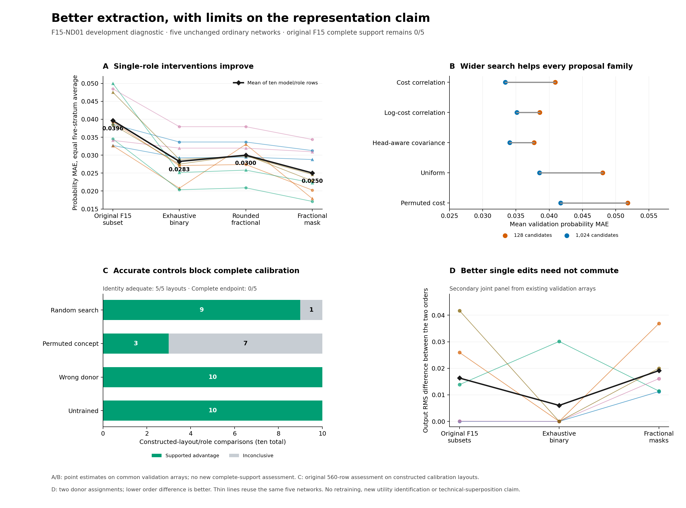

# F15-ND01: why the ordinary neural intervention probe did not establish support

Contributor: **ChatGPT (GPT-6 Astra Pro)**, with attributed calibration,
search, relaxation, representation and independent protocol/statistics
collaborators. October 5, 2026 UTC. Source revision:
`9f42a047126618b0364cf334002f846e5839d726`, observed on GitHub main at entry.

**The registered diagnostic executed successfully, without retraining the
five ordinary networks. Concrete contributing limitations supported by evidence are
limited extraction search and a demanding complete endpoint that also tests
superiority over capable controls.** Fractional replacement adds a smaller,
consistent accuracy gain beyond exhaustive eight-coordinate search, but its
improved single-role edits do not establish a joint two-cost representation.

**Ordinary training gives the network no task-specific reason to organize its
features into one clean eight-neuron block for each expected cost.** It rewards
the final predictions, leaving the internal decomposition underdetermined.
The original probe therefore tested whether the learned representation was
accessible to its particular extraction procedure as well as whether the task
was learned. Mixed features, distributed directions, or another decomposition
of the same computation are plausible. These results do not identify
technical superposition as the cause in these networks.

F15's original **0/5 complete identity intervention support remains unchanged**.
ND01 is a separately frozen **development diagnostic**, not an F15 retry or a
new confirmatory pass. The original retention results and the bounded C4-S
synthesis/application contribution are unaffected. A/B retain their scoped
passes; F16 and Gates C/D remain unattempted. Protected Research90 accounting
and final task closure are recorded in the [work log](../work_logs/F15_ND01_2026-10-05_S1.md).



The [standalone PDF](F15_ND01_analysis/figures_v3/diagnostic_overview.pdf)
uses the same checked data. Thin lines reuse the five fixed networks; neither
role counts nor candidate counts are independent trained-model replications.

## 1. Questions, methods and exposure discipline

The user selected a 90-minute diagnostic to distinguish several explanations
for the original negative complete endpoint: insufficient search, the
eight-coordinate restriction, inadequate endpoint sensitivity, and imperfect
ordinary task learning. The [ND01 protocol](neural_diagnostic_v1/protocol.md),
[configuration](neural_diagnostic_v1/config.json) and
[freeze](neural_diagnostic_v1/freeze.json) were fixed before new discovery or
validation results. The exhaustive binary arm was prospectively added before
that freeze because the finite search space was tractable. Its earlier draft
configuration is preserved; it was not added in response to outcomes.

| Arm | Fixed design | What it can establish |
|---|---|---|
| Complete-endpoint calibration | Five positive rescalings/permutations of one constructed cost network; the original four hypotheses, five alignment/control families, two roles, 128 candidates and 560-row assessment | Whether known useful structure is recognized by the complete endpoint, including its control-advantage requirements. These are five layouts of one function, not five ordinary training replications. |
| Wider coordinate search | The five original networks; five proposal families; nested 128/1,024 candidate pools; original MSE and worst-normalized selectors | Whether better eight-coordinate interventions were available to a bounded search. All 20 variants are reported. |
| Fractional and exhaustive binary masks | The same networks and paired discovery/validation inputs; native output weights retained; mask mass eight | A matched finite logit-MSE comparison between all binary size-eight masks and their fractional relaxation. Rounding and the original F15 masks are also retained. |

New ordinary training steps and new ordinary training labels: **zero**.
Cost-derived counterfactual targets were used for alignment discovery, as the
diagnostic specifies. That is distinct from supervising the original neural
training with expected-cost labels. The calibration network was deliberately
constructed and is explicitly separate from ordinary training evidence.

The numerical runtime was **CPython 3.12.14, NumPy 2.3.5, Linux x86_64**, with
`OMP_NUM_THREADS=1 OPENBLAS_NUM_THREADS=1 MKL_NUM_THREADS=1` set before Python.
No PyTorch was required. The C++ enumerator was built with g++ 13.3.0 and
`-O3 -std=c++17 -ffp-contract=off -fno-fast-math`; its executable, source and
build record are registered. This records the actual environment and does
not promise bitwise equality across arbitrary hosts.

| Binding | SHA256 |
|---|---|
| Original F14 manifest, 34 files | `b860021d3cb26705196b75d6b13277135d0c9220c266b21e05d7d11e719b2f9c` |
| ND01 manifest, 47 files plus five source preparations | `9c15af55b83d7edf134542a9c70bcc0f087c6f4f6491f993361a27493b5cf24c` |
| ND01 configuration | `d65ffe53ca95362599cc785495676a0e84bf003278d760e92a2a7bf8cba1667a` |
| Preparation completion | `5d79d2684c18e1b1a8ecd9e962efb952ff517ea4945ccd2a7d34051d9a82962a` |
| Evaluation completion | `2ad2bd351392800fe2268c2faffa40d17a4b7b012fa8cf92af0cb14ae2f4fc92` |
| Core descriptive summary | `5f51177477784de4af33796cf519108f044412c11da1ab787c8601ab0fbb9043` |
| Supplementary mechanism results | `5f351b68d31d22b28e590827816005774e6bc4a61cb423425c6caf1c00080c1f` |
| Selection/control-ceiling diagnostic | `1789775da6b3167e0b14be6ae288f8dc519287d882adb32050181666d146b958` |

The ND01 freeze was written at **16:57:25.738438 UTC**. All **15** preparations
were durably saved, hashed and validated before any new validation population:
five calibration layouts, five ordinary search records and five ordinary
mask records. The final individual preparation was saved at **17:02:08.307771**;
preparation completed at **17:02:14.636223**. A separate reread/verification
completed at **17:03:51.595642**. The evaluator's global 15-unit gate passed at
**17:04:36.565220**, the durable exposure marker followed at
**17:04:36.568886**, and the first evaluation unit began at
**17:04:36.570270**. All evaluations completed at **17:04:57.737900**.

Both stages completed on **attempt 1**, with exit 0 and no scientific retry.
No completed unit was overwritten. The one-unchanged-retry contract was not
used. No retention experiment was repeated. The five original source model
artifacts remain byte-identical, as do both experimental freezes.
[Preparation manifest](../work_logs/F15_ND01_v1_run1/preparation_complete.json),
[exposure marker](../work_logs/F15_ND01_v1_run1/evaluation_start.json),
[completion manifest](../work_logs/F15_ND01_v1_run1/evaluation_complete.json),
[readiness audit](../work_logs/F15_ND01_2026-10-05_S1/audit_readiness.md).

## 2. The calibration changes what 0/5 means

The constructed layouts contain a known cost decomposition and a known
eight-coordinate oracle per role. The actual alignment search was not given
those oracle subsets. It used the original extraction protocol; the oracle
was evaluated separately as an accuracy calibration.

| Calibration requirement | Result |
|---|---:|
| Complete identity endpoint | **0/5 layouts** |
| Searched identity adequacy | **5/5 layouts** |
| Identity intervention MAE upper-bound requirements | **50/50 supported** |
| Identity near/far decision upper-bound requirements | **20/20 supported** |
| Same-subset scale comparisons | **30/30 supported** |
| Known-oracle uniform error bound | **50/50 cells hold** |
| Searched subset exactly equals the known oracle | **2/10 roles** |

The searched mean identity MAE is approximately **0.007244**, averaged over
the five layouts, two roles and five strata. The separate known-oracle mean
is **0.001351**, with maximum absolute error **0.005967**. Thus the calibration
has both deliberately available structure and useful structure recovered by
the actual search. It still obtains zero complete outcomes.

The blocker is the required superiority over each matched optimized control:

| Identity control | Supported .01 advantage | Inconclusive | Violated |
|---|---:|---:|---:|
| Random search | 9/10 roles | 1/10 | 0/10 |
| Permuted-concept search | 3/10 | 7/10 | 0/10 |
| Incorrect donor | 10/10 | 0/10 | 0/10 |
| Untrained network | 10/10 | 0/10 | 0/10 |

This is not simply a false-positive control behaving irrationally. The random
and permuted-concept searches still rank candidates primarily by the actual
counterfactual intervention objective. Permuting the concept weakens the
proposal/decoder route, but does not remove the correct intervention target
from that primary selection objective. A capable control can therefore find
real structure. Failing to beat it is meaningful evidence against the
claimed extraction advantage; it is not evidence that useful structure is
absent.

The saved-statistic ceiling makes the issue precise. For a fixed observed
control,

```math
\Delta=\mathrm{MAE}_{control}-\mathrm{MAE}_{aligned}
\leq\mathrm{MAE}_{control}.
```

The frozen pooled paired-advantage radius is **0.022115658601168407**. To
achieve a lower bound of .01, even a hypothetical zero-error aligned
intervention needs observed control MAE at least **0.03211565860116841**.
Seven permuted-control roles and one random-control role fall below that
ceiling. **Every constructed layout has at least one such blocker.** For
these saved controls and this fixed radius, improving only aligned accuracy
could not make any layout complete.

This is a conditional arithmetic bound, not a new support test or an estimate
of future control behavior. Confidence width is not the whole explanation:
if all intervals are collapsed to their observed means, only **1/5** layouts
meets the complete conjunction. Increasing sample counts cannot be assumed
to fix a missing point-level .01 advantage. All 560 original interval rows,
including unfavorable rival outcomes, remain in the record: **383 supported,
136 inconclusive and 41 violated** across the whole calibration family.
[Core summary](F15_ND01_analysis/core_summary.json),
[all calibration cells](F15_ND01_analysis/calibration_rows.csv),
[independent interval audit](../work_logs/F15_ND01_2026-10-05_S1/audit_calibration_saved.json),
[control-ceiling derivation and all records](F15_ND01_analysis/selection_diagnostics.md).

The complete endpoint remains a valid record of its prespecified conjunction.
The diagnostic shows why interpreting it as a simple count of networks with
or without expected-cost representations would be too strong.

## 3. Better interventions were present in the unchanged ordinary networks

The methods below use the same new validation pairs. MAE averages each of
five strata equally, then the two roles and five fixed models equally.
“Point-adequate” requires all five role-level MAEs at most .05, near decision
disagreement at most .35, and far disagreement at most .10. It does **not**
apply confidence bounds or the full matched-control/scale conjunction.

| Existing/fitted intervention | Mean MAE | Near disagreement | Far disagreement | Equal-target effect RMS, mean role | Point-adequate roles | Models with both roles point-adequate |
|---|---:|---:|---:|---:|---:|---:|
| Original F15 selected subset | 0.039626 | 0.354932 | 0.001062 | 0.038405 | 3/10 | 0/5 |
| Exhaustive binary, eight coordinates | 0.028251 | 0.291992 | 0.000085 | 0.030631 | 9/10 | 4/5 |
| Top-eight rounding of fractional mask | 0.029993 | 0.308508 | 0.000134 | 0.031772 | 9/10 | 4/5 |
| Fractional mask, total mass eight | **0.025032** | **0.257288** | **0** | **0.026838** | **10/10** | **5/5** |

Fractional masks improve mean probability MAE in **all ten roles** relative
to each other method in this table. The exhaustive binary improvement is
already substantial while retaining the original kind of eight-coordinate
intervention. Approximately 78% of the pooled original-to-fractional MAE
reduction occurs by the exhaustive-binary step, with about 22% added by the
fractional step. This is descriptive arithmetic, not a causal allocation of
failure percentages: the original alignment and the diagnostic also differ
in discovery data and objective.

The exhaustive and fractional arms do share an objective and discovery
arrays. With native head weight `v`, the design matrix is
`A_ij=v_j(h_j(d_i)-h_j(b_i))`, and the target is the desired logit change
relative to the actual base network. Both minimize `mean((A m-target)^2)`.
Exhaustive search visits all **10,518,300** size-eight masks per role, totaling
**105,183,000**. It resolves this finite float64 logit quadratic, with a direct
residual recomputation; it is not a certified exact-real optimum, probability
MAE optimum or population-wide optimum.

The fractional mask is feasible under `0<=m<=1, sum(m)=8`. Seven of ten
optimizers reached the declared first-order gap of `1e-8`; three reached the
fixed iteration cap. The largest remaining gap is **6.577368e-8**. All ten
feasible fractional objectives are below the exhaustive binary minimum, by
**0.001296–0.011339** discovery logit MSE. Their saved attained values are
reported even where convergence tolerance was not reached. Total iterations:
**52,224**. There are 3–10 fractionally weighted coordinates per role using
the recorded `1e-10` classification tolerance, in
addition to any fully selected ones; mass eight is not eight active neurons.

The three capped solutions remain feasible and already attain lower values
than their exhaustive binary comparators. Their convergence status therefore
does not erase the observed finite-objective advantage. It leaves a small
numerical optimization uncertainty, with no extra iterations or attempt
selected after validation.

The larger family can average several imperfect binary logit edits. That is
a useful operational improvement, but it can occur without finding a clean
feature or a rotated orthogonal subspace. The fractional method keeps the
native output weights and does not become an unconstrained retrained decoder.
[All mask cells](F15_ND01_analysis/mask_rows.csv),
[optimizer certificates and role rows](F15_ND01_analysis/core_summary.json),
[derivation](F15_ND01_analysis/mechanism_derivation.md).

### Ordinary and negative baselines remain visible

All five original models had passed F15 task readiness. Their new development
task MAE averages **0.014964**, ranging **0.012278–0.018941**; this is not a new
formal readiness assessment. All 50 conditional-base point MAEs are below
.05. On common conditioned pairs:

| Stratum | Ordinary base MAE against its own target | No-swap MAE against intervention target | Whole-layer swap MAE against intervention target | Fractional intervention MAE |
|---|---:|---:|---:|---:|
| Mixed near | 0.014964 | 0.147176 | 0.147402 | 0.021854 |
| Mixed far | 0.015232 | 0.150036 | 0.149481 | 0.029438 |
| Preserve other cost | 0.015192 | 0.147835 | 0.015366 | 0.023622 |
| Equal target cost | 0.015176 | 0.015176 | 0.148019 | 0.022674 |
| Scale separating | 0.015406 | 0.164842 | 0.140857 | 0.027571 |

Whole-layer replacement is already a good comparator on preserve-other
pairs, because the donor's full answer then equals the intended target.
Doing nothing is already appropriate on equal-target pairs. The mixed and
scale-separating strata prevent those easy special cases from supplying the
whole interpretation. Near-boundary pairs deliberately have target
probabilities within .04 of .5, so small absolute errors can still flip many
decisions. Zero observed far disagreement is conditional on that easier
margin, not a general error-free claim.

## 4. Search coverage, selector choice and a useful negative outcome

Every proposal family benefited in aggregate from increasing the original
MSE selector's budget from 128 to 1,024. No role-level mean MAE became worse
in those five nested-budget comparisons; some were unchanged.

| Proposal family | MAE at 128, original MSE selector | MAE at 1,024, original MSE selector | MAE at 128, robust selector | MAE at 1,024, robust selector |
|---|---:|---:|---:|---:|
| Cost correlation | 0.040887 | **0.033379** | 0.042876 | 0.037716 |
| Log-cost correlation | 0.038585 | 0.035146 | 0.040567 | 0.038357 |
| Positive native-contribution covariance | 0.037712 | 0.034045 | 0.039456 | 0.036929 |
| Uniform | 0.048030 | 0.038540 | 0.048262 | 0.038879 |
| Permuted cost correlation | 0.051828 | 0.041721 | 0.052187 | 0.042474 |

At 1,024, native-contribution covariance reaches 9/10 point-adequate roles
and 4/5 models, while cost correlation reaches 8/10 and 3/5. Cost correlation
has the smaller overall mean MAE. These criteria do not select one universal
winner. All 20 variants and all 1,000 cells are available in
[search_rows.csv](F15_ND01_analysis/search_rows.csv) and the core summary.

The logarithmic contribution identity does not make a log-cost correlation
proposal uniformly superior. It improves this aggregate at budget 128, but
cost correlation is better at 1,024. A proposal's marginal correlations do
not encode every interaction or cancellation in the selected native-head
sum. The observed budget effect is more consistent across families than the
benefit of this particular proposal change; a favorable theoretical scale
alone does not choose the best finite extraction heuristic.

The saved pools can be rescored by the *same* logit objective used for the
exhaustive comparison, without selecting or evaluating a new winner. For
each pool,

```math
f(\text{selected})-f(\text{global})
=[f(\text{selected})-f(\text{best in pool})]
 +[f(\text{best in pool})-f(\text{global})].
```

The first term is a selection/objective gap; the second is candidate coverage.
**All 100 distinct pool prefixes miss the exhaustive optimum.** For the
original-style cost-correlation family at 128, the selection/objective gap is
exactly zero in every role, while the mean coverage gap is **0.025980**.
At 1,024, the corresponding means are **0.00002584** and **0.00923324**.
Thus candidate coverage directly explains that finite-objective shortfall;
it is not merely an inference from comparing different selection objectives.
The supplementary analysis does not adopt a post-hoc pool winner on validation.

The proposed robust selector is a visible negative result. It minimizes a
maximum of stratum MAE and near/far disagreement, normalized by their point
thresholds. It gives **worse aggregate validation MAE in all ten family/budget
comparisons**. It changes 41 of 100 selected subsets; every change improves
the discovery worst-normalized objective, but validation on that same
worst-normalized objective improves for only 10 and worsens for 31. The
remaining 59 retain the same subset. Nine of ten
group averages worsen on the validation worst-normalized objective as well.

This measured discovery/validation reversal is consistent with noisy
selection on 128 examples per stratum, especially maximum and thresholded
statistics. It does not uniquely identify overfitting rather than finite
sample variability and objective tradeoffs. These 100 comparisons reuse five
models and overlapping pools; they are not 100 independent trials.
[Selection diagnostic](F15_ND01_analysis/selection_diagnostics.json),
[mechanism results](F15_ND01_analysis/mechanism_results.json),
[independent mechanism audit](../work_logs/F15_ND01_2026-10-05_S1/audit_mechanism_results.md).

## 5. What the improved results do and do not say about representation

### 5.1 Ordinary optimization permits another computational decomposition

For this task, `eta=.5+(x1+x2)/8`, `J0=cFN*eta`, and
`J1=cFP*(1-eta)`. The ordinary conditional weighted cross-entropy has optimum

```math
p^*=\frac{J_0}{J_0+J_1},\qquad
\mathrm{logit}(p^*)=\log c_{FN}-\log c_{FP}
                         +\log\eta-\log(1-\eta).
```

That final function can be understood in terms of two price contributions
and one probability-odds contribution. It need not be organized as one
neuron block computing `log J0` and another computing `-log J1`. The
probability factor is shared between the costs; extracting a clean individual
cost can require a different decomposition from the one useful for predicting
the final answer. This is a concrete version of the user's explanation,
without assuming that the networks necessarily have that alternative form.

ReLU has privileged neuron axes, so arbitrary hidden rotations are not exact
parameter symmetries of the architecture. Nevertheless, the task loss does
not select this particular cost partition. Established distributed alignment
methods motivate testing a different intervention basis. Technical
superposition requires more specific evidence about feature compression and
interference than this diagnostic supplies.
[Checked primary sources and comparison scope](F15_ND01_analysis/primary_literature.md).

### 5.2 Baseline error and isolation error are distinct and can cancel

For a selected native contribution `phi_m=sum(m_j v_j h_j)`, define ordinary
base logit error `e=z-z*` and role residual `r=phi_m-ell_role`, where
`ell_0=log J0` and `ell_1=-log J1`. Exactly,

```math
z_{intervention}-z_H=e(base)+r(donor)-r(base).
```

The corresponding mean squared logit error includes a cross term. On the
existing validation pairs, equal-weighted averages are:

| Method | Base-error MSE | Residual-change MSE | Twice cross moment | Total logit MSE |
|---|---:|---:|---:|---:|
| Original subset | 0.007301 | 0.047217 | -0.006530 | 0.047988 |
| Exhaustive binary | 0.007301 | 0.024240 | -0.006410 | 0.025131 |
| Fractional | 0.007301 | 0.019602 | -0.006423 | 0.020480 |

The substantial improvement is in the contribution-isolation term, while
ordinary weights and the base-error term remain fixed. Baseline approximation
still matters. The negative cross terms prevent a simple additive percentage
attribution of total error to learning versus isolation. They also mean
ordinary base error is not a universal lower bound on intervention error.
More training could change both terms; improvement of the full interpretation
is not guaranteed merely by decreasing ordinary loss.

### 5.3 The improved fractional edits are not a demonstrated joint abstraction

On a secondary panel assembled from already generated validation arrays,
the two independently fitted masks have the following behavior. This panel
is not claimed to satisfy a frozen joint stratum, and no new confidence
claim is assigned to it.

| Pair of role interventions | Models with nonzero observed order difference | Mean order probability RMS | Joint MAE, role 0 then 1 | Joint MAE, role 1 then 0 |
|---|---:|---:|---:|---:|
| Original subsets | 4/5 | 0.016329 | 0.049927 | 0.049095 |
| Exhaustive binary | 1/5 | **0.006024** | 0.031312 | 0.031351 |
| Fractional masks | 5/5 | 0.019126 | 0.032132 | **0.028377** |

For diagonal masks, the exact hidden-state order difference is
`M0*M1*(donor1-donor0)`. The output-head identity is verified to floating-point
precision. Fractional masks can improve single-role accuracy while producing
more order dependence than the binary alternatives. One favorable joint
order should not be selected after seeing both.

A further explicitly post-outcome calculation uses only saved discovery
quadratic moments. Repeating the same fractional edit produces additional
logit RMS change **0.038512–0.130179** across the ten roles. Binary masks
are structurally idempotent. The fractional drift is
`v^T M(I-M)(donor-base)` and its squared mean is computed from the stored
Gram matrix. This is not another validation population or acceptance test.
[Repeatability outputs](F15_ND01_analysis/repeatability.json),
[joint algebra and scope](F15_ND01_analysis/intervention_algebra.md).

### 5.4 Even a good subspace output effect would not identify a unique feature

All five networks have exactly certified inactive coordinates over the whole
declared input box: counts **2, 2, 3, 3, 3**. The certificate uses exact
rational corner bounds for the real-valued ReLU function with the stored
binary64 coefficients, rather than a finite-sample rank estimate.

For a scalar head, an orthogonal projector's effective coefficient `q=Pv`
obeys `q^T v=||q||^2`. A fractional coefficient usually fails that equality
on the full hidden space. An activation-difference null direction can shift
the coefficient onto this sphere while preserving its output effect on all
allowed differences. The deterministic supplementary construction does this
for every role, using an inactive coordinate. Ten rank-one projectors match
the fractional validation logit effects to at most **2.75e-16**.

This is an algebraic output-equivalence construction, **not a DAS training
result or newly identified learned cost representation**. The two constructed
role projectors are not mutually orthogonal, and no claim is made that this
construction provides a compatible common basis. The example explains why
a good subspace score alone would still require interpretation. The primary
literature contains both cautions about dormant-path patching and criticism
of treating every nullspace effect as an invalid explanation. ND01 does not
resolve that debate; it establishes the local underidentification and keeps
the semantic claim narrow.

### 5.5 Compatible replacements can exist without resolving the semantic question

An optional algebraic question was explicitly selected after the core results,
within a twenty-minute sub-budget of Research90: can the *existing* pair of
mask effects be reproduced by two mutually orthogonal subspaces over the
**entire declared input box**, rather than just the saved pairs? This did not
fit another alignment, generate data, score a new validation method or begin
the proposed ND02 experiment.

The exact affine bounds and distinct interior ReLU kink hyperplanes certify
complete activation-difference ranks **30, 30, 29, 29, 29**. The complementary
directions are precisely the inactive coordinates already identified. Using
that certificate, a two-sphere calculation gives a necessary and sufficient
condition for compatible output-equivalent projector coefficients. All twenty
current cases use the rational central branch, so their classifications do
not depend on a numerical optimizer or rounded square-root comparisons.

| Existing pair of mask effects | Models admitting compatible projectors | Models not admitting exact reproduction |
|---|---:|---:|
| Original F15 subsets | 2/5 | 3/5 |
| Exhaustive binary subsets | 4/5 | 1/5 |
| Rounded fractional masks | 3/5 | 2/5 |
| Fractional masks | **4/5** | **1/5** |

Explicit deterministic rank-one projector pairs are saved for all thirteen
feasible cases. Their largest checked algebra/coefficient discrepancy is
**2.23e-16**. Each pair can also be extended to two disjoint rank-eight
subspaces without changing its effective output coefficients, by adding
directions orthogonal to the head and the two existing coefficients. That
extension is an existence argument, not a newly fitted eight-dimensional
representation. The sole infeasible fractional pair is model index 1, whose
exact compatibility margin is approximately **−0.039148**.

The four feasible fractional cases do not contradict the measured order
dependence of the actual fractional edits. Matching outputs when either role
is edited from an ordinary base state leaves behavior on already edited
intermediate states undetermined. The compatible constructions resolve that
low-level algebraic issue for those effects, but their joint agreement with
the intended two-cost semantics has not been established. The infeasible
case excludes exact reproduction of that fixed pair in this metric; it does
not exclude a different approximately useful joint alignment.

The **stored Euclidean metric and inactive directions are material limits**.
Positive rescaling of an inactive ReLU unit and reciprocal rescaling of its
head weight preserve the ordinary network function and coordinate-mask
effects. They can nevertheless change this Euclidean feasibility condition.
With at least two null directions and a nonzero inactive head component,
sufficiently strong such rescaling makes any fixed finite pair in this
calculation feasible. Conversely, removing those inactive directions leaves
a full activation-difference span; a strictly fractional coefficient with
positive sphere deficit then has no exactly equivalent orthogonal projector
within that restricted space, even for one role.

No weights were rescaled or removed here. These analytic observations explain
why the next experiment must fix geometry and treatment of inactive units
before validation. An attractive projector construction alone would not
identify the network's unique or natural cost representation.
[Exact proof and scope](F15_ND01_analysis/joint_feasibility.md),
[rational results](F15_ND01_analysis/joint_feasibility.json),
[explicit witnesses](F15_ND01_analysis/joint_witnesses.json),
[independent rational audit](../work_logs/F15_ND01_2026-10-05_S1/audit_joint_feasibility.md),
[independent witness audit](../work_logs/F15_ND01_2026-10-05_S1/audit_joint_witnesses.md).

A final interpretation derivation makes the remaining error question precise.
For a common base and two donors under compatible projectors, joint logit
error equals `individual_error0 + individual_error1 - ordinary_base_error`.
Valid norm bounds require all terms to use the same triple distribution's
marginals. A small algebraic example has perfect ordinary predictions and
both single-role probability errors below .05 uniformly, yet combined error
above .05. It is a tolerance counterexample, not a sixth trained model or a
new evaluation arm. Thus even compatible low-level operations do not grant
the joint edit the same error tolerance automatically.
[Derivation, exact rational bounds and scope](F15_ND01_analysis/joint_semantic_error.md).
[Illustration output](F15_ND01_analysis/joint_semantic_error_example.json) and
[independent derivation audit](../work_logs/F15_ND01_2026-10-05_S1/audit_joint_semantic_error.md)
preserve the calculation separately from the five-model results.

## 6. Hypothesis dispositions

| Explanation of the original incomplete endpoint | Diagnostic disposition | What remains uncertain |
|---|---|---|
| The complete endpoint demands more than useful cost correspondence | **Directly supported.** Known constructed layouts have adequate searched identity interventions and scale discrimination, yet all fail the control-advantage conjunction. | The calibration does not assign every ordinary-network failure to selectivity; original ordinary-network intervention adequacy was also not established. |
| Too little candidate coverage | **Directly supported for this fixed search/objective family.** All pools miss the exhaustive optimum; wider search improves validation. | Exhaustive finite logit optimization is not population-optimal probability MAE or a universal search result. |
| Binary coordinate extraction is restrictive | **Supported as a local operational limitation.** The fractional family beats the exhaustive binary discovery minimum and improves every validation role's mean MAE. | The gain can reflect averaging; it neither demonstrates superposition nor establishes a faithful rotated/joint representation. |
| The worst-stratum selector would improve the result | **Not supported in this attempt.** Its aggregate validation MAE is worse in all ten groups. | A differently powered or regularized prospective selector could behave differently. No rescue tuning was performed. |
| Ordinary training is simply inadequate | **Not a sufficient explanation of this record.** All five original models were task-ready, and interventions improve without training. | Baseline error remains nonzero; additional training could help or change feature organization. |
| More evaluation data alone would fix complete support | **Not established.** Calibration has point-level as well as interval-level selectivity limitations. | Different future means/counts have not been observed; the frozen result cannot be repaired by extending its sample. |
| The networks lack all expected-cost representations | **Unsupported inference.** Restricted-search failure cannot establish that universal negative. | A useful joint abstraction may or may not exist under a broader, explicitly defined family. |
| Technical superposition is the demonstrated cause | **Not established.** It remains a possible specialized explanation, beyond the broader accessibility concern. | No feature-count/interference diagnosis was performed. |
| Better individual scores already establish a coherent joint representation | **Not established.** The literal fractional edits drift on repetition and show order effects. Alternative compatible projectors reproduce their individual effects in four models. | Their joint cost semantics are untested; the existence calculation depends on the declared metric and inactive directions. |

The most defensible practical diagnosis is therefore layered. The original
search did leave useful intervention correspondence undiscovered. The
eight-coordinate family has an additional measured accuracy limitation on
the matched diagnostic objective. The complete criterion also asks for a
selective advantage that accurate extraction does not guarantee. These
findings reduce the need to invoke failure of ordinary learning as the sole
explanation, while leaving its nonzero approximation error visible. They do
not give numerical probabilities to competing explanations or allocate a
percentage of the original failures to each cause.

A recurrence aimed only at a better score could exploit the demonstrated
search improvement. A recurrence aimed at stronger understanding should
instead test whether one declared pair of cost variables has coherent,
generalizing intervention behavior. That is why the optional next neural
chunk targets a joint abstraction on the unchanged networks, rather than
assuming that more ordinary training, a logarithmic proposal, more evaluation
samples or a different confidence threshold would resolve the interpretation.

## 7. Resource costs, verification and every attempt

The external recorder measures whole child processes; the runner also records
narrower nested scientific regions. These scopes must not be summed. CPU
seconds, principal engaged minutes and idle tool waits are separate quantities.

| External command | Attempt | Exit | Wall seconds | Child CPU seconds | Peak RSS, KiB |
|---|---:|---:|---:|---:|---:|
| Preparation | 1 | 0 | 83.015488 | 82.951811 | 176,380 |
| Pre-evaluation all-unit verification | 1 | 0 | 3.855591 | 3.832545 | 226,268 |
| Evaluation | 1 | 0 | 25.541099 | 25.515367 | 358,016 |
| Supplementary same-array mechanism reconstruction | 1 | 0 | 7.794540 | 7.784869 | 232,960 |
| Post-outcome repeatability from saved moments | 1 | 0 | 0.118125 | 0.117703 | 23,996 |
| Exact joint-feasibility classification | 1 | 0 | 0.204879 | 0.204518 | 20,764 |
| Deterministic compatible-projector witnesses | 1 | 0 | 0.259737 | 0.259321 | 28,576 |
| Final read-only freeze and reproduction checks | 1 | 0 | 10.169906 | 10.167239 | 236,672 |

Inner preparation uses **82.338060 wall / 82.285513 parent-plus-native-child
CPU seconds**; the latter includes **0.938807 native enumeration CPU seconds**.
Inner evaluation uses **21.172718 wall / 21.148612 CPU seconds**. These are
included in the external costs above. Calibration's oracle-only cost is a
separate nested `oracle_known_subset_accuracy.resource` field, in addition
to the calibration evaluator's main `resource` field; it is already included
in the stage total. It reuses the same pairs and must not be counted as
additional independent evaluation data.

The study records **25,600 calibration candidate scores**, **51,200 ordinary
search candidate fits/scores**, **105,183,000 exhaustive binary subset visits**,
and **52,224 fractional iterations**. Shared-pool reuse avoids counting
115,200 logical search scores as 115,200 actual executions. The supplementary
reconstruction recomputes 51,200 saved candidate logit scores and regenerates
only **6,400 existing discovery pairs and 409,600 existing validation pairs**,
checking all corresponding hashes. It introduces zero independent populations
and zero new fits. Repeatability and selection diagnostics use saved moments
or statistics only.

The exact joint-feasibility and witness calculations also perform zero model
forwards, new fits and population generations. They inspect saved weights and
masks. Their twenty feasibility classifications and thirteen witnesses are
analytic outputs, not additional neural replications or acceptance outcomes.

Independent checks pass for all **103 run JSON files**, the 15-unit exposure
ordering, all 560 calibration intervals and the descriptive tables. The
saved-output audit has **46,840 checks**, independent calibration reconstruction
**9,214**, core-summary reconstruction **5,359**, and supplementary mechanism
audit **5,250**. These are audit assertions, not scientific sample counts.
The mechanism auditor independently checks saved quadratics, source weights,
decompositions and coefficient algebra; it does not claim to have independently
regenerated the unsaved joint panel's exact RMS/MAE. Generic primitive and
enumerator checks preceded scientific execution. Collaborating review is
separately attributed and supplies no additional principal minutes.
The independent whole-box feasibility audit passes **3,625 checks**, including
all 160 exact affine bounds, 2,003 distinct hyperplane pairs and twenty rational
classifications. Audit counts measure verification work, not evidential power.
The independent witness audit passes **452 checks** on the thirteen pairs,
using compensated scalar products rather than repeating their constructor.

| Failure or limitation | Disposition |
|---|---|
| Scientific preparation/evaluation | Both first attempts succeed; no stage failure or retry. |
| Pre-freeze drafting | A missing closing bracket in the search module and one rejected malformed runner patch were corrected before freezing or scientific execution. A provisional synthetic node-count description was corrected against the executable count. |
| Saved-output audit schema | An event reference hash was initially treated as the containing object's hash. The first reporting audit is preserved; its reader was corrected, without changing raw data. |
| Core-summary audit path | A read-only CSV inspection used the wrong directory and raised `FileNotFoundError`; the corrected saved-output audit passes. |
| Mechanism audit status | An audit expected `complete` rather than the actual `preparation_complete`/`evaluation_complete` status strings. The first source/output is preserved; correcting only that assertion gives 5,250 passing checks. |
| Root reporting | One context-sensitive prose patch was rejected without editing a file. One inline aggregate inspection used `variant` instead of the actual `method` key and raised `KeyError`; its schema clarification is preserved. |
| Figures | Three successful renders use identical numerical inputs. The first had clipped/overlapping labels; the second left a legend too close to data; the final layout is visually checked. Earlier renders, renderers and manifests are retained. These are formatting revisions, not scientific retries. |
| Mathematical-note link check | A naive link expression misread a formula as a link; the mathematical text was unchanged and a math-aware check passed. |
| Literature access | Failed early full-text/version opens and an irrelevant search are recorded in the principal literature note; working primary full texts were subsequently read. |
| Historical Windows limitations | Original CRLF differences, three native access violations and the distinct frozen path-portability defect remain recorded. The crashes are not a hardware diagnosis; no frozen Windows test was edited and no new Windows/full-repository pass is claimed. |

[Command records](../work_logs/F15_ND01_2026-10-05_S1/commands/),
[audit failures](../work_logs/F15_ND01_2026-10-05_S1/audit_failures.jsonl),
[root reporting failures](../work_logs/F15_ND01_2026-10-05_S1/root_failures.jsonl),
[scientific audit](../work_logs/F15_ND01_2026-10-05_S1/audit_saved_results.md).

### Reproduction without another scientific run

From the repository root:

```bash
export OMP_NUM_THREADS=1 OPENBLAS_NUM_THREADS=1 MKL_NUM_THREADS=1
python -m v2.experiments.freeze verify
python -m v2.experiments.neural_diagnostic_v1.runner verify
python v2/experiments/F15_ND01_analysis/summarize.py --check
python v2/experiments/F15_ND01_analysis/selection_diagnostics.py --check
python v2/experiments/F15_ND01_analysis/repeatability.py --check
python v2/experiments/F15_ND01_analysis/joint_feasibility.py --check
python v2/experiments/F15_ND01_analysis/joint_witnesses.py --check
python v2/experiments/F15_ND01_analysis/joint_semantic_error_example.py --check
```

The executed stage commands were:

```bash
python -m v2.experiments.neural_diagnostic_v1.runner prepare --out v2/work_logs/F15_ND01_v1_run1
python -m v2.experiments.neural_diagnostic_v1.runner evaluate --out v2/work_logs/F15_ND01_v1_run1
```

They are recorded for provenance, not instructions to launch another attempt
against completed markers. Mechanism reconstruction used
`python -m v2.experiments.F15_ND01_analysis.mechanism_analysis`; its exclusive
output guard preserves the completed analysis. Every reported supplementary
numeric result has a machine-readable artifact and a source hash.

## 8. Contribution, protected effort and recommended next work

**ND01 completes a diagnostic application, not a new neural support claim.**
Its useful local delta is separating limitations of the complete endpoint
and extraction procedure, demonstrating better individual correspondence,
and identifying a concrete remaining joint-intervention question. Coordinate versus distributed
accessibility, activation patching, convex relaxation, search calibration and
output underidentification have established antecedents. The formal work here
specializes those ideas to this fixed affine-head task. No worldwide-priority
search or distinct new general interpretability result is claimed.

| Contribution field | ND01's exact disposition |
|---|---|
| Object | Diagnosis of this fixed ordinary-network intervention implementation and its complete endpoint. |
| Type | Application of established calibration, bounded/exhaustive search, relaxation and intervention analysis; elementary formal specialization to the scalar affine head. |
| Local addition | A known-structure endpoint check; matched finite-objective binary/fractional comparison on unchanged networks; saved-pool coverage accounting; whole-box existing-effect compatibility and its semantic/error limits. |
| Magnitude | A useful, bounded diagnostic and small mathematical specialization. It does not introduce a new general representation method. |
| Evidence and comparison scope | All three registered arms and the explicitly labeled supplementary derivations; direct ordinary/matched comparisons; the four named interpretability sources and existing C4 comparison record. |
| Priority and project support | No independent novel-neural-finding or worldwide-priority claim is established. The project continues on C4-S's separately supported synthesis/application claim. |

**C4-S retains its bounded SUPPORTED synthesis/application disposition.**
Its object is the already specified integration of price-family retention,
repair and approximation consequences with source/consumer/reception
contracts, relative to the named inspected comparisons. ND01 neither
displaces that difference nor supplies an exclusive capability or arithmetic
speed advantage. The neural negative outcome was never automatically a novel
finding, and the new positive partial correspondences do not make it one.
If F16 displaces the exact C4-S difference, reopen R-N01-01 with a named
60/90-minute evidence target; do not manufacture a gate pass.

The selected chunk protects **90 measured D+L+E minutes**, with O and idle
waits separate. Its initial central forecast was D10/L10/E70/O10 = 100
engaged minutes; high D15/L15/E90/O15 = 135, R/X 60/40, waits 3/10 separately.
The scientific core was interpreted by the observed **17:28:32.095661 UTC**
checkpoint, at roughly 43.2 research minutes before final exclusion review.
The protected remainder was assigned to explicit mechanism, repeatability,
selection-generalization, interpretation and verification work, rather than
idle waiting or new validation tuning. Final measured research is
**90.797984 minutes** (D 32.501816, L 4.629884, E 53.666283),
plus **8.689412 O minutes**, for **99.487395 recorded engaged minutes**.
Actual R/X is 54.19/45.81 percent.
Waits (1.053788) and recovery (20.710532 minutes) are excluded.
All 949 prior ledger rows are preserved; the independent accounting audit passes
1,221 checks. Post-cutoff administration is explicitly unquantified/uncredited.
The [exact actuals](../work_logs/F15_ND01_2026-10-05_S1/actuals.json) retain
full precision and forecast errors.

**The 90-minute allowance was appropriate for the fully interpreted diagnostic,
though more than required for its core execution.** Its remaining effort added
specific discrimination between search, representation family, endpoint
selectivity and joint semantic accuracy. Further neural effort could test the
joint question below; it should not silently prolong this completed diagnostic.

The recommended next project task is **F16, fresh adversarial reconstruction,
D60**, with its own original 120/240 central/high estimates and a fresh
mode/lane forecast. It should challenge the source/consumer/reception
argument, the strongest ordinary combined baseline, the exact C4-S delta,
and the narrower neural interpretation in this report. ND01's collaborators
do not count as F16 and do not satisfy its derivation floor. No F16 work has
been executed in this diagnostic.

The optional neural continuation is **F15-ND02, Research90**, if selected:
test a joint two-cost abstraction on these unchanged networks using a common,
declared subspace geometry, known-structure calibration, matched controls,
single-role tests, repeated assignments and two donors. A concrete planning
split is D20/L10/E60 with O10 centrally; high D30/L15/E85/O15 = 145 engaged
minutes, R/X 50/50, waits 3/10 separately. Before any fresh validation, freeze
normalization, treatment of inactive coordinates, subspace ranks, budgets,
selection and acceptance rules; save all five fitted alignments first.
Report absolute adequacy and control superiority separately. This is a named
unstarted evidence chunk for the unresolved joint claim, not permission to
continue the present study indefinitely.

The project-level balance favors a fresh defense of the supported application
before a second consecutive neural expansion. POST-B-1 is cumulative from
N01, not restarted here: ND01 enters at **701.64299296445 engaged minutes**,
with **258.35700703555** remaining to the sixteen-hour checkpoint. Its actual
addition gives **801.130388 cumulative engaged minutes**, leaving
**158.869612** to sixteen hours. The append-only ledger and work log
preserve the entry balance and complete arithmetic. Broader ambition and stronger defense should both inform the next
checkpoint; a more attractive neural score is not a substitute for either.
