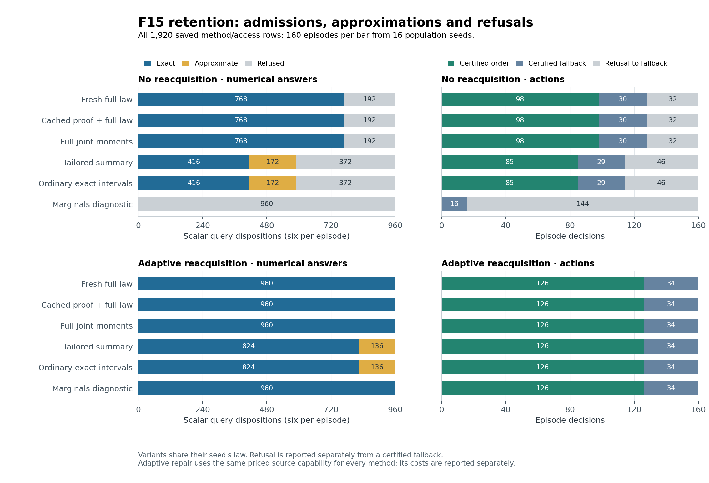
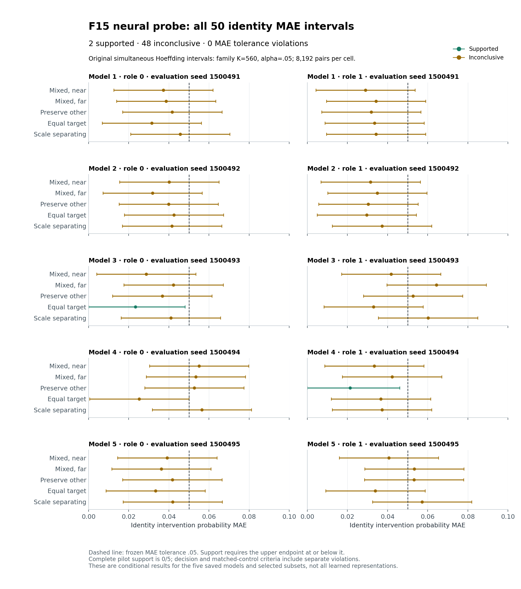
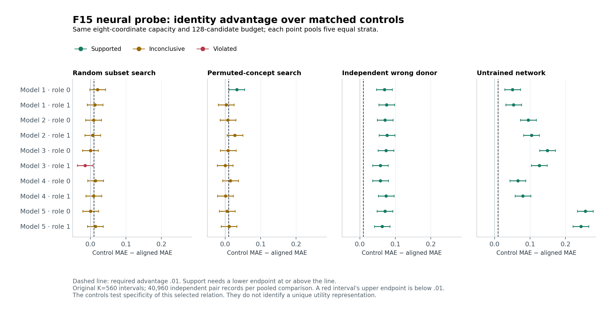

# F15: results of the frozen revision and neural challenge

Contributor: **ChatGPT (GPT-6 Astra Pro)**, with attributed collaborating
execution, exact-retention and neural-statistics audits. October 5, 2026 UTC
(October 4, America/Los_Angeles). Starting source revision:
`5388a3f9b0f18ad4f4e33d7e0cd04ea38f03e43e`.

**Scientific execution is complete: both stages completed on attempt 1.**
**F15 is complete at reporting scope, with E60 satisfied at 60.090886
measured minutes and 64.915803 total engaged minutes.**
The revision/retention application meets its frozen useful-application
criterion. All five ordinary-trained networks meet task readiness, but
**zero of five meet the complete expected-cost intervention criterion**.
One damaged aggregate has an exact, separately preserved recovery; the
original damaged file remains visible. Task accounting and final preservation
are recorded in the [F15 work log](../work_logs/F15_2026-10-04_S1.md).
The report's preservation revision is the Git commit returned by
`git log -1 --format=%H -- v2/experiments/results.md`; the final task handoff
supplies that exact hash and the observed push status. Command records bind
scientific execution to the F14 source revision above.

The result supports the bounded application of an existing method. It does
not establish an exclusive capability, speed superiority, a unique neural
utility representation, or worldwide priority. **C4-S retains its modest,
bounded synthesis/application disposition; Gates C/D are unattempted.**
This report and its collaborating checks are F15 work, not the fresh F16
reconstruction. [Frozen claim boundaries](protocol.md#1-questions-claims-and-limits-fixed-before-evaluation).

## 1. What was completed, and what the evidence supports

| Question | Disposition | Evidence and practical limit |
|---|---|---|
| Did the frozen challenge execute? | **Yes, with a documented storage exception and exact recovery.** | All five preparation units and 160 retention/five neural evaluation units completed; no scientific retry. The original aggregate is damaged, not silently replaced. |
| Are the recorded retention admissions correct on the stipulated cases? | **Supported on all recorded cases.** | 11,520 scalar intervals and 1,920 decision rows pass the frozen assessment and an independent rational saved-output audit. This is finite exact-source evidence, not deployment calibration. |
| Is the application criterion met? | **Yes.** | Useful native derivations occur in 68 distinct revision episodes across all 16 population seeds; 15 episodes include useful selective retention with an approximate selected cost and no reacquisition. |
| Does the native/selective route outperform ordinary information analysis? | **No exclusive or general performance claim is supported.** | All 960 baseline-facing equal-information pairs agree on ordinary results, native targets and acquisition behavior. Ordinary intervals reproduce the selective results. Full-law arithmetic is often much cheaper. |
| Did ordinary training learn the task? | **Yes, all five models.** | All five ordinary task and all 50 conditional-base MAE tests pass their registered upper-bound criteria. Training used binary outcomes, with no expected-cost labels. |
| Did the specified identity-cost intervention pilot succeed? | **No: 0/5 supported models; at least 4/5 required.** | Identity MAE has 2 supported and 48 inconclusive cells, with no MAE-tolerance falsification. Separate near-decision and random-control requirements each have one confidence-bound violation. |
| Is a competing scale established instead? | **No complete rival support.** | All four hypotheses and all controls remain reported. Some rival subset claims are falsified; other cells are inconclusive. No replacement hypothesis was selected on evaluation. |
| What contribution survives? | **C4-S, unchanged in type and bounded scope.** | Modest methodological synthesis/formal adaptation with small technical application extensions, relative to the named checked antecedents. This run adds application evidence; the neural null is not independently established as a novel empirical finding. |

Machine sources: [frozen retention assessment](../work_logs/F15_v1_run1/evaluation_attempt_1/retention_assessment.json),
[frozen neural assessment](../work_logs/F15_v1_run1/evaluation_attempt_1/neural_assessment.json),
[complete descriptive summary](F15_v1_analysis/summary.json),
[exact audit](../work_logs/F15_2026-10-04_S1/retention_output_audit.md),
[neural audit](../work_logs/F15_2026-10-04_S1/analysis_contract_audit.md).

## 2. Freeze, runtime and exposure record

### 2.1 Source and environment

The initial repository inspection found main at the supplied F14 commit and
no subsequent F15 output/attempt markers. A fresh Linux checkout with
`core.autocrlf=false` preserved the registered bytes. F14 was not repeated or
redesigned. Its development cases and full-count development neural run remain
development data and are excluded from every F15 denominator.

| Binding | Recorded value |
|---|---|
| Protocol | `F14-v1` |
| Frozen files | 34 |
| Manifest SHA256 | `b860021d3cb26705196b75d6b13277135d0c9220c266b21e05d7d11e719b2f9c` |
| Configuration SHA256 | `ea76f361eb1f2f055e6fa09096ba87fc5558bfe679982466e6de9543541d1918` |
| Preparation-complete manifest SHA256 | `89a97b417c5862cf6b5aaf31bc9e9b9933e90a526dc6b9af57e0c548426a3041` |
| Runtime | CPython 3.12.14; NumPy 2.3.5; Linux x86_64; neural binary64 and retention exact rational arithmetic |
| Numerical thread environment | `OMP_NUM_THREADS=1`, `OPENBLAS_NUM_THREADS=1`, `MKL_NUM_THREADS=1`, set before Python |
| Observed BLAS | OpenBLAS 0.3.30, one thread confirmed through `threadpoolctl` |
| Experimental output | `v2/work_logs/F15_v1_run1` |

The complete [environment record](../work_logs/F15_2026-10-04_S1/environment.json)
contains the interpreter, NumPy build and thread details. F15 requires no
PyTorch. The optional figure generator uses Matplotlib, separately recorded
in its [figure manifest](F15_v1_analysis/figures/manifest.json).

The user-supplied Windows limitations are preserved: six older dependency
files had CRLF differences; three focused-suite attempts ended in native
access violations; and
`test_dependency_closure_includes_parent_initializers_and_relative_imports`
has a distinct deterministic backslash/forward-slash portability mismatch.
None was repaired by changing a frozen file or registered hash. The crashes
are not a hardware diagnosis. The unchanged Linux focused suite passed
**78 tests** in this session. F14's broader record had two legacy imports
without PyTorch; no new full-repository or Windows pass is claimed.
[Execution audit](../work_logs/F15_2026-10-04_S1/execution_audit.md).

### 2.2 Commands actually executed

From the repository root, with the prescribed environment:

```bash
export OMP_NUM_THREADS=1 OPENBLAS_NUM_THREADS=1 MKL_NUM_THREADS=1
python -m v2.experiments.freeze verify
python -m unittest discover -s verification -p 'test_v2_f14*.py' -v
python -m v2.experiments.runner prepare --task F15 --out v2/work_logs/F15_v1_run1
python -m v2.experiments.runner evaluate --task F15 --out v2/work_logs/F15_v1_run1
```

The [external launcher](../work_logs/F15_2026-10-04_S1/launch.py) surrounds
these commands with exclusive start/end records, stdout/stderr, native return
codes, hashes, wall/CPU timing and RSS. It changes no experimental code and
does not retry commands automatically.

| Stage | Attempt | Native exit | External wall seconds | Child CPU seconds | Peak child RSS, KiB |
|---|---:|---:|---:|---:|---:|
| Freeze verification | 1 | 0 | 0.356669 | 0.356182 | 40,428 |
| Focused tests | 1 | 0 | 10.746994 | 10.736763 | 45,072 |
| Preparation | 1 | 0 | 7.628116 | 7.621769 | 44,020 |
| Evaluation | 1 | 0 | 184.274726 | 184.249148 | 248,364 |

These are process costs, not additional engaged research minutes. The frozen
runner's narrower measured work regions record preparation **7.321806 wall /
7.316302 CPU seconds**, and evaluation **183.776528 wall / 183.751241 CPU
seconds**. External startup/imports, preflight and marker I/O outside the inner
timers, and process exit account for the scope difference.
Native substage times are nested diagnostics and are not added to their
parent timers. [Command records](../work_logs/F15_2026-10-04_S1/commands/).

### 2.3 All five models existed before any final population

Preparation completed at **03:46:15.790579 UTC**. A separate all-five
reload/hash/shape/budget/alignment validation was recorded at
**03:47:06.149535**. The durable final-exposure marker was written only at
**03:47:20.675387**. Retention generation began after that marker, just as
neural evaluation did. Evaluation completed at **03:50:24.452339**.

| Model index | Training/discovery seed | Prepared bytes | Prepared file SHA256 |
|---|---:|---:|---|
| 0 | 1500401 | 1,876,860 | `52de88560a13d803dd7192bb737efe601066b732a66092ff112a19790d31a479` |
| 1 | 1500402 | 1,877,849 | `98f3d557a69d67b15c384a8d08fd44c62068188ab06222d7937fad38812bc2ab` |
| 2 | 1500403 | 1,876,691 | `04ab7379b89e50fcdc524fe3afa547e34f4213d1b9253d4ee3b16aa350434867` |
| 3 | 1500404 | 1,878,588 | `a7dbf2ad531cd4bc8c22d7f32554a90c2ebd5e55b74ce9282898c7c342132bba` |
| 4 | 1500405 | 1,876,003 | `e4188f429721a562267e4cb6c0aadf4439023258b4b8d2679cc88500067e8600` |

Each file contains both full networks, all 20 hypothesis/control alignments,
two roles each, candidate pools and scores, selected indices, decoders,
budgets and internal digests. Files and directories were durably synchronized
before evaluation. The exposure marker binds the common preparation manifest.
[Pre-exposure validation](../work_logs/F15_2026-10-04_S1/pre_evaluation_validation.json),
[preparation completion](../work_logs/F15_v1_run1/preparation_complete.json),
[exposure marker](../work_logs/F15_v1_run1/evaluation_start.json),
[evaluation completion](../work_logs/F15_v1_run1/evaluation_complete.json).

### 2.4 Failure and recovery dispositions

**No preparation or evaluation retry was used.** Completed units were never
replaced by different seeds, models, directories or budgets. The one-unchanged-
retry contract remains a bound on experimental stages, not permission for a
new run after successful completion.

| Event | Recorded outcome and disposition |
|---|---|
| Primary preparation/evaluation | Both succeeded on attempt 1, with exit 0 and no recorded stage failure. |
| `F15-ART-01`: original retention aggregate | After successful evaluation, `evaluation_attempt_1/retention_results.json` was observed to be zero bytes while its original sidecar retained the nonempty digest. Cause undetermined. Original file and sidecar preserved unchanged. |
| Optional retention audit, first invocation | Aborted during JSON loading of that empty aggregate, before numerical checks. Original script and failure record preserved. Its revised reader uses the 160 individually hash-valid original units. This is not an experimental-stage retry. |
| Optional execution-audit aggregate comparison | A separate read-only aggregate/per-case diagnostic also raised `JSONDecodeError` on the empty aggregate. Its command and failure are preserved in the execution-audit command history. Both parse failures belong to F15-ART-01; neither invoked an experimental generator or stage retry. |
| Exact aggregate recovery | Frozen-order canonical assembly of the 160 original case files produced 15,833,616 bytes with exactly the original SHA256. Saved separately, fsynced, reread in another process and checked again in the complete artifact audit. |
| Optional row-inspection probe | A read-only inline query used `rows` instead of the saved case key `methods`, raising `KeyError`. Corrected reader; no inputs written or populations generated. |
| Optional figure layout | The first render had footer/axis-label overlap. Original rendered outputs and manifest are preserved; only margins and figure height changed for the second render. Numerical inputs are unchanged. |
| Documentation edits | Three context-sensitive patch requests were rejected: the auxiliary-results edit and two later status cleanups. Existing text was reread and exact-context/subsequence edits succeeded. One intervening prose typo was corrected. No experimental or saved-data mutation occurred. |
| Clock inspection | A read-only command named nonexistent `clock_segments.jsonl`; the directory listing identified the actual `segments.jsonl`. No clock record changed because of the failed read. |
| User-reported connection interruption | Reported at 04:55:57 UTC, after both stages completed. Saved execution state was available and the same task continued. No interruption duration is inferred, and no experimental stage was restarted. |
| Generated-artifact whitespace | The staged Git whitespace check flags spaces in Matplotlib SVG path data. The original generated bytes and verbatim diagnostic log are preserved with their hashes. A check limited to authored files passes; no global whitespace pass, changed Git attributes or changed scientific output is claimed. |

The recovered aggregate is
[retention_results_recovered.json](../work_logs/F15_2026-10-04_S1/retention_results_recovered.json),
with SHA256
`0b0d9f79a7e74ddecef52bf5d20654eb433a5472d66cc3df63f84ae27dd04691`.
**180/181 original JSON artifacts pass their sidecars; the original aggregate
is the explicit exception.** No experimental unit is missing. The separately
preserved recovery is byte-for-byte consistent with the original aggregate
digest, not a newly generated substitute population.

[F15-ART-01](../work_logs/F15_2026-10-04_S1/F15_ART_01.md) is an explicit
reporting/storage amendment and exposed-data disposition. No deterministic
experimental defect was identified, no frozen dependency changed, and no
criterion was relaxed. Analysis retains the original completed units as
primary F15 data. The damaged original is not labeled intact. The report
generator reads the hash-checked case units directly and verifies their
canonical aggregate against the original sidecar.
[Recovery provenance](../work_logs/F15_2026-10-04_S1/retention_aggregate_recovery.json),
[artifact audit](../work_logs/F15_2026-10-04_S1/artifact_integrity_audit.json),
[reporting failures](../work_logs/F15_2026-10-04_S1/reporting_failures.jsonl).

## 3. Revision and retention: complete outcomes

### 3.1 Denominators and the information contract

The challenge contains **16 initial-population seeds × 10 revisions = 160 episodes**,
each with six methods and two access regimes: **1,920 method rows and 11,520
scalar queries**. Variants sharing a seed are dependent observations. The
reported episode counts are descriptive; no confidence interval or workload
generalization has been added. Each seed's source-drift variant includes a
further current-law draw, rather than 160 independent initial populations.

The six consumers are orders of three reset procedures. The source is an
exact correlated eight-world law. Initial prices are `(1,1,1)`, terminal
penalty 4, and fallback cost 5/2. Small signed price edits are ±1/40; larger
edits, a two-attempt program change, known marginals and source-authority
loss provide adverse regimes. Numeric answers admit an interval midpoint
only when its worst error is at most **1/20**. Decisions use coherent
**same-law** worst regret at most **1/20**, including the fallback among
alternatives. Native receipt separately checks the requested comparison with
fallback at budget zero. [Frozen retention design](protocol.md#3-revisionretention-population-and-information-contracts).

`fresh`, `cached_proof` and `full_joint` carry the same rank-7 full-law
information. `tailored` and `exact_intervals` carry equivalent rank-5 old-mean
information. The rank-3 marginal method is a weaker-information diagnostic.
All methods lose old authority after withdrawal/drift, even when the old
full law remains true. The hidden scoring law is not supplied to restricted
solvers as a consistency witness or silently recovered from generator seeds.

### 3.2 Every method and access regime

Each table row has 960 scalar queries and 160 decisions. Numeric entries are
**exact / approximate / refused**. Decision entries are **certified order /
certified fallback / refusal to fallback**. Receipt counts include diagnostics;
they do not by themselves count useful decisions.

| Access | Method | Numeric counts | Decision counts | Native receipts | Mean realized regret | Useful native rows |
|---|---|---:|---:|---:|---:|---:|
| No reacquisition | fresh | 768 / 0 / 192 | 98 / 30 / 32 | 98 | 0.086538 | 68 |
| No reacquisition | cached_proof | 768 / 0 / 192 | 98 / 30 / 32 | 98 | 0.086538 | 68 |
| No reacquisition | full_joint | 768 / 0 / 192 | 98 / 30 / 32 | 98 | 0.086538 | 68 |
| No reacquisition | tailored | 416 / 172 / 372 | 85 / 29 / 46 | 88 | 0.105168 | 53 |
| No reacquisition | exact_intervals | 416 / 172 / 372 | 85 / 29 / 46 | 88 | 0.105168 | 53 |
| No reacquisition | marginal_diagnostic | 0 / 0 / 960 | 0 / 16 / 144 | 0 | 0.400208 | 0 |
| Adaptive reacquisition | fresh | 960 / 0 / 0 | 126 / 34 / 0 | 126 | 0 | 68 |
| Adaptive reacquisition | cached_proof | 960 / 0 / 0 | 126 / 34 / 0 | 126 | 0 | 68 |
| Adaptive reacquisition | full_joint | 960 / 0 / 0 | 126 / 34 / 0 | 126 | 0 | 68 |
| Adaptive reacquisition | tailored | 824 / 136 / 0 | 126 / 34 / 0 | 126 | 0 | 68 |
| Adaptive reacquisition | exact_intervals | 824 / 136 / 0 | 126 / 34 / 0 | 126 | 0 | 68 |
| Adaptive reacquisition | marginal_diagnostic | 960 / 0 / 0 | 126 / 34 / 0 | 126 | 0 | 68 |

Totals are **8,624 exact, 616 approximate and 2,280 refused scalar answers**;
**1,220 certified orders, 368 certified fallbacks and 332 refusals**;
**1,226 receipts and 694 insufficient-current-request results**. No final
case was classified as proof-budget unavailable. The permanent development
budget-refusal sentinels remain development evidence. Old cached proofs were
received in 56 rows and rejected then replaced in 264. There are **248**
full-law-true comparisons that the retained/current information fiber does
not establish. [Method summaries](F15_v1_analysis/retention_by_method.json),
[all variant summaries](F15_v1_analysis/retention_by_variant.json).



Across all rows, 58 have an approximate selected cost and a certified order.
That weaker conjunction is not the full useful-application criterion. Of the
1,226 receipts, **1,218 concern certified selected orders and eight are
diagnostic only**. Conversely, two certified epsilon-regret orders lack a
received zero-budget fallback comparison. These are different requested
guarantees, not an inconsistent count.

There are **276 realized regrets above 1/20**, all on refused decisions.
The maximum is **7/5**. The no-reacquisition marginal diagnostic sometimes
looks fast because it declines service and executes fallback; its refusals
receive no useful-decision credit. Every admitted numerical answer and every
certified decision meets its frozen tolerance on the actual scoring profile.
The largest admitted scalar error is **35/1488 ≈ 0.023522**.
[Independent exact audit](../work_logs/F15_2026-10-04_S1/retention_output_audit.md).

### 3.3 Useful application, without a claim of exclusive power

The prospective criterion requires useful derivations in at least four
distinct episodes, at least two seeds, both price and program revisions,
and at least one uncertain selective no-reacquisition case whose selected
cost is approximate. A useful row must bind the actual nonfallback decision,
have a native margin of at least 1/20 against fallback, use at least two
nonzero source-row premises, and satisfy the coherent regret certificate.
[Exact criterion](protocol.md#6-retention-correctness-and-useful-application-criteria).

F15 records **68 distinct useful episodes across all 16 seeds**, with the
following direct-revision coverage:

| Revision | Useful distinct episodes, out of 16 |
|---|---:|
| Small positive price edit | 14 |
| Small negative price edit | 14 |
| Large positive price edit | 9 |
| Large negative price edit | 16 |
| Program edit | 15 |

There are **30** qualifying uncertain, approximate-selected-cost,
no-reacquisition rows across `tailored` and `exact_intervals`. These are
**15 distinct episodes across eight seeds**, counted once when checking
the application criterion. Repeating the same episode across methods does
not inflate distinct-case support. The total of 718 useful method rows
likewise is not 718 independent applications.

All **960** nonredundant baseline-facing equal-information pairs
(`cached_proof`/`fresh`, `full_joint`/`fresh`, `tailored`/`exact_intervals`,
within each access regime) agree exactly on numeric intervals, deterministic
decisions, native semantic target/status, scoring and acquisition. An
ordinary solver over the same fiber supplies the same sharp answers. The
application evidence concerns the integration of retained information,
revision, admission, useful action and current reception. It does not show
that ordinary arithmetic cannot supply those answers.
[Paired analysis and case-selection rules](../work_logs/F15_2026-10-04_S1/retention_case_analysis.json).

### 3.4 Saved examples that explain the distinctions

These are explicitly **post-exposure illustrations**, selected by saved,
deterministic first-match rules. They do not replace the full denominators
or create new confirmatory hypotheses. Procedure indices are zero-based.

**A useful decision with an inexact selected cost.** At seed 15104,
`small_price`, tailored retention without reacquisition chooses `(1,2,0)`.
Its selected cost lies in
`[13557/6640, 34059/16600]`; the admitted midpoint is `135903/66400`.
The realized cost is `1699/830`, midpoint error `17/66400`, and both
coherent and realized regret are zero. The native fallback-comparison bound
is `-7441/16600`, with eight source premises and a received current proof.
No source query was acquired. The equally informed ordinary interval method
gives the same result.

**A robust action despite refusing every precise scalar answer.** At seed
15105, `program_edit`, tailored no-reacquisition chooses `(2,1)` with coherent
regret zero, although all six cost intervals are too wide to admit midpoints.
The selected interval is `[370/231,184/77]`, and the received fallback bound
is `-17/154`. It is useful to know which procedure to use even when its
cost cannot be estimated to the separate 1/20 numeric tolerance. Five
tailored no-reacquisition program rows have this useful conjunction.

**Truth does not restore withdrawn authority.** At seed 15102, `withdrawal`,
the fresh method still stores the old complete law, but it cannot use it as
current authority. The diagnostic comparison is actually `-61/138` under
the unchanged scoring law, while the admissible current fiber has upper
bound `9/2`. The method refuses and pays fallback, incurring actual regret
`1/2`. This is an intended information/authority limitation, not a false
native admission.

**A certified decision need not prove the tighter fallback request.** At
seed 15116, `program_edit`, tailored no-reacquisition chooses `(1,0)` with
coherent worst regret `1/38`, below 1/20. Its worst cost above fallback is
also `1/38`, so it cannot receive a request requiring that difference to be
at most zero. Actual regret happens to be zero; the actual scoring law
cannot replace the stronger retained-fiber claim.

**A diagnostic receipt need not justify the chosen action.** At seed 15105,
`large_price`, tailored no-reacquisition receives a proof for a diagnostic
order with bound `-73/462`. The best coherent regret is still `8/77`, so
the decision rule refuses and executes fallback. Realized regret is
`45/154`. Reception of one favorable comparison is not an all-alternative
decision certificate.

**Repair may purchase answers without improving the action.** At seed
15101, `large_price`, the tailored adaptive arm pays for two exact current
means: two calls, two scalar fields, sixteen world/order executions and
131 transferred bytes. Before repair, fallback was already certified but
two numeric queries were refused. Afterwards all six means are exact and
fallback remains optimal at cost 5/2. The repair obeys the frozen quality-first
rule; a decision-only benefit calculation gives zero in this episode.

The maximal-regret example is seed 15111, `large_negative_price`, marginal
no-reacquisition: fallback costs 5/2 while the best current order costs
11/10, producing regret 7/5. The saved `coherent_worst_regret` describes
the best candidate before refusal, not a certification of the fallback
that is actually executed. The separate actual-regret field prevents that
distinction from hiding the decision loss.

### 3.5 Optional saved-data check: action information versus scalar completeness

This **post-exposure descriptive analysis** addresses a narrower information
question without adding a registered control or changing any frozen outcome.
For each recorded action-cost interval `[L_a,U_a]`, temporarily relax the
common probability fiber to a rectangle of independent action costs. Include
fallback's exact interval `[5/2,5/2]`. The worst regret of action `a` in that
relaxation is `max(0, max_{b != a}(U_a-L_b))`; comparison with itself remains
exactly zero. Compare the smallest such bound with the frozen .05 decision
tolerance. This asks what the separate interval endpoints would certify if
their joint constraints were discarded; it does not rerun a decision policy
or describe the registered exact-interval method, which retains the fiber.

Across all 1,920 rows, **80 certified decisions coexist with at least one
refused numerical answer**, including **32 with all six answers refused**.
There are **24 certified-order rows whose selected cost itself is refused**.
Thus inability to quote an absolute cost to the requested tolerance does not
automatically prevent a justified comparison or action. These counts include
certified fallback where stated and are not additional useful-derivation
counts.

| Access and method | Certified decisions | Some numerical refusal | All six refused | Selected order's cost refused | Certified, but no action certifiable from the rectangle | Useful native rows in the preceding column |
|---|---:|---:|---:|---:|---:|---:|
| No reacquisition — fresh / cached proof / full joint (each) | 128 each | 0 | 0 | 0 | 0 | 0 |
| No reacquisition — tailored | 114 | 32 | 8 | 12 | 11 | 8 |
| No reacquisition — exact intervals | 114 | 32 | 8 | 12 | 11 | 8 |
| No reacquisition — marginal diagnostic | 16 | 16 | 16 | 0 | 0 | 0 |
| Adaptive reacquisition — each of the six methods | 160 each | 0 | 0 | 0 | 0 | 0 |

The **22 rows** requiring the common-fiber relationships for this action
tolerance are eleven episodes, each appearing in both selective methods:
eight program edits, two large positive-price edits and one large
negative-price edit. Sixteen of those rows are useful native derivations,
representing **eight distinct episodes**, not sixteen independent findings.
This sharpens the information-contract interpretation while preserving the
success of the strongest ordinary control.

The first frozen-order useful program example is seed **15105**, already
illustrated above. All six individual intervals have width **182/231**,
too wide for a .05 absolute-error estimate. The selected order `(2,1)` has
saved common-fiber worst regret **0** and actual regret **0**, yet even the
best rectangle-based action has worst regret **155/231**, above .05. Taking
the selected cost's separate upper endpoint and a competitor's separate
lower endpoint combines extremes that the shared source need not permit
together. Ordinary exact fiber optimization preserves that dependency and
obtains the same decision as the tailored route.

The check verifies all 1,920 inequalities between the saved selected
common-fiber bound and its rectangle relaxation, plus 1,600 field agreements
between tailored and exact-interval rows. For refused decisions, the stored
`coherent_worst_regret` belongs to the **rejected recommendation**; it is not
a guarantee on the fallback subsequently executed. That distinction is
preserved in every record. This is a concrete illustration of established
joint-information reasoning, not a newly established general theorem,
exclusive native capability or independently novel empirical discovery.
[Complete diagnostic and exact witnesses](../work_logs/F15_2026-10-04_S1/decision_information_analysis.json).
An independently written box-corner enumeration checks all **13,440**
action regrets across those 1,920 rows and reproduces every reported count.
[Attributed saved-data review](../work_logs/F15_2026-10-04_S1/decision_information_review.md).

## 4. Retention resources, acquisition and amortization

### 4.1 Complete resource accounting

Common source/query generation and serialization took **0.018451 seconds**
physically, once over all 160 cases. The sum of the measured method stage
regions was **175.109005 seconds**. The common charge is assigned equally
to each comparison arm for fairness, but is not multiplied by twelve when
reporting physical run time. Harness scoring/serialization and other runner
work remain in the wider process totals.

The following medians summarize stored serialized representations. They are
wire-format sizes, not process RSS or arbitrary compression lower bounds.
Adaptive arms additionally carry an external archive with median 102 bytes,
including episodes where it is unused. All start with the same exposure to
eight initial source fields; the known-marginal variant adds three common
current fields. Public schema, query metadata, current context/proof,
cached context/proof and transient solver dimensions remain in the complete
[resource vectors](F15_v1_analysis/retention_by_method.json).

| Method | Retained/resident bytes, median | Current context bytes, no-reacquisition median | Current proof bytes, no-reacquisition median | Total stored serialized upper bytes, no / adaptive medians |
|---|---:|---:|---:|---:|
| fresh | 137 | 7,359 | 12,482.5 | 20,527 / 20,779 |
| cached_proof | 20,198 | 7,359 | 12,482.5 | 40,379.5 / 40,750 |
| full_joint | 142 | 7,359 | 12,482.5 | 20,531.5 / 20,783.5 |
| tailored | 125 | 9,477 | 11,366.5 | 21,503 / 21,107 |
| exact_intervals | 143 | 9,477 | 11,366.5 | 21,523 / 21,123.5 |
| marginal_diagnostic | 123 | 9,157 | 11,840 | 21,654.5 / 20,764.5 |

The tailored payload uses five declared measurement fields versus six old
means for `exact_intervals`; both have information rank five. Its median
resident saving is 18 bytes against that ordinary equivalent, and 12 bytes
against fresh full-law retention. Those small payload savings do not imply
smaller total working storage: selective uncertainty can require larger
current contexts. Proof/context wrappers dominate these serialized totals.
The cached method retains its old context and proof as well as the law;
omitting that state would substantially understate its cost.

### 4.2 Arithmetic and receipt-required time are different services

The table reports **mean local milliseconds per episode**, with all 160
episodes per row, including refusals. Initial cost includes old proof
construction/checking for the cached arm. Arithmetic-only update includes
archive construction, retained solving, acquisition where required and the
decision computation. The native-inclusive increment adds current context
construction and the complete current proof/reception protocol. Nested native
timers are not summed again.

| Access | Method | Initial ms | Arithmetic update ms | Native-inclusive update ms |
|---|---|---:|---:|---:|
| No reacquisition | fresh | 0.043500 | 1.005003 | 72.134739 |
| No reacquisition | cached_proof | 47.275578 | 1.028475 | 99.743813 |
| No reacquisition | full_joint | 0.077103 | 1.089924 | 71.542604 |
| No reacquisition | tailored | 0.170729 | 5.984763 | 81.452699 |
| No reacquisition | exact_intervals | 0.148450 | 6.223357 | 80.224726 |
| No reacquisition | marginal_diagnostic | 0.049740 | 10.534705 | 66.196208 |
| Adaptive | fresh | 0.040784 | 1.076895 | 77.871164 |
| Adaptive | cached_proof | 47.710252 | 1.105025 | 107.869967 |
| Adaptive | full_joint | 0.077900 | 1.163163 | 78.679721 |
| Adaptive | tailored | 0.170872 | 6.192827 | 87.095882 |
| Adaptive | exact_intervals | 0.150614 | 6.142694 | 86.634599 |
| Adaptive | marginal_diagnostic | 0.047686 | 11.143150 | 89.021955 |

The broad averages are resource descriptions, not like-for-like speed
claims: some methods admit fewer answers. The saved paired analysis also
filters to pairs that admit all numbers, certify a nonfallback order and
receive its current proof. On those **98** no-reacquisition full-information
pairs, cached proof is slower than fresh in every complete-case comparison,
with a mean additional **81.113254 ms**. On **126** adaptive such pairs, it
is also slower in every complete-case comparison, with an additional
**77.079734 ms** on average. No cache-speed advantage is established.

For tailored versus ordinary intervals, equal-information admitted-service
pairs number **59** without reacquisition and **126** with it. Tailored has
lower complete-case time in 28/59 and 67/126 respectively, but mean paired
time differences are **+1.564215 ms** and **+0.695430 ms**. Small local
variations do not establish general superiority. Their results and acquisition
are exactly equal; storage encodings differ. For full joint moments versus
fresh, the ordinary arithmetic mean overhead remains positive on both
admitted-service panels, despite mixed native-inclusive timing differences.
[Quality-matched comparisons](../work_logs/F15_2026-10-04_S1/retention_case_analysis.json).

A saved-resource structural audit checks every timer/storage identity,
including the nested native subtimers and all four horizon formulas, without
rerunning a benchmark. In the no-reacquisition fresh arm, mean current native
time is **68.579434 ms**: **3.366128 ms** proof production,
**61.149802 ms** receipt checking, and the remaining bound/request/serialization
work. Tailored's corresponding means are **72.464194**, **4.112633** and
**63.793819 ms**. Receipt checking, rather than arithmetic alone, dominates
those measured services. The residual between the parent timer and its named
subtimers stays positive in every row and is already included in the totals.

The cached arm additionally spends **29.837017 ms** per no-reacquisition row
checking its old proof. Even a successful cache hit still enters the frozen
produced-theorem/current-request reception path. Thus this result concerns
the implemented cache protocol, not every possible optimized proof cache.
Skipping or changing checks would be new implementation work, not an
unreported faster version of this run. All current contexts, cached states,
archives and initial source exposures satisfy the declared storage sums.
[Resource structure and components](../work_logs/F15_2026-10-04_S1/resource_structure_audit.json).

### 4.3 What adaptive acquisition costs

Across 960 adaptive rows, **412 repairs** occurred: **60 two-mean repairs**
and **352 eight-field source responses**. The remaining 548 adaptive rows
needed no repair. Counting all method/access rows gives 1,508 zero-acquisition
rows. Two exact mean queries really execute sixteen world/order paths at the
source; they are not free labels. Eight fields are a declared wire response,
not an eight-dimensional information lower bound for a normalized law.

| Method family, each method separately | Adaptive zero / two / eight-field rows | Observed mean decision cost |
|---|---:|---:|
| fresh / cached_proof / full_joint | 128 / 0 / 32 | 2.099792 |
| tailored / exact_intervals | 82 / 30 / 48 | 2.099792 |
| marginal_diagnostic | 0 / 0 / 160 | 2.099792 |

All adaptive decisions have zero observed regret on this finite set. Selective
methods retain 136 approximate numeric answers each because they do not
acquire merely to improve an already admitted answer. The quality-first
trigger is any numeric refusal or decision refusal. It was not optimized
after seeing measurement prices.

For the frozen scalar fees, the next table reports mean **initial acquisition
charge + current acquisition charge + actual decision cost**, the `h=1`
quantity. It includes the eight common initial fields, any three current
known marginals and method-specific repair. CPU and bytes have no invented
conversion into loss units.

| Access / method family | Fee 0 | Fee 1/20 | Fee 1/2 |
|---|---:|---:|---:|
| No reacquisition: full-information methods | 2.186330 | 2.601330 | 6.336330 |
| No reacquisition: tailored / exact_intervals | 2.204960 | 2.619960 | 6.354960 |
| No reacquisition: marginal diagnostic | 2.500000 | 2.915000 | 6.650000 |
| Adaptive: full-information methods | 2.099792 | 2.594792 | 7.049792 |
| Adaptive: tailored / exact_intervals | 2.099792 | 2.653542 | 7.637292 |
| Adaptive: marginal diagnostic | 2.099792 | 2.914792 | 10.249792 |

At fee 1/20, full-information adaptive repair slightly lowers this mean total
relative to no reacquisition, while the selective adaptive arm increases it.
At fee 1/2, all adaptive families have larger mean totals. This is not a
violation of the registered quality rule: that rule also purchases numeric
answers, whose utility was not assigned an extra monetary value here.

The [paired acquisition analysis](F15_v1_analysis/retention_acquisition_economics.json)
also gives each episode's observed action-cost reduction and its decision-only
break-even fee. Among 78 acquiring episodes for each selective method, **38**
have zero actual action-cost improvement and **32** already had a certified
decision. At fees 0 / 1/20 / 1/2, the acquiring selective arm strictly improves
decision-plus-repair cost in **40 / 21 / 0** episodes. Corresponding counts
are **27 / 16 / 0** of 32 for each full-information method and **125 / 75 / 0**
of 160 for the marginal diagnostic. These are descriptive comparisons of
the existing panels, not a new policy or an inference of optimal acquisition.

### 4.4 Horizon projections with quality attached

The frozen accounting projects **`I + h U`** at `h=1,4,16,64` and computes
a strict eventual crossing against fresh solving. It repeats the one measured
update algebraically; no repeated-update experiment was performed. A short
setup advantage can disappear with slower updates. Common initial production
is retained and cancels only within a properly matched comparison.

The table counts native-inclusive timing wins **only among rows whose full
quality vector equals fresh and where both admit all numeric queries, certify
an order and receive its proof**. All rows, including shared refusals and
arithmetic-only comparisons, remain in the machine output.

| Access | Method | Eligible pairs | Wins at h=1 / 4 / 16 / 64 |
|---|---|---:|---:|
| No reacquisition | cached_proof | 98 | 0 / 0 / 0 / 0 |
| No reacquisition | full_joint | 98 | 44 / 44 / 44 / 44 |
| No reacquisition | tailored | 28 | 2 / 2 / 2 / 2 |
| No reacquisition | exact_intervals | 28 | 4 / 4 / 4 / 4 |
| No reacquisition | marginal_diagnostic | 0 | 0 / 0 / 0 / 0 |
| Adaptive | cached_proof | 126 | 0 / 0 / 1 / 1 |
| Adaptive | full_joint | 126 | 53 / 53 / 53 / 52 |
| Adaptive | tailored | 95 | 15 / 15 / 15 / 15 |
| Adaptive | exact_intervals | 95 | 13 / 13 / 13 / 13 |
| Adaptive | marginal_diagnostic | 126 | 20 / 19 / 19 / 19 |

For example, the cached no-reacquisition arm has seven eventual crossings
if all rows are counted, but **none supplies this matched admitted service**.
Reporting those seven as useful amortized gains would be misleading. The
machine file preserves every strict crossing, setup difference, update
saving and horizon comparison alongside the admission flags.
[Horizon comparisons](F15_v1_analysis/retention_horizon_comparisons.json).

The source-fee projection has the same explicit repeated-update interpretation:
`8*fee + h*(decision loss + current-common fee + repair fee)`. The initial
eight-field charge is amortized, but the one recorded current repair charge
is repeated at every projected update. At fee 1/20 the mean **cost per
projected update**, including amortized initial source cost, is:

| Access / representative method | h=1 | h=4 | h=16 | h=64 |
|---|---:|---:|---:|---:|
| No reacquisition / fresh | 2.601330 | 2.301330 | 2.226330 | 2.207580 |
| No reacquisition / tailored | 2.619960 | 2.319960 | 2.244960 | 2.226210 |
| No reacquisition / marginal diagnostic | 2.915000 | 2.615000 | 2.540000 | 2.521250 |
| Adaptive / fresh | 2.594792 | 2.294792 | 2.219792 | 2.201042 |
| Adaptive / tailored | 2.653542 | 2.353542 | 2.278542 | 2.259792 |
| Adaptive / marginal diagnostic | 2.914792 | 2.614792 | 2.539792 | 2.521042 |

Caching an acquired law for future revisions would change that dynamic policy
and its retained state. The frozen projection does not evaluate that policy
or infer its future gains. A larger horizon therefore does not by itself
turn quality-first acquisition into a price-optimal strategy.

## 5. Ordinary-trained neural intervention probe

### 5.1 What training and intervention mean here

The four inputs are `(x1,x2,cFN,cFP)` with the frozen law
`x1,x2 ∈ [-1,1]`, `cFN,cFP ∈ [1/2,2]`. The binary outcome has probability
`eta = 1/2 + (x1+x2)/8`. A dense 32-ReLU MLP is trained by ordinary weighted
binary cross-entropy. Its analytical optimal probability is
`p* = J0/(J0+J1)` for `J0=cFN*eta`, `J1=cFP*(1-eta)`.

Each of the five models has 193 parameters and receives **768,000 binary
outcome labels** over 3,000 steps. Across the pilot that is **3,840,000 binary
labels and zero expected-cost training labels**. Costs are ordinary task
inputs/loss weights; no architecture module, hidden target or interchange
loss forces the hypothesized representation.

Discovery selects exactly eight of 32 coordinates per role using 128
candidates per hypothesis/control. There are four fixed scales, five arms,
two roles and five models: **25,600 candidate evaluations and decoder fits**.
The three rival aligned searches collectively have three times identity's
aligned budget; every individual comparison has the same budget. All choices
were saved before evaluation.

Final evaluation contains **409,600 intended intervention pairs**, another
**409,600 independently generated incorrect-donor records**, **40,960
ordinary task examples**, and **8,192,000 alignment/role/pair evaluations**.
Each role/stratum/model has 8,192 intended pairs. The pair-evaluation count
excludes additional gauge and diagnostic forwards. Their results are retained
and their compute is included in evaluation wall/CPU totals; the frozen output
does not isolate every such forward call as a separate resource count. There
were **zero alignment refits**.
[Neural model records](F15_v1_analysis/neural_models.json),
[all 1,000 intervention cells](F15_v1_analysis/neural_interventions.json).

Final pair construction generated **2,301,952 intended proposals** and
**2,297,856 incorrect-donor proposals**, retaining 409,600 pairs from each.
Discovery generated 204,800 proposals in each stream family and retained
6,400 pairs from each. Batch-generated proposals include eligible tail
candidates that were not needed; retained/generated is not a direct estimate
of the rejection rule's acceptance probability. These generation counts
are separate from network evaluations and binary training labels.

Across the five models, measured training regions total **1.938275 wall
seconds**, the inclusive train/discovery preparation regions total
**6.955395 seconds**, and the neural evaluation regions total **6.223330
seconds**. Training is already included in preparation; it is not added
twice. The reporting JSON's `discovery_resource` is a copy of the frozen
preparation `resource` field and includes training. The
[auxiliary resource record](../work_logs/F15_2026-10-04_S1/neural_auxiliary_summary.json)
labels this scope explicitly and retains every proposal count and model time.

For role 0, the high-level intervention replaces `J0(base)` with `J0(donor)`;
role 1 replaces `J1`. The actual intervention swaps just the selected hidden
coordinates. A decoder's ability to read a cost does not show that the
network uses it this way. With an **exact optimal base network**, exact
interchange in this affine-output architecture would require the corresponding
log-cost differences in selected logit contributions. For an approximate
base network, the exact relation also contains base-logit error. The tested
claim is approximate on specified pair populations.
[Frozen neural design](protocol.md#4-ordinary-training-neural-probe).

### 5.2 Task learning succeeded; the complete intervention claim did not

The table uses evaluation seeds to identify the five fixed trained models.
Each ordinary task MAE has the original simultaneous upper bound. Identity
MAE ranges cover all ten role/stratum means, not an interval on the range.

| Evaluation seed | Ordinary MAE mean / upper bound | Task-regret upper bound, cost units | Identity MAE mean range | Identity MAE supported / inconclusive / violated | Full identity support |
|---|---:|---:|---:|---:|---|
| 1500491 | 0.018832 / 0.043558 | 0.035131 | 0.028980–0.045641 | 0 / 10 / 0 | No |
| 1500492 | 0.013913 / 0.038639 | 0.034756 | 0.029585–0.042575 | 0 / 10 / 0 | No |
| 1500493 | 0.012171 / 0.036897 | 0.034560 | 0.023284–0.064399 | 1 / 9 / 0 | No |
| 1500494 | 0.016111 / 0.040837 | 0.034830 | 0.021266–0.056457 | 1 / 9 / 0 | No |
| 1500495 | 0.013380 / 0.038106 | 0.034706 | 0.033358–0.057169 | 0 / 10 / 0 | No |

All five models pass task readiness, including both probability MAE and
decision regret. All **50 conditional-base MAE** cells pass as well, so the
intervention result is not classified as ordinary task underlearning under
the frozen thresholds. No model meets every identity intervention/control/
scale condition. The pilot therefore has **0 supported models versus the
required minimum of four**.

Readiness concerns mean errors, not perfect predictions or a uniform
per-input guarantee. Ordinary action agreement with the analytical optimal
action ranges from **96.2769% to 97.5220%**. Observed mean task regrets range
from **0.000561 to 0.001133**, while model-wise maximum task regrets range
from **0.091814 to 0.152879**. Those maxima are compatible with the registered
mean-regret criterion and remain visible in the saved task rows.



### 5.3 Support, inconclusiveness and specific falsifications

All **560** confidence rows retain the original two-sided Hoeffding/union-bound
family, `K=560`, familywise alpha .05. At 8,192 rows, the radius for a
`[0,1]` mean is **0.024726057999695232**. Support for a .05 MAE tolerance
therefore requires the observed mean to be at most **0.025273942000304768**.
At 40,960 pooled rows, the `[-1,1]` paired-advantage radius is
**0.022115658601168408**. The same five equally weighted strata are pooled;
sample sizes are not enlarged by Cartesian pairing or duplicated controls.

Of the **50 identity intervention MAE** cells, **2 are supported, 48 are
inconclusive and none has a lower bound above .05**. A failure of an upper
bound to establish the tolerance is not its falsification. For instance,
model index 3/role 0/equal-target has upper bound `0.05000712007842059`;
it remains inconclusive even though rounding to three decimals could make
it look like a pass. Thresholds were applied to the saved full-precision
values, not the rounded report table.

There are nevertheless specific negative results beyond wide MAE intervals:

- **Identity near decisions:** 3/10 model/role cells are supported, six
  inconclusive and one violated. For evaluation seed 1500494, role 0,
  near-boundary disagreement is `0.423706`, with interval
  `[0.398980,0.448432]`, above the .35 limit. All ten far-decision identity
  cells pass their .10 upper-bound limit.
- **Identity advantage over random search:** 0/10 cells support the required
  .01 margin. Nine are inconclusive; evaluation seed 1500493/role 1 has
  advantage `-0.014875`, interval `[-0.036990,0.007241]`, whose upper bound
  is below .01. This rejects the registered material-advantage claim for
  that comparison; the interval still includes zero, so it is not evidence
  of a strictly negative advantage at that confidence level.

Thus the outcome cannot be described solely as an imprecise but otherwise
successful intervention relation. It also cannot be generalized to the
absence of expected-cost representations from all coordinates, rotations,
larger subsets, architectures, tasks or training budgets. Those were not
searched. [All original intervals with dispositions](F15_v1_analysis/neural_interval_rows.json).

### 5.4 Strong ordinary controls and all alternative scales

For identity's per-role paired superiority criterion, the required .01
advantage is supported in **0/10** comparisons against random search,
**1/10** against permuted-concept search, and **10/10 each** against
incorrect donors and untrained networks. The latter controls show that the
trained selected interventions differ from those adverse alternatives.
They do not establish an advantage over equally budgeted ordinary subset
search. The permuted-concept arm is a control procedure, not a permutation
p-value; it still selects candidates using actual intervention scores.



Every fixed high-level hypothesis keeps its own search and all evaluation
cells. The next table summarizes all 50 MAE, 20 decision and 40 matched-control
intervals per hypothesis; entries are **supported / inconclusive / violated**.
They are correlated claims within the single frozen family, not independent
votes for a representation.

| Hypothesis | Concepts | MAE cells | Decision cells | Matched-control advantage cells | Complete model support |
|---|---|---:|---:|---:|---:|
| identity | `(J0,J1)` | 2 / 48 / 0 | 13 / 6 / 1 | 21 / 18 / 1 | 0/5 |
| inv_eta | `(J0,J1)/eta` | 0 / 46 / 4 | 19 / 1 / 0 | 20 / 20 / 0 | 0/5 |
| inv_one_minus_eta | `(J0,J1)/(1-eta)` | 0 / 39 / 11 | 14 / 4 / 2 | 21 / 18 / 1 | 0/5 |
| inv_total_cost | `(p*,1-p*)` | 9 / 41 / 0 | 18 / 1 / 1 | 20 / 20 / 0 | 0/5 |

The normalized-probability rival has more supported MAE cells and lower
descriptive average errors, but it does not satisfy the complete bounded
criterion. Evaluation was not used to replace the discovery-selected rival
or pick a new subset. The fifteen rival MAE violations concern those saved
subsets on their specified strata, not impossibility of those scale families.
Near/far and separating strata were generated using the identity high-level
conditions. Rival-specific margins did not reselect pairs, so the table is
not an experiment equating each rival's decision-margin distribution.

Same-identity-subset scale superiority is supported in **4/10** roles against
`inv_eta`, **5/10** against `inv_one_minus_eta`, and **1/10** against normalized
probabilities. No model establishes all six role/rival distinctions.
All thirty separating-frequency rows pass, as expected for the stipulated
conditional generator; this does not estimate the frequency of separating
examples in ordinary inputs. A bounded rival family and coordinate search
cannot identify a unique absolute utility representation.

### 5.5 Numerical invariance, overlap and descriptive model checks

All **20 transported gauges** pass, with maximum discrepancy
**2.6645352591003757e-15**, below `1e-10`; global factor-two and numerical
controls pass with zero refits. These checks cover the specified positive
rescalings/permutations and high-level scaling. They are not a proof under
every function-preserving reparameterization.

The two identity roles overlap in **0, 1, 1, 1 and 2** selected neurons across
the five models. Frozen secondary composition-order differences are,
respectively, **0, 0.087539, 0.071200, 0.000412 and 0.125665** in probability.
Those observations reinforce the stated per-role scope; even a favorable
primary result would not establish independently composable joint variables
or that the selected units are necessary for ordinary behavior.

The optional [saved-model diagnostics](../work_logs/F15_2026-10-04_S1/model_diagnostics.md)
perform no new forward evaluation. Identity-aligned discovery MSE averages
0.0025667 across ten model/role records versus 0.0025276 on saved final
statistics; final MSE is larger in only four of ten. This gives no clear
basis for attributing the result to discovery overfitting. Individual pools
contain 127–128 distinct subsets out of `C(32,8)=10,518,300`, with only two
within-pool duplicate draws across all 25,600 charged candidates. A full
128-candidate pool covers 0.001217% of the coordinate-subset space; that
coverage is not a probability that a successful representation was missed.

Exact rational preactivation bounds from the stored parameters classify the
160 trained hidden units as 13 always-zero, three strictly-active and 144
sign-switching on the declared input box. Two identity model/role selections
contain an always-zero coordinate. These are inspectable parameter properties,
not demonstrated explanations of the intervention outcome. No units were
removed, substituted or refit after seeing them.

### 5.6 Ordinary no-swap, whole-layer and decoding diagnostics

The required auxiliary results are not hidden behind the full-criterion
failure. The following entries are equal-weight descriptive means over the
ten fixed identity model/role cells in each stratum. Each cell has 8,192
saved pairs. These are no new confidence tests, and there is no pooling of
training replicates into an assumed iid population of learned networks.

| Identity stratum | Selected-swap MAE | No-swap MAE | Whole-layer-swap MAE | Pooled adjusted-effect RMSE |
|---|---:|---:|---:|---:|
| mixed_near | 0.037669 | 0.148122 | 0.147509 | 0.047774 |
| mixed_far | 0.043149 | 0.149848 | 0.149415 | 0.052603 |
| preserve_other | 0.040218 | 0.147439 | 0.015418 | 0.051393 |
| equal_target | 0.032265 | 0.015196 | 0.147880 | 0.038963 |
| scale_separating | 0.045251 | 0.164234 | 0.141749 | 0.056414 |

Selected swaps fit the mixed and separating high-level predictions better
descriptively than either of those simple ordinary behaviors. Whole-layer
copying fits preserve-other well because the target there equals the donor's
optimal probability. No-swap fits equal-target well because the target there
equals the base optimum. Neither of those two strata alone distinguishes
the intended partial relation from these simpler behaviors. These facts
motivate the frozen multi-stratum requirement; they do not waive the stronger
matched-search controls that the complete pilot failed.

Identity observational decoder NRMSE ranges **0.134963–0.284814** across ten
model/role scores; the weighted log-contribution RMSE ranges
**0.106159–0.183766**. Their normalizers and target quantities differ, so
neither is directly comparable with probability MAE. They have no registered
acceptance threshold, and decodability does not establish causal use. The
machine summary reports observational scores once per model/role rather than
pretending the same repeated task diagnostic is a new sample in each stratum.

On equal-target identity pairs the expected high-level intervention is null,
up to floating-point error. The recorded output-effect RMS nevertheless
ranges **0.029847–0.052271** across model/roles. This is a descriptive lack
of exact invariance. It does not create a new falsification of the .05 mean
absolute probability-error claim. Adjusted-effect RMSE subtracts each base
network's error before squaring; it remains a secondary quantity, separate
from both observational decoding and the primary MAE intervals.

The saved frozen assessment also contains a **derived adjusted-effect MAE
upper bound**, obtained by adding intervention and conditional-base MAE
upper bounds. For identity, 16/50 such bounds are at most .10; not all strata
are established. This is a triangle-inequality consequence of the existing
confidence family, not an additional interval, RMSE bound or per-input
guarantee. It cannot repair the failed primary conjunction.

All five evaluation records repeat the **same constructed unused-duplicate
fixture**: exact decoder error zero, unused-unit logit effect zero, and
used-unit effect 1.9. This validates the distinction between reading a value
and using it. It is permanent method calibration, not five independently
learned positive results. The fixture receives no ordinary-training or
held-out discovery credit.

The [saved auxiliary summary](../work_logs/F15_2026-10-04_S1/neural_auxiliary_summary.json)
contains all 100 hypothesis/control/stratum diagnostic groups, the original
derived-effect bounds, decoder score ranges and inclusive resource scopes.
No new inputs, network predictions, candidate selection or intervals were
generated by this descriptive analysis.

## 6. Verification scope and reproducible deliverables

The report separates exact recomputation, scientific inference and independent
review. Collaborating agents used separate implementations to check saved
data, but shared the project context and worked within this F15 task. This
is not external peer review and does not discharge F16.

| Check | Result | Limit |
|---|---|---|
| Unchanged Linux focused suite | 78 passed | No full-repository or Windows pass |
| Saved-artifact control audit | 3,644 checks; zero unexpected errors | Explicit original-aggregate exception; directory controls cannot prove absence of unrecorded external work |
| Independent retention arithmetic | 203,311 exact checks; zero mismatches | Saved information contracts assumed; no second native kernel proof check from absent proof objects |
| Independent neural arithmetic | All 560 intervals and saved support decisions agree | Conditional saved-statistic validation; no new samples or causal necessity result |
| Saved resource structure | All 1,920 rows satisfy timer nesting, storage sums and horizon identities | Serialized accounting and measured local timings, not process-memory or optimized-cache lower bounds |
| Optional decision-information relaxation | Independent box-corner calculation agrees on all 13,440 action regrets | Descriptive saved-data check; no new confirmatory control or novelty judgment |
| Main report recomputation | Frozen retention/neural assessments reproduce byte-exactly | Reads original hash-valid units; preserves and reports aggregate damage |
| Optional case, resource and parameter analysis | Hash-bound descriptive outputs | Post-exposure illustrations/diagnostics; no additional confirmatory intervals |

The retention audit independently reconstructs 16 initial eight-world laws
from saved old and large-price means, verifies 144 non-drift profiles with a
closed prefix-product cost formula, and rebuilds exact information-fiber
vertices using ordinary rational elimination. It checks same-law regret,
numeric admissions, repair requests and acquisition pricing. It does not
infer the unrecorded drift laws from six means; the saved current mean
profile suffices for those recorded query checks. Reconstructing information
in an external audit does not give that information to a restricted method
during the experiment.

The complete deliverable map is:

| Artifact | Contents |
|---|---|
| [F15 primary run](../work_logs/F15_v1_run1/) | All prepared networks and alignments; exclusive stage/exposure/completion markers; 160 original retention case files; five neural evaluations; original assessments and SHA256 sidecars |
| [Summary](F15_v1_analysis/summary.json) | Exact outcome/count/resource aggregation and explicit original-aggregate exception |
| [Method](F15_v1_analysis/retention_by_method.json) and [variant](F15_v1_analysis/retention_by_variant.json) summaries | All twelve method/access groups and 120 variant groups, complete resource fields and acquisition/horizon arithmetic |
| [Acquisition economics](F15_v1_analysis/retention_acquisition_economics.json) | 960 paired descriptive action-benefit/fee comparisons |
| [Horizon comparisons](F15_v1_analysis/retention_horizon_comparisons.json) | 1,920 projections with quality/admission flags and arithmetic/native distinctions |
| [Neural models](F15_v1_analysis/neural_models.json) and [interventions](F15_v1_analysis/neural_interventions.json) | All five models and 1,000 hypothesis/control/role/stratum cells |
| [Auxiliary neural summary](../work_logs/F15_2026-10-04_S1/neural_auxiliary_summary.json) | Required no-swap/whole-layer/decoder/effect diagnostics, every original proposal count, and explicit inclusive time scopes |
| [Decision-information diagnostic](../work_logs/F15_2026-10-04_S1/decision_information_analysis.json) | All 1,920 joint numerical/decision/receipt dispositions and a post-exposure rectangle relaxation of saved intervals; no new registered control or confidence claim |
| [Confidence rows](F15_v1_analysis/neural_interval_rows.json) | Exactly the original 560 intervals; thresholds, full-precision endpoints and support/violation/inconclusive dispositions |
| [Input manifest](F15_v1_analysis/input_manifest.json) and [output manifest](F15_v1_analysis/output_manifest.json) | Input/code/derived-output hashes, with aggregate damage distinguished from intact units |
| [Figures](F15_v1_analysis/figures/manifest.json) | PNG and SVG versions of all three saved-data figures, with hashes and rendering dependency |
| [Session evidence](../work_logs/F15_2026-10-04_S1/) | Environment, commands, clocks, forecasts, independent audits, recovery, failures, case/model diagnostics and accounting |

The reporting code is [summarize_f15.py](summarize_f15.py) and
[plot_f15.py](plot_f15.py), both outside the frozen dependency closure.
Neither trains, selects alignments or draws populations. To verify the saved
report without reopening experimental stages:

```bash
export OMP_NUM_THREADS=1 OPENBLAS_NUM_THREADS=1 MKL_NUM_THREADS=1
python -m v2.experiments.freeze verify
python -m v2.experiments.summarize_f15 --check
python v2/work_logs/F15_2026-10-04_S1/retention_case_analysis.py --check
python v2/work_logs/F15_2026-10-04_S1/neural_auxiliary_summary.py --check
python v2/work_logs/F15_2026-10-04_S1/resource_structure_audit.py --check
python v2/work_logs/F15_2026-10-04_S1/decision_information_analysis.py --check
python -m v2.experiments.plot_f15 --check
```

The plot byte check requires the recorded rendering environment. The JSON
summaries and source statistics remain the numerical authority. Independent
audit scripts and their own reproduction instructions are in the session
directory. The `--check` commands above preserve existing records. Some
one-off audit scripts have fixed-path result writers; their saved reviews and
source hashes identify the original invocation, and those writers must not
be rerun over preserved results. The historical
prepare/evaluate commands above are not a request to run the completed
stages again or create a second allegedly untouched population.

## 7. Contribution, remaining ambitions and next task

### 7.1 Exact contribution disposition

The applicable novelty judgment is [C4-S](../contribution_review.md#5-contribution-disposition-under-the-broadened-criterion),
under the author's broader criterion. Its six fields remain explicit:

| Field | F15-close disposition |
|---|---|
| Object | The combined method for revisable loss reasoning with source access, retained consumer information, current proof reception and action choice |
| Type | Modest methodological synthesis/formal adaptation, plus small technical application extensions |
| Delta | The precise weighted price-family retention/repair/approximation consequences and their integration with the declared source/consumer/reception contract; not the invention of LP duality, optimal recovery, proof certificates, confidence bounds or causal abstraction |
| Magnitude | Bounded and modest; useful finite applications and specialized technical consequences, not new general foundations |
| Evidence | Prior local derivations and named comparisons, now supplemented by the frozen useful-application challenge, strong ordinary equality/negative controls and explicit cost/refusal outcomes |
| Comparison scope | The named inspected antecedents in the C4 comparison; worldwide priority and one previously unavailable close technical section remain unresolved |

The [C4 comparison](../literature/06_c4_contribution_comparison.md) credits
quantitative/utility logic, assurance and proof-grounding methods, chain-rank
and sufficiency principles, optimal recovery and DKW concentration. F15 does
not perform a new global priority search. Equality with ordinary interval
analysis was expected and displaces exclusive/performance claims. It does
not by itself displace an explicitly modest synthesis/application claim.
Conversely, merely relabeling an existing combination would not preserve
meaningful distinctiveness if a closer antecedent supplied the exact delta.

The neural result supplies an honest boundary on the attempted application.
It is **not automatically a novel negative finding**: significance and a
distinct comparison to prior neural work have not been independently
established here. No positive neural result, superiority over arithmetic,
or worldwide-priority claim is required for the currently bounded C4-S
assessment. No gate passes follow from this assessment or from elapsed time.

### 7.2 Further effort and the next selected task

**Recommend F16 next, selected but unstarted: fresh D60, original central/high
120/240 engaged minutes, with a new mode/lane forecast at its start.** Its
concrete target is to reconstruct the load-bearing source/consumer/reception
arguments and the strongest ordinary combined baseline, then challenge the
exact C4-S delta and the F15 useful-application interpretation. New source
checks belong to L in addition to D60. This session's collaborating checks
cannot be borrowed as that fresh review.

If F16 identifies an actual proof defect, a close antecedent covering the
delta, or a merely verbal integration, reopen **R-N01-01** with a named
**60/90-minute** evidence/recurrence chunk and an exact target. F15 has not
found that displacement, so it does not manufacture a recurrence solely
because the neural result is negative. It also does not treat the bounded
contribution judgment as Gate C/D acceptance.

For additional scope beyond the present task, a sensible optional **90-minute
F15-EXT-01 proposal** is to formulate one jointly uncertain old/new-source
acquisition case, spending about 45 minutes on the new question and 45 on
the ordinary comparator, loss/cost contract and prospective validation plan.
This would address the exact-source assumption that limits practical use.
It is proposed only: no new data, code path, freeze or empirical claim is
started here. It would require its own explicit scope/freeze before execution.

A neural continuation should likewise name a new question—such as a broader
representation class or a different training condition—and defend it with
new controls and a fresh evaluation plan. Increasing samples alone cannot
be assumed to remove the observed near-decision and material-control-advantage
failures. F15's exposed data can inform future design only as exposed
development evidence, never as an untouched test set.

### 7.3 Time-floor assessment

The protected **E60** floor applies to measured engaged implementation,
experimental work and analysis, not to process runtime. Initial central/high
forecasts remain **120/240 engaged minutes**, not stopping limits. The actual
accounting, excluded recovery/waits, POST-B-1 continuation and final floor
disposition are in the [work log](../work_logs/F15_2026-10-04_S1.md) and its
machine records. Final measured totals are **60.090886 E minutes**, **4.824917 O
minutes**, and **64.915803 total engaged minutes**. D and L are zero in this
execution task. **0.218666 tool-wait minutes** and **22.401088 recovery/unobserved
minutes** are excluded; subsequent administration is an uncredited tail.
R/X is **25.301313 / 34.789573 minutes**. The project clock advances from
**636.727190** to **701.642993** cumulative engaged minutes, leaving
**258.357007** to sixteen hours, with no reset. Original central/high total
forecasts exceed measured engaged work by **55.084197 / 175.084197 minutes**.
[Exact actuals and nanosecond floor check](../work_logs/F15_2026-10-04_S1/actuals.json).

The raw computation is short; the substantial work is preserving the
prospective boundary, verifying the saved evidence, separating different
guarantees and interpreting ordinary controls without overstating a null.
The observed scientific reporting core-ready point was **45.299135 E minutes**,
at 04:53:02.950055 UTC, after conservative exclusions; raw outputs alone were
ready at 03:50 UTC. The remaining protected analysis produced the joint-
information diagnostic, its independently enumerated 13,440 action regrets,
and the final checks on what ordinary equality and the neural intervals
actually support. [Core-ready observation](../work_logs/F15_2026-10-04_S1/core_ready.json),
[scientific readiness audit](../work_logs/F15_2026-10-04_S1/scientific_readiness_audit.md).

**Assessment: E60 is appropriate for this complete, audited two-part report.**
The extra analysis clarified a consumer-information consequence and prevented
several possible overclaims; it did not require new samples or a favorable
outcome. More time spent repeating this unchanged run now has little identified
value. Additional effort should pursue the specific fresh F16 defense or the
named broader-source question, with new experimental work prospectively
specified. More data under a changed plan might tighten uncertainty, but it
cannot be assumed to remove the observed near-decision or material-control-
advantage failures. Final measured actuals and forecast errors are in the
work log; elapsed time never supplies scientific or contribution support.

**A/B retain their scoped passes. F16, F17 and Gates C/D have not been
attempted as part of F15.**
