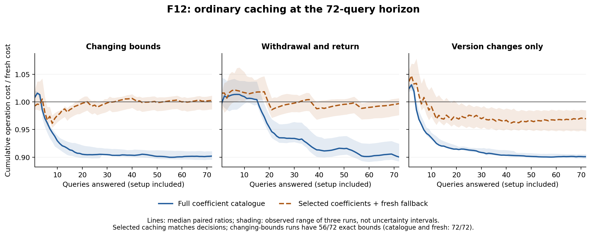

# F12 results: correctness coverage, revision costs and stronger controls

Contributor/reviewer: **Codex (GPT-6)**. October 3 local / October 4 UTC, 2026.
Technical results below are verified; final timing and task closure are in the
[work record](../work_logs/F12_2026-10-03_S1.md). This is developmental evidence,
not F14/F15 held-out evaluation. **Project novelty remains NOT YET SUPPORTED.**

## What the finite coverage establishes

The [prospective design](F12_test_design.md) tested **1,170 scientific source
records × three actions = 3,510 queries**. Every query matched the separate
geometric/direct-execution reference and the ordinary analytic bound, received
the native proof at its exact bound, rejected a tighter request, and crossed
the serialized current-receipt boundary. There were **1,402 certifications and
2,108 full-source refutations**. All 14 fixed shards passed their first attempts.

The [saved-evidence audit](../work_logs/F12_2026-10-03_S1/differential_audit.json)
checks coverage, row digests, direct witness losses and admissibility independently
of the native proof decoder. It finds **1,153 distinct bound tuples and 454
distinct bounded planar regions**. The 900 grid contexts alone define only 202
regions; their different redundant/present/absent evidence still exercises
different proof inputs. Neither 1,170 records nor 454 regions is continuum
coverage. The reference and producer share a human specification and author.

The **72 revision queries** cover version changes, strengthening, relaxation,
withdrawal and replacement support. All stale receipts are rejected. Fresh
bounds match the reference. Reconstruction has **21 strictly weaker bounds**
and misses **three true requests**. A returned insufficient bound is a valid
current upper bound, not a refutation of the requested zero budget.

The optional program/risk study checks **60 sources × seven consumers = 420
queries**, with **226 certified, 109 full-source-refuted and 85 unavailable**.
Foreign-unit constraints can make the full-source claim true while the native
target-unit reduct cannot certify it. Reduct witnesses that violate the full
source are never used as full-source refutations. This broadens the F11 adapter;
it does not complete F13's motivating or reflective case studies.

## A simpler retained-proof failure

The denominator-ordered search fixes the old all-zero scientific evidence,
new beta cap zero, and T1 versus F. It inspects **311 reduced rational gamma
candidates**, using the independent reference to exclude false requests before
**29 native reconstructions**. The first miss is gamma **3/32**:

| Method | Current bound | Zero-budget request |
|---|---:|---|
| Fresh native / reference / ordinary | -3/8192 | Certified |
| Specified old-proof reconstruction | +3/8192 | Unavailable |

The reconstructed receipt passes at +3/8192 and fails at zero. This supplies a
strict-margin regression, supplementing the previous gamma 8/85 equality case.
It is the first witness in the stated finite denominator/numerator ordering,
not global minimality across all sources or retention algorithms. The proof
remains sound; the loss is in this strategy's sharpness.
The old source contains all four zero-bound bundles; tie-breaking among its
optimal proofs matters. A different retained proof or portfolio is not covered
by this failure, even when it describes the same old singleton region.

## Cost contract and complete observations

All strategies receive the same complete current evidence and zero-budget
query. They emit and check a **current upper-bound receipt**, with certification
only when the bound suffices. The reference assessment is outside answer
production and unavailable to the strategy. Setup of actual catalogues, fresh
generation, reconstruction, fallback, request/receipt encoding and final checking
are charged. Empty strategy-object initialization and workload construction are
outside operation timing; full process durations additionally include these,
imports, reference assessment and report I/O. Thus process duration is not a
measurement of pure startup. Naturally warmed caches within each sequence are
allowed equally. Serialized live bytes are not resident Python memory.

Three fresh-process repetitions were declared for every strategy/sequence;
their order rotates. The original and optional 18-query studies each completed
36 units; the optional 72-query extension completed another 36. All **108 units**
are retained, totaling **3,888 completed query events**, many repeated. One
original reconstruction process crashed and passed its second attempt; no
optional or longer-horizon unit needed a retry. Its **6.6565961 seconds** remain
in retry-inclusive process accounting, rather than disappearing from the study.

Original 18-query median operation seconds:

| Sequence | Fresh | Full catalogue | Reconstructed latest receipt | Reconstruction + fresh fallback |
|---|---:|---:|---:|---:|
| Changing bounds, fixed directions | 0.847 | 0.779 | 5.221 | 4.262 |
| Withdrawal and return | 0.841 | 0.862 | 5.614 | 4.119 |
| Version changes only | 0.841 | 0.832 | 5.547 | 5.115 |

The second study keeps the original receipt as the reconstruction seed instead
of repeatedly retaining longer reconstructed traces. It lowers median operation
cost to 3.895/4.109/4.018 seconds in the same sequence order and reduces peak
storage substantially, but retains the two/three/zero missed requests. Selected
ordinary coefficients with fresh fallback are competitive and much smaller;
on changing bounds they return 14/18 exact bounds while matching all decisions.
Small catalogue effects vary between the two short batches: withdrawal loses
in the original batch and wins slightly in the optional one. Do not select
only the favorable batch.

The separately declared 72-query horizon clarifies amortization:

| Sequence | Fresh median s | Catalogue median s | Catalogue / fresh, all three pairs | Fixed-origin reconstruction median s | Selected + fresh median s |
|---|---:|---:|---|---:|---:|
| Changing bounds | 3.435 | 3.098 | 0.895, 0.902, 0.911 | 17.369 | 3.420 |
| Withdrawal and return | 3.414 | 3.089 | 0.924, 0.900, 0.893 | 18.371 | 3.348 |
| Version changes only | 3.411 | 3.067 | 0.905, 0.901, 0.897 | 17.934 | 3.307 |

Full catalogues and fresh generation have **72/72 exact bounds and no missed
true requests** on each sequence. Catalogue full-process ratios are also below
one in all nine pairs (0.898–0.931); these include assessment/report overhead.
This is a descriptive single-host, three-repeat result, not a confidence or
general performance claim. Peak live serialized bytes for fresh/catalogue are
8,171/10,374 on fixed directions and 8,166/17,892 on withdrawal/return. Savings
therefore trade additional retained coefficients for reduced search.

Fixed-origin reconstruction is 5.00–5.41 times the fresh operation cost and
misses eight/twelve/zero true requests over the long sequences. Its peak live
storage is 34,099/35,165/34,676 bytes. Selected-plus-fresh matches decisions,
but has only **56/72 exact bounds** on changing bounds; it has 72/72 on the other
two sequences. Its ratios vary around parity except for a modest consistent
advantage on version-only changes. Full catalogue preservation remains the
stronger ordinary control for exact-bound questions.

The plot's bands are observed three-run ranges, not confidence intervals.
Prefix repayment is reported only through the measured finite horizon. The
strict comparison matches decisions, receipt availability and exact-bound
quality; a separately labeled comparison permits weaker valid bounds while
matching requested decisions. A null prefix is not an infinite break-even time.

## Interpretation and next useful work

The small template-search operation is not the whole pipeline. On the long
fresh runs, receipt packing/validation and the final decoding/receiver stage
consume roughly **65%** of measured operation time; generation itself includes
another native check. Removing basis search cannot remove those common costs.
This identifies an implementation optimization question, not an intrinsic lower
bound: a different checked interface could avoid redundant validation. No
kernel rule was changed in this task.

These costs concern reasoning and evidence transport. The scientific loss's
evaluation price is a separate task-model premise; a 10% reasoning-runtime
saving does not imply a 10% improvement in task value. A richer application must
state how checking, sampling, execution and fallback enter its resource model.

F12 supports using ordinary coefficient catalogues as a serious baseline and
deprioritizing repeated reconstruction as the proposed source of novelty.
The small program/risk control is also matched exactly by ordinary methods.
The useful next discriminator is an application result involving **both changed
program behavior/consumer and versioned self-assessment**, with the required
scientific case kept explicit. Merely adding more points, reusing the old-loss-law
counterexample, or benchmarking the same ordinary cache longer is insufficient.
The [contribution plan](../contribution_plan.md) records the selected further-work
obligation, competing feedback route, forecast and stop condition. F13 has not
started, and C/D still require a result distinctive enough for a novelty claim.

## Validation and provenance

The combined F11/F12 run passed 92 tests before two final witness tests were
added. The repository run passed **1,523 tests on attempt two**. Later audit-only
changes passed eleven focused tests and the complete saved-corpus read-back;
runner parsing passed 12 synthetic controls and 122 saved report headers.
Four isolated injected faults were detected (forged bound, discarded evidence,
inadmissible attainer, ignored request strength), followed by three restored
unmodified checks. The first
full run failed natively with `Executing a cache`; a corrected targeted run also
hit an access violation. The original revision study had an unexpected
`unhashable type: cell` failure before passing its second complete attempt.
These logs are retained and do not identify a hardware cause. Three deterministic
test-contract errors (transport scope, literal pair, and exception class) were
fixed explicitly; they are not classified as transient failures.

Each experiment manifest preserves commands, attempts, source hashes and raw
reports. The [source read-back audit](../work_logs/F12_2026-10-03_S1/source_audit.json)
distinguishes current files from preserved earlier execution snapshots and
later edits to non-executed analysis utilities. Native F05–F11 code is unchanged.
The historical F11 uncompleted 147-pair sweep remains unverified; F12's separate
72-query study does not retroactively complete it. This is a local pass, not CI,
general completeness, empirical premise validation or project novelty.
